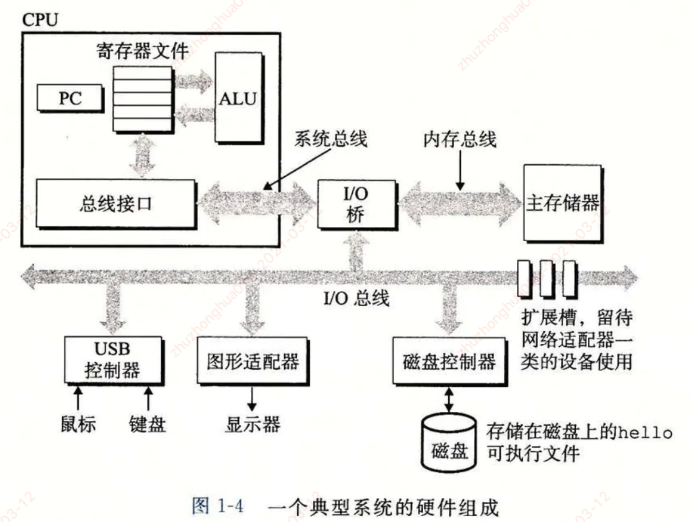
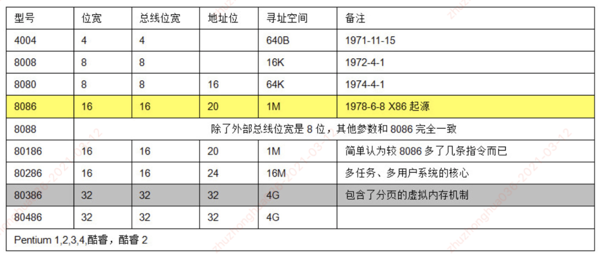
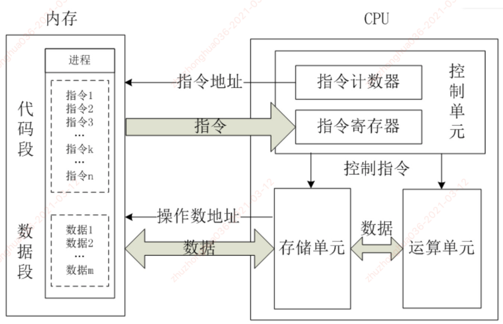

#### 编译系统

**编译：** 是计算机的**编译器**基于编程语言，目标机器的指令集和操作系统的约定去**生成机器码**（machine code）的过程。

- 编译器：C编译器（GCC）生成的是就是汇编码（assembler code）的一种形式
  - 汇编码是机器码不同程序指令给出的文本表示
- GCC同时调用汇编器(assember code)和链接器（linker），将汇编码生成可执行的机器码

##### 编译流程： 

gcc -o my_ext p1.c p2.c    (调用gcc编译器将p1.c和p2.c源文件编译处理，最后生成my_exe可执行文件)

- 1.预处理：
  - C预处理器（pre processor）会把需要的#include标识的文件和#define声明的宏（macros）添加到源代码（source code）中。
- 2.编译
  - C编译器会生成汇编码，依据源码生成了相应的两个p1.s和p2.s的两个文件
- 3.汇编
  - 汇编器把上面的汇编码转换成二进制的目标文件(object-code file) p1.o和 p2.o，目标代码是机器码的一种二进制文件形式
    - 它包含了全部的指令，但是没有包含全局变量的地址（需要到链接阶段）**？？？全局变量地址**
- 4.链接
  - 链接器归并这两个目标文件和代码需要调用的内核库函数（比如printf），生成可执行（executable）的机器码文件（my_ext ,my.so）
  - 链接的过程分为静态链接和动态链接。
    - 静态链接会把静态库文件全部加入到可执行代码中
    - 动态链接只是在运行时，把调用的库加入到可执行程序。动态库在lunix文件名为.so,在windows下为.dll文件

#### 计算机硬件

##### 主存：主存是一个临时存储设备，在处理器执行程序时，用来存放程序和程序处理的数据。

- 从物理上来说，主存是由一组动态随机存取存储器（DRAM）芯片组成的
- 从逻辑上来说，存储器是一个线性的字节数组，每个字节都有其唯一的地址（即数组索引），这些地址从零开始。
- 组成程序的每条机器指令都由不同数量的字节构成

##### 处理器：中央处理器（CPU），简称处理器，是解释（或执行）存储在主存中指令的引擎。

- 处理器的组成：
  - 一个字长的存储设备（或寄存器）
  - 程序计算器（PC）：PC都指向主存中的某条机器语言指令（即含有该条指令的地址）
  - ALU：计算单元

Intent公司的CPU：8086-x86

##### CPU核心功能处理流程：

- 控制单元在时序脉冲的作用下，将指令计算器里所指向的指令地址（这个地址在内存里的）送到地址总线上去，然后CPU将这个地址里的指令读到指令寄存器中进行译码。
- 对于执行指令过程中所需要用到的数据，会将数据地址也送到地址总线，然后CPU把数据读到CPU的内部存储单元（内部寄存器）暂存起来
- 最后命令运算单元对数据进行处理加工

##### 寄存器：

基本寄存器是由 D触发器组成，在 CP 脉冲作用下，每个 D触发器能够寄存一位二进制码。在 D=0 时，寄存器储存为 0，在 D=1 时，寄存器储存为 1。在低电平为 0、高电平为 1 时，需将信号源与 D 间连接一反相器，这样就可以完成对数据的储存。寄存器的主要作用如下：

- 可将寄存器内的数据执行算术及逻辑运算
- 存于寄存器内的地址可用来指向内存的某个位置，即寻址
- 可以用来读写数据到电脑的周边设备

