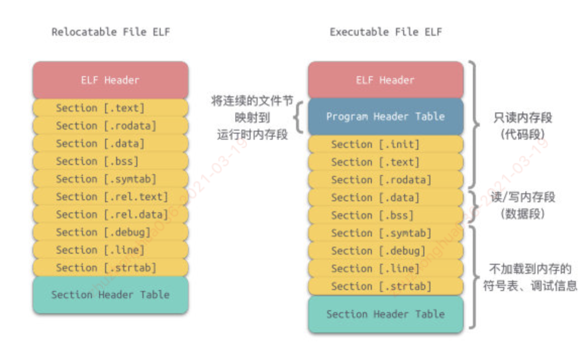
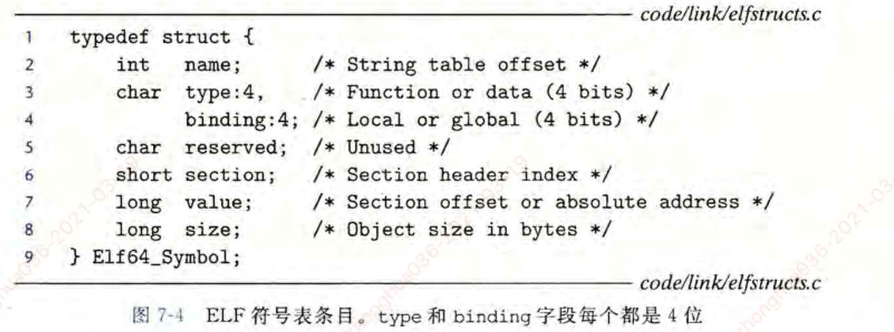
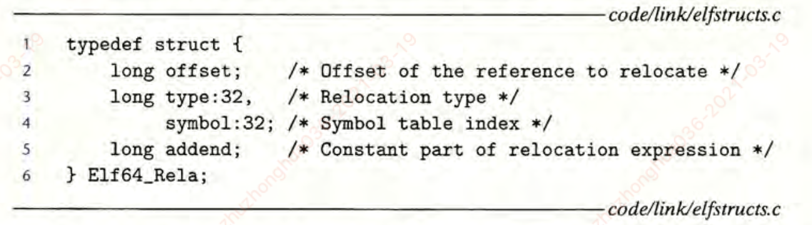

- 链接的相关概念
- 静态链接
- 加载时的共享库的动态链接
- 运行时的共享库的动态链接
- ELF目标文件格式

#### 1.链接

- 链接（linking）是将各种代码和数据片段收集并组合成为一个单一文件的过程，这个文件可被加载（复制）到内存并执行
- 链接由链接器程序自动执行，可以执行于编译时，加载时和运行时

##### 链接器的作用：

- 链接器使得分离编译成为可能。
- 我们不用将一个大型的应用程序组织为一个巨大的源文件，而是可以把它分解为更小，更好管理的模块，可以独立地修改和编译这些小的模块。
- 当我们改变这些模块中的一个时，只需要简单地重新编译它，并重新链接应用，而不必重新编译其他文件

#### 2.静态链接

- 静态链接器以一组**可重定位目标文件**和命令行参数作为输入，**生成一个完全链接的，可以加载和运行的可执行目标文件**作为输出。
  - 输入的**可重定位目标文件由各种不同的代码和数据节（section）组成**，每一节都是一个连续的字节序列
  - 指令在一节中（.text）；初始化了的全局变量在另一节中（.data）；而未初始化的变量又在另外一节中（.bss）
- 链接器构造可执行目标文件，需要完成两个主要任务
  - **1.符号解析（symbol resolution）**：目标文件定义和引用符号；符号解析的目的是将每个**符号引用（使用这个符号定义的地方，例如调用printf函数）**正好和一个**符号定义**关联起来（什么是符号定义？-就是地址吗）
    - 每个**符号**对应于**一个函数，一个全局变量或一个静态变量**。
  - **2.重定位（relocation）：**
    - 编译器和汇编器生成从地址0开始的代码和数据节。
    - **链接器通过把每个符号定义与一个内存位置关联起来，从而重定位这些节，然后修改所有对这些符号的引用，使得他们指向这个内存的位置（重定位核心概念）**

#### 3.目标文件

- 目标文件有三种形式：
  - **1.可重定位目标文件（Relocatable File）：**包括二进制代码和数据，其可以在编译时与其他可重定位目标文件合并起来，创建一个可执行目标文件
    - ELF Header中的文件类型为`ETL_REL`，一般为.o文件。
    - 可以被链接成可执行文件或共享目标文件。
    - 静态链接库属于可重定位文件
  - **2.可执行目标文件：**包含二进制代码和数据，其可以被直接复制到内存并执行
    - `ET_EXEC`,可以直接执行的程序
  - **3.共享目标文件：**一种特殊类型的可重定位目标文件，可以在加载或者运行时被动态地加载进内存并链接
    - `ET_DYN`,一般为.so文件
    - 链接器将其与其他可重定位文件，共享目标文件链接成新的目标文件
    - 动态链接器将其与其他共享目标文件，结合成一个可执行文件，创建进程映像
- 编译器和汇编器生成可重定位目标文件（包括共享目标文件）；链接器生成可执行目标文件
  - 不同系统的目标文件格式不同：
  - Window使用PE格式
  - Linux使用ELF格式

- 可重定位目标文件与可执行目标文件比较：

##### 注意点：

- 段（Segment）与节（Section）的区别。段时程序执行的必要组成，当多个目标文件链接成一个可执行文件时，会将相同权限的节合并到一个段中。相比而言，节的粒度更小

#### 4.可重定位目标文件

##### 一个典型的ELF可重定位目标文件格式如下：

- **ELF头（ELF header）：** 以一个16字节的序列开始，描述了生成该文件的系统的字大小和字节序列，目标文件类型，机器类型，节头部表的文件偏移，以及节头部中条目的大小和数量。

- 在ELF头和节头部表之间的都是节：

**.text：**已编译程序的机器代码

**.data:** 已初始化的全局和静态变量，局部变量在运行时被保存在栈中，不出现在.data节中，也不出现在.bss节中

**.bss:** 未初始化的全局和静态变量，以及所有被初始化为0的全局和静态变量。

**.rodata:** 只读数据，比如printf语句中的格式串和开关语句的跳转表

**.symtab:** 符号表，它存放程序中定义和引用的函数和全局变量的信息

**.rel.text:** 一个.text节中位置的列表，当链接器把这个目标文件和其他文件组合时，需要修改这些位置

**.rel.data:**被模块引用或定义的所有全局变量的重定位信息

**.debug:** 一个调试符号表，其条目是程序中定义的局部变量和类型定义，程序中定义和引用的全局变量。

**.line: ** 源文件中的行号和.text节中机器指令之间的映射

**.strtab:** 一个符号串表，其内容包括.symtab 和 .debug节中的符号表，以及节头部中的节名字

#### 经典例题：（查看可重定目标文件内容）

- 1.创建 link.c 源文件

~~~c
#include <stdio.h>

int global_init_var = 84;   // 全局变量-已初始化
int global_uninit_var;      // 全局变量-未初始化

void func1(int i){
    printf("%d/n",i);
}

int main(){
    static int static_var = 85;     //静态变量--已初始化
    static int static_var2;         //静态变量--未初始化
    //局部变量
    int a = 1;
    int b ;
  
    func1(static_var+static_var2+a+b);

    printf("main - end!\n");
    return 0;
}
~~~

##### 2.编译源文件生成目标文件

- 1.编译源文件： `gcc -c link.c` 
  - (参数 -c 表示只编译不链接),生成link.o目标文件

- 2.查看目标文件内容
  - 使用objdump工具来查看.o目标文件的内部结构
  - ` objdump -h link.o`

~~~c
FVFX2HDLHV29:07_链接 zhuzhonghua036$ objdump -h link.o
link.o:	file format Mach-O 64-bit x86-64
Sections:
Idx Name             Size     VMA              Type
  0 __text           0000007a 0000000000000000 TEXT
  1 __data           00000008 000000000000007c DATA
  2 __cstring        00000012 0000000000000084 DATA
  3 __bss            00000004 0000000000000140 BSS
  4 __compact_unwind 00000040 0000000000000098 DATA
  5 __eh_frame       00000068 00000000000000d8 DATA
~~~

- 3.输出代码段的所有内容：` objdump -s -d link.o`

~~~c
FVFX2HDLHV29:07_链接 zhuzhonghua036$ objdump -s -d link.o
link.o:	file format Mach-O 64-bit x86-64

  //text段内容
Contents of section __text:
 0000 554889e5 4883ec10 897dfc8b 75fc488d  UH..H....}..u.H.
 0010 3d6f0000 00b000e8 00000000 4883c410  =o..........H...
 0020 5dc3662e 0f1f8400 00000000 0f1f4000  ].f...........@.
 0030 554889e5 4883ec10 c745fc00 000000c7  UH..H....E......
 0040 45f80100 00008b05 00000000 03050000  E...............
 0050 00000345 f80345f4 89c7e800 00000048  ...E..E........H
 0060 8d3d2300 0000b000 e8000000 0031c989  .=#..........1..
 0070 45f089c8 4883c410 5dc3               E...H...].
Contents of section __data:
 007c 54000000 55000000                    T...U...
Contents of section __cstring:
 0084 25642f6e 006d6169 6e202d20 656e6421  %d/n.main - end!
 0094 0a00                                 ..
Contents of section __bss:
<skipping contents of bss section at [0140, 0144)>
Contents of section __compact_unwind:
 0098 00000000 00000000 22000000 00000001  ........".......
 00a8 00000000 00000000 00000000 00000000  ................
 00b8 30000000 00000000 4a000000 00000001  0.......J.......
 00c8 00000000 00000000 00000000 00000000  ................
Contents of section __eh_frame:
 00d8 14000000 00000000 017a5200 01781001  .........zR..x..
 00e8 100c0708 90010000 24000000 1c000000  ........$.......
 00f8 08ffffff ffffffff 22000000 00000000  ........".......
 0108 00410e10 8602430d 06000000 00000000  .A....C.........
 0118 24000000 44000000 10ffffff ffffffff  $...D...........
 0128 4a000000 00000000 00410e10 8602430d  J........A....C.
 0138 06000000 00000000                    ........

// .text 段汇编语言内容展示：                                     
Disassembly of section __TEXT,__text:
0000000000000000 _func1:
       0: 55                           	pushq	%rbp
       1: 48 89 e5                     	movq	%rsp, %rbp
       4: 48 83 ec 10                  	subq	$16, %rsp
       8: 89 7d fc                     	movl	%edi, -4(%rbp)
       b: 8b 75 fc                     	movl	-4(%rbp), %esi
       e: 48 8d 3d 6f 00 00 00         	leaq	111(%rip), %rdi
      15: b0 00                        	movb	$0, %al
      17: e8 00 00 00 00               	callq	0 <_func1+0x1c>
      1c: 48 83 c4 10                  	addq	$16, %rsp
      20: 5d                           	popq	%rbp
      21: c3                           	retq
      22: 66 2e 0f 1f 84 00 00 00 00 00	nopw	%cs:(%rax,%rax)
      2c: 0f 1f 40 00                  	nopl	(%rax)

0000000000000030 _main:
      30: 55                           	pushq	%rbp
      31: 48 89 e5                     	movq	%rsp, %rbp
      34: 48 83 ec 10                  	subq	$16, %rsp
      38: c7 45 fc 00 00 00 00         	movl	$0, -4(%rbp)
      3f: c7 45 f8 01 00 00 00         	movl	$1, -8(%rbp)
      46: 8b 05 00 00 00 00            	movl	(%rip), %eax
      4c: 03 05 00 00 00 00            	addl	(%rip), %eax
      52: 03 45 f8                     	addl	-8(%rbp), %eax
      55: 03 45 f4                     	addl	-12(%rbp), %eax
      58: 89 c7                        	movl	%eax, %edi
      5a: e8 00 00 00 00               	callq	0 <_main+0x2f>
      5f: 48 8d 3d 23 00 00 00         	leaq	35(%rip), %rdi
      66: b0 00                        	movb	$0, %al
      68: e8 00 00 00 00               	callq	0 <_main+0x3d>
      6d: 31 c9                        	xorl	%ecx, %ecx
      6f: 89 45 f0                     	movl	%eax, -16(%rbp)
      72: 89 c8                        	movl	%ecx, %eax
      74: 48 83 c4 10                  	addq	$16, %rsp
      78: 5d                           	popq	%rbp
      79: c3                           	retq
~~~

#### 5.符号和符号表

- 每个可重定位目标模块都有一个符号表，他包含该目标目标定义和引用的符号信息
- 符号分为三种：
  - 由模块m定义并能被其他模块引用的全局符号。对应于非静态的函数和全局变量
  - 由其他模块定义并被模块m引用的全局符号。这些符号称为外部符号，对应其他模块中定义的非静态函数和全局变量
  - 只被当前模块m定义和引用的局部符号。不能被其他模块引用

##### 符号表

- 符号表是由汇编器构造，使用编译器输出到汇编语言.s文件中的符号。  .symtab节中包含ELF符号表

- 符号表内容：
  - name是字符串表中的字节偏移，指向符号的以null结尾的字符串名字
  - vlaue是符号的地址。
    - **对于可重定位的模块来说，value是距定义目标的节的其实位置的偏移。**
    - **对于可执行目标文件来说，该值是一个绝对运行时地址**
  - size是目标的大小（单位为字节）
  - type通常要么是数据，要么是函数
- 每个符号都被分配到目标文件的某个节，由section字段表示，该字段也是一个到节头部表的索引。

#### 6.符号解析

- 链接器符号解析引用的方法是将每个引用与他输入的可重定位目标文件的符号表中的一个确定的符号定义关联起来。

#### 7.重定位

- 链接器完成符号解析时，就把代码中的每个符号引用和正好一个符号定义关联起来了
  - 符号定义可以看作是函数和变量的一个定义
  - 符号引用可以理解为对函数或变量的使用方，符号解析的时候，符号表中可以知道那个地方调用了那个方法，当重定位后，符号定义（函数和变量）就有运行时地址了，然后调用这些函数和变量的地方，在运行时需要知道函数和变量调用的真实地址，怎么知道呢？==》就是通过重定位操作
- 重定位步骤中，将合并输入模块，并未每个符号分配运行时地址。

##### 重定位由两步组成：

- 1.重定位节和符号定义：
  - 在这一步中，链接器将所有相同类型的节合并为同一类型的新的聚合节
    - 例如将所有输入模块的.data节被全部合并成一个节
  - 然后，链接器将运行时内存地址赋给新的聚合节，赋给输入模块定义的每个节，以及赋给输入模块定义的每个符号。
  - 上面两步完成时，程序中的每条指令和全局变量都有唯一的运行时内存地址了。
- 2.重定位节中的符号引用：
  - 在这一步中，链接器修改代码节和数据节中对每个符号的引用，使得他们指向正确的运行时地址。
  - 要执行这一步，链接器以来可重定位目标模块中称为**重定位条目**的数据结构

