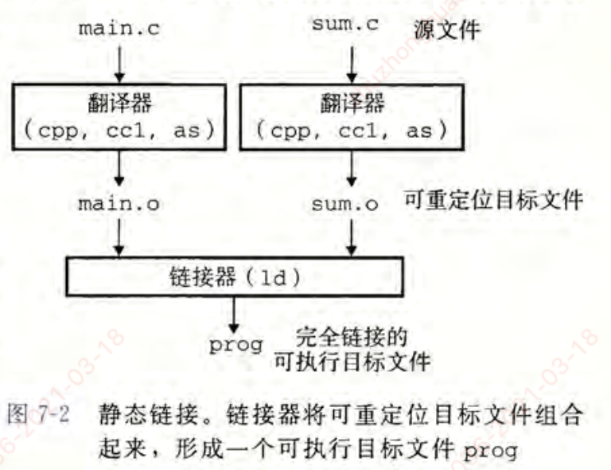
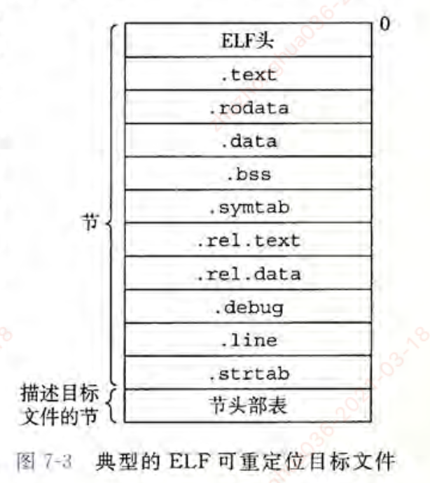

- 链接的相关概念
- 静态链接
- 加载时的共享库的动态链接
- 运行时的共享库的动态链接
- ELF目标文件格式

#### 1.链接

- 链接（linking）是将各种代码和数据片段收集并组合成为一个单一文件的过程，这个文件可被加载（复制）到内存并执行
- 链接由链接器程序自动执行，可以执行于编译时，加载时和运行时

##### 链接器的作用：

- 链接器使得分离编译成为可能。
- 我们不用将一个大型的应用程序组织为一个巨大的源文件，而是可以把它分解为更小，更好管理的模块，可以独立地修改和编译这些小的模块。
- 当我们改变这些模块中的一个时，只需要简单地重新编译它，并重新链接应用，而不必重新编译其他文件

#### 2.静态链接

- 静态链接器以一组**可重定位目标文件**和命令行参数作为输入，**生成一个完全链接的，可以加载和运行的可执行目标文件**作为输出。
  - 输入的**可重定位目标文件由各种不同的代码和数据节（section）组成**，每一节都是一个连续的字节序列
  - 指令在一节中（.text）；初始化了的全局变量在另一节中（.data）；而未初始化的变量又在另外一节中（.bss）
- 链接器构造可执行目标文件，需要完成两个主要任务
  - **1.符号解析（symbol resolution）**：目标文件定义和引用符号；符号解析的目的是将每个**符号引用（使用这个符号定义的地方，例如调用printf函数）**正好和一个**符号定义**关联起来（什么是符号定义？-就是地址吗）
    - 每个**符号**对应于**一个函数，一个全局变量或一个静态变量**。
  - **2.重定位（relocation）：**
    - 编译器和汇编器生成从地址0开始的代码和数据节。
    - **链接器通过把每个符号定义与一个内存位置关联起来，从而重定位这些节，然后修改所有对这些符号的引用，使得他们指向这个内存的位置（重定位核心概念）**

#### 3.目标文件

- 目标文件有三种形式：
  - **1.可重定位目标文件：**包括二进制代码和数据，其可以在编译时与其他可重定位目标文件合并起来，创建一个可执行目标文件
  - **2.可执行目标文件：**包含二进制代码和数据，其可以被直接复制到内存并执行
  - **3.共享目标文件：**一种特殊类型的可重定位目标文件，可以在加载或者运行时被动态地加载进内存并链接
- 编译器和汇编器生成可重定位目标文件（包括共享目标文件）；链接器生成可执行目标文件
  - 不同系统的目标文件格式不同：
  - Window使用PE格式
  - Linux使用ELF格式

#### 4.可重定位目标文件

##### 一个典型的ELF可重定位目标文件格式如下：

- **ELF头（ELF header）：** 以一个16字节的序列开始，描述了生成该文件的系统的字大小和字节序列，目标文件类型，机器类型，节头部表的文件偏移，以及节头部中条目的大小和数量。

- 在ELF头和节头部表之间的都是节：

**.text：**已编译程序的机器代码

**.data:** 已初始化的全局和静态变量，局部变量在运行时被保存在栈中，不出现在.data节中，也不出现在.bss节中

**.bss:** 未初始化的全局和静态变量，以及所有被初始化为0的全局和静态变量。

**.rodata:** 只读数据，比如printf语句中的格式串和开关语句的跳转表

**.symtab:** 符号表，它存放程序中定义和引用的函数和全局变量的信息

**.rel.text:** 一个.text节中位置的列表，当链接器把这个目标文件和其他文件组合时，需要修改这些位置

**.rel.data:**被模块引用或定义的所有全局变量的重定位信息

**.debug:** 一个调试符号表，其条目是程序中定义的局部变量和类型定义，程序中定义和引用的全局变量。

**.line: ** 源文件中的行号和.text节中机器指令之间的映射

**.strtab:** 一个符号串表，其内容包括.symtab 和 .debug节中的符号表，以及节头部中的节名字

#### 经典例题：

