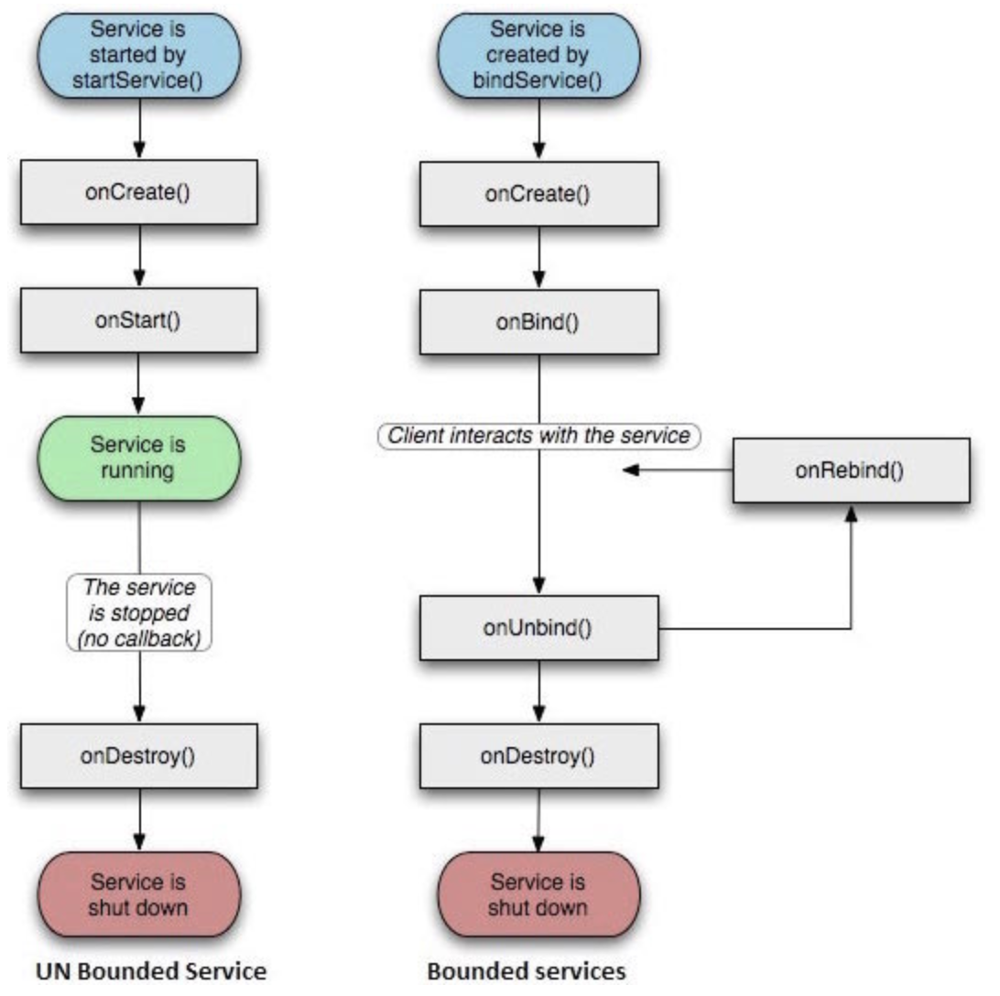

https://www.cnblogs.com/huangjialin/p/7738104.html

1. 服务的概念
2. Service的生命周期
3. 启动的两种方式，startService，bindService
4. 远程服务通信-aidl

#### 1.服务-Service

- Service是Android四大组件之一，后台运行的组建，可以长时间执行且不需要与用户交互；即使应用被销毁也依然可以工作。

##### 1.1.服务的生命周期

- 当以startService启动服务时：服务是Started状态，一旦启动，服务可以在后台无期限运行，即使启动它的组件已经被销毁。
- 当以bindService绑定服务时：服务时Bound状态。Bound状态的服务提供了一个服务连接接口，用于组件与服务进行交互，如发送请求，获取结果，甚至通过IPC来进行跨进程通信

##### 1.2. 代码实现-startService启动服务

- 1.创建java类，并继承自系统Service类

~~~java
public class MyService1 extends Service {

    public MyService1() {
    }

    @Override
    public void onCreate() {
        TLog.d("onCreate");
        super.onCreate();
    }

    @Override
    public IBinder onBind(Intent intent) {
        throw new UnsupportedOperationException("Not yet implemented");
    }

    @Override
    public int onStartCommand(Intent intent, int flags, int startId) {
        TLog.d("onStartCommand flags:" + flags + " ,startId:" + startId);
        return super.onStartCommand(intent, flags, startId);
    }

    @Override
    public void onDestroy() {
        TLog.d("onDestroy");
        super.onDestroy();
    }
}
~~~

- 2.清淡文件中进行注册

~~~java
        <service
            android:name=".MyService1"
            android:enabled="true"
            android:exported="true" />
              
<service android:enabled=["true" | "false"]
    android:exported=["true" | "false"]
    android:icon="drawable resource"
    android:isolatedProcess=["true" | "false"]
    android:label="string resource"
    android:name="string"
    android:permission="string"
    android:process="string" >
    . . .
</service>
~~~

**service 解析：**

###### - name：对应Service类名

###### - enabled：是否可以被系统实例化，默认为true

###### - exported：代表是否能被其他应用隐式调用，默认值由service中有无intent-filter决定；如果有intent-filter，默认值为true，否则为false； 如果为false情况下，即使有intent-filter匹配，也无法隐式调用

###### - process：是否需要在单独的进程中运行，当设置为“ ：remote”时，代表service在单独的进程中运行

- “：”很重要，它表示要在当前进程名称前面附加上当前的包名，
  - " remote ":表示进程名为 remote
  - " :remote":表示进程名称为 app package name : remote

- 3.启动服务

~~~java
public class MainActivity extends AppCompatActivity {

    @Override
    protected void onCreate(Bundle savedInstanceState) {
        super.onCreate(savedInstanceState);
        setContentView(R.layout.activity_main);
    }

    public void startService(View view) {
        Intent intent = new Intent(this, MyService1.class);
        startService(intent);
    }

    public void stopService(View view) {
        Intent intent = new Intent(this, MyService1.class);
        stopService(intent);
    }
}
~~~

**1.3.调用结果：**

- 点击启动服务：打印

~~~java
│ MyService1.onCreate  (MyService1.java:17)│ onCreate
│ MyService1.onStartCommand  (MyService1.java:28)│ onStartCommand flags:0 ,startId:1
~~~

- 当多次点击启动服务

~~~java
│ MyService1.onCreate  (MyService1.java:17)│ onCreate
│ MyService1.onStartCommand  (MyService1.java:28)│ onStartCommand flags:0 ,startId:1
│ MyService1.onStartCommand  (MyService1.java:28)│ onStartCommand flags:0 ,startId:1
│ MyService1.onStartCommand  (MyService1.java:28)│ onStartCommand flags:0 ,startId:1
│ MyService1.onStartCommand  (MyService1.java:28)│ onStartCommand flags:0 ,startId:1
~~~

- 点击停止服务

~~~java
│ MyService1.onDestroy  (MyService1.java:34)│ onDestroy
~~~

##### ==>第一次调用startService方法启动服务时，Service的onCreate和onStartCommand方法会执行一次

##### 当再次启动服务，由于该Service已经存在，并不会重新创建（onCreate方法不会调用）；只会调用onStartCommand

##### 1.4.注意，startService启动的服务，运行在同一进程的主线程中

~~~java
│ MainActivity.startService  (MainActivity.java:19)│ Process.myPid():7589 Thread Id:2
│ MyService1.onCreate  (MyService1.java:16)│ onCreate Process.myPid():7589 Thread Id:2
~~~

- 如果要让service运行在其他进程，需要修改请问文件中的service属性

~~~java
        <service
            android:name=".MyService1"
            android:process=":aaa"
            android:enabled="true"
            android:exported="true" />

│ MainActivity.startService  (MainActivity.java:19)│ Process.myPid():10096 Thread Id:2
│ MyService1.onCreate  (MyService1.java:16)│ onCreate Process.myPid():10590 Thread Id:2      
~~~

#### 2.绑定服务-bindService

- 通过startService启动的服务，activity与service只有启动和销毁的操作，并没有activity与service的更多交互操作，如果activity向获取service中的数据资源，可通过绑定服务，获取服务连接接口

~~~java
public class MyService2 extends Service {

    public MyService2() {
    }

    @Override
    public void onCreate() {
        TLog.d("onCreate Process.myPid():" + Process.myPid() + " Thread Id:" + Thread.currentThread().getId());
        super.onCreate();
    }

    @Override
    public IBinder onBind(Intent intent) {
        TLog.d("onBind");
        return new MyBinder();
    }

    @Override
    public int onStartCommand(Intent intent, int flags, int startId) {
        TLog.d("onStartCommand flags:" + flags + " ,startId:" + startId);
        return super.onStartCommand(intent, flags, startId);
    }

    @Override
    public boolean onUnbind(Intent intent) {
        TLog.d("onUnbind");
        return super.onUnbind(intent);
    }

    @Override
    public void onDestroy() {
        TLog.d("onDestroy");
        super.onDestroy();
    }

    public class MyBinder extends Binder {
        public String getName() {
            return "111";
        }
    }
}
~~~

- 调用绑定服务：

~~~java
    public void bindService(View view) {
        Intent intent = new Intent(this, MyService2.class);
        bindService(intent, serviceConnection = new ServiceConnection() {
            @Override
            public void onServiceConnected(ComponentName name, IBinder service) {
                MyService2.MyBinder myBinder = (MyService2.MyBinder) service;
                String name1 = myBinder.getName();
                TLog.d("name1:" + name1);
            }

            @Override
            public void onServiceDisconnected(ComponentName name) {

            }
        }, BIND_AUTO_CREATE);
    }

    public void unBindService(View view) {
        unbindService(serviceConnection);
    }
~~~

**解析：**

- 在MyService2类中创建一个MyBinder类（继承自Binder），在onBind方法中返回MyBinder实例
- 调用绑定服务bindService方法时，需要创建一个ServiceConnection匿名类，需要重写内部方法
  - onServiceConnected方法表示与服务建立关联，并获取MyBinder的实例，可通过该实例调用MyBinder中的public方法
  - onServiceDisconnected：解除与服务的绑定

~~~java
│ MyService2.onCreate  (MyService2.java:16)│ onCreate Process.myPid():15841 Thread Id:2
│ MyService2.onBind  (MyService2.java:22)│ onBind
│ MainActivity$1.onServiceConnected  (MainActivity.java:41)│ name1:111
│ MyService2.onUnbind  (MyService2.java:34)│ onUnbind
│ MyService2.onDestroy  (MyService2.java:40)│ onDestroy
~~~

##### 2.3报错

- java.lang.ClassCastException: android.os.BinderProxy cannot be cast to
- 原因：Service是否在同一个进程中，默认不配置 android:process=":procressName"则是在同一个进程中，否则如果配置了其中一个，另一个也需要指定相同的配置，否则会出现以上错误。如果不是夸进程操作，建议默认即可（不配置），使其在同一个进程中。

#### 3.远程服务--AIDL

- AIDL（Android Interface Definition Language）是Android接口定义语言的意思，通过它可以使的某个Service与多个应用程序组件进行跨进程通信。
- aidl用于跨进程通信，所以存在两个应用程序进程，一个service端提供服务，一个client端调用服务端获取服务

##### 3.1.代码实现

- 1.创建aidl文件,在main目录下新建aidl文件夹，然后创建.aidl文件，并构建项目生成aidl文件对应的Java类IMyAidlInterface
- aidl文件生成的java类目录在：build/generated/aidl_source_output_dir/...

~~~java
package com.timmy.aidl;

interface IMyAidlInterface {
    String getStr();
}
~~~

- 2.创建服务端进程

~~~java
package com.timmy.service;
import com.timmy.aidl.IMyAidlInterface;

public class AidlService extends Service {
    public AidlService() {
    }

    @Override
    public void onCreate() {
        TLog.d("onCreate Process.myPid():" + Process.myPid() + " Thread Id:" + Thread.currentThread().getId());
        super.onCreate();
    }

    @Override
    public IBinder onBind(Intent intent) {
        TLog.d("onBind Process.myPid():" + Process.myPid() + " Thread Id:" + Thread.currentThread().getId());
        return new MyBinder();
    }

    @Override
    public int onStartCommand(Intent intent, int flags, int startId) {
        TLog.d("onStartCommand flags:" + flags + " ,startId:" + startId);
        return super.onStartCommand(intent, flags, startId);
    }

    @Override
    public boolean onUnbind(Intent intent) {
        TLog.d("onUnbind");
        return super.onUnbind(intent);
    }

    @Override
    public void onDestroy() {
        TLog.d("onDestroy");
        super.onDestroy();
    }

    public class MyBinder extends IMyAidlInterface.Stub {
        @Override
        public String getStr() throws RemoteException {
            return "aaaaabbbb";
        }
    }
}

清单文件服务注册：
        <service
            android:name=".AidlService"
            android:enabled="true"
            android:exported="true">
            <intent-filter>
                <action android:name="com.timmy.aidl.MyService" />
            </intent-filter>
        </service>
~~~

- 其中AidlService的MyBinder类继承自IMyAidlInterface.Stub，该类是AS自动生成的，后面详细介绍其结构

- 3.调用

~~~java
    public void aidlBindService(View view) {
        TLog.d("Process.myPid():" + Process.myPid() + " Thread Id:" + Thread.currentThread().getId());

        //隐式绑定服务
        Intent intent = new Intent();
        //设置服务端的package name，和服务intent-filter
        intent.setPackage("com.timmy.service");
        intent.setAction("com.timmy.aidl.MyService");
        bindService(intent, serviceConnection = new ServiceConnection() {
            @Override
            public void onServiceConnected(ComponentName name, IBinder service) {
                IMyAidlInterface iMyAidlInterface =
                         IMyAidlInterface.Stub.asInterface(service);
                try {
                    String str = iMyAidlInterface.getStr();
                    TLog.d("str:" + str);
                } catch (RemoteException e) {
                    e.printStackTrace();
                }
            }

            @Override
            public void onServiceDisconnected(ComponentName name) {

            }
        }, BIND_AUTO_CREATE);
    }

    public void aidlUnBindService(View view) {
        unbindService(serviceConnection);
    }

最后打印：
│ MainActivity.aidlBindService  (MainActivity.java:57)│ Process.myPid():23553 Thread Id:2
│ AidlService.onCreate  (AidlService.java:18)│ onCreate Process.myPid():23423 Thread Id:2
│ AidlService.onBind  (AidlService.java:24)│ onBind Process.myPid():23423 Thread Id:2
│ MainActivity$2.onServiceConnected  (MainActivity.java:70)│ str:aaaaabbbb
~~~

1. Android进程间通信--AIDL
2. Service - 注册
3. 服务端有数据更新怎么通知客户端？--回调方法吗？--判断进程是否还存活？

1. aidl -- service
2. BinderPool：池化的概念
3. Binder 异常
4. Messager -- 底层是Handler+AIDL  ， 就可以不使用aidl

- RPC：远程过程调用
- IPC：进程间通信
- Android AIDL
  - Service：清淡文件中注册
  - .java文件
- AS编程结束后，生成.aidl的对应java类
  - IBinder 接口
    - transact() -- 进程间调用的方法
    - linkToDeath() -- binder异常的监听
    - isBinderAlive() -- 在客户端，判断服务端是否存活
  - IInterface 接口
    - asBinder -- 
  - Stub.asInterface() 方法获取远端服务代理对象
- CountDownLatch -- 启动优化

- 进程保活
- 多进程
  - 图片加载
  - webview

#### 学习五步曲：

- 原理是什么？
- 技术调研，--优缺点？
- 为什么这么设计？
- 使用场景
- 相关的4，5个知识点总结出来

ELF解析：

-程序从编译过程：预处理，编译（二进程汇编文件），汇编（机器码），链接（可执行文件）

-目标文件，elf格式文件

-文件分区：头, .text, .data, .bss 

内存：

-程序运行，数据需要加载到内存中，每个进程都有一块对应的虚拟内存 -- 物理内存

-内核态与用户态

进程：

-进程相关概念

-进程间通信

-android 进程间通信-binder

线程

网络

- 近期计划
  - 进程-- aidl项目实现
  - 线程学习 -- 线程池
  - 网络-- nio，epoll，dns解析

