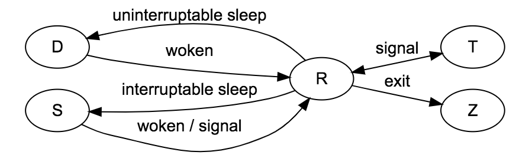

1. 进程相关概念
   - pid，ppid
2. 进程间通信
   - pipe
   - fork
   - clone
   - 共享内存
3. 进程创建
   - fork
4. Android进程间通信
   - Binder
5. 书籍
   - 《理解Linux进程》

#### 进程

https://tobegit3hub1.gitbooks.io/understanding-linux-processes/content/process_basic/status.html

#### 1.进程相关概念：

##### 1.1.进程：

- 进程运行程序的实体；
- 进程是独立的地址空间（资源分配的最小单位）

##### 1.2.PID：

- 全称Process ID，标识和区分进程的ID，它是一个全局唯一的正整数

##### 1.3.PPID：

- Parent Process ID，父进程ID，每个进程除了一定有pid还会有ppid，通过ppid可以找到父进程的信息
  - 进程都是由父进程衍生（fork）出来的，所以父进程都会有父进程id
  - 祖先进程为一个PID为1的进程，由内核创建的init进程，其他子进程都由它衍生出来，他没有ppid

- 通过终端执行指令：ps -ef 查看当前进程的pid和ppid

~~~c
timmydeMBP:~ timmy1$ ps -ef
  UID   PID  PPID   C STIME   TTY           TIME CMD
    0     1     0   0  9:43上午 ??         0:34.04 /sbin/launchd
    0    56     1   0  9:43上午 ??         0:00.93 /usr/sbin/syslogd
    0    57     1   0  9:43上午 ??         0:02.99 /usr/libexec/UserEventAgent (System)
    0    60     1   0  9:43上午 ??         0:00.54 /System/Library/...s/uninstalld
    0    61     1   0  9:43上午 ??         0:05.56 /usr/libexec/kextd
    0    62     1   0  9:43上午 ??         0:06.17 /System/Library/F..port/fseventsd
    0    64     1   0  9:43上午 ??         0:00.20 /System/Li..ramework/Support/mediaremoted
   55    66     1   0  9:43上午 ??         0:00.38 /System/Library.../appleeventsd --server
    0    67     1   0  9:43上午 ??         0:01.86 /usr/sbin/systemstats --daemon
    0    69     1   0  9:43上午 ??         0:03.18 /usr/libexec/configd
...
~~~

- 指令：ps aux  ,让ps命令显示更详细的参数信息

#### 1.4.进程状态

~~~c
static const char * const task_state_array[] = {
  "R (running)",        /*   0 */
  "S (sleeping)",        /*   1 */
  "D (disk sleep)",    /*   2 */
  "T (stopped)",        /*   4 */
  "t (tracing stop)",    /*   8 */
  "X (dead)",        /*  16 */
  "Z (zombie)",        /*  32 */
};
~~~

##### 进程状态转移

- 可以通过ps aux查看进程的状态
  - O：进程正在处理器运行
  - S：休眠状态（sleeping）
  - R：进程处于运行或就绪状态（Running or runnable）
  - I：空闲状态(Idle)
  - Z：僵尸状态（Zombile）
  - T：跟踪状态（Traced）
  - B：进程正在等待更多的内存页
  - D：不可中断的深度睡眠，一般由IO引起

##### 1.5.僵尸进程

- 孤儿进程：父进程执行完成或被终止后还继续运行的一类进程。也就是父进程不在了，子进程还在运行
- 僵尸进程：
  - 一个进程使用fork创建子进程，如果子进程退出，而父进程并没有调用wait或waitpid获取子进程的状态信息，那么子进程的进程描述符冷然保存在系统中。这种进程称之为僵尸进程。
  - 子进程退出，父进程没有获取到子进程的状态信息，系统还认为子进程在运行

##### 1.6.文件描述符

- Linux的设计思想是一切皆文件，网络是文件，键盘外设也是文件，所有的资源都有统一的接口
- 内核给每个访问的文件分配了文件描述符（fd），在打开或新建文件时返回。

- fd其实是一个索引值，指向每个进程打开文件的记录表，文件描述符帮组应用找到这个文件
- inode

##### 1.7. Epoll机制

- 高并发有关，能同时处理大量文件描述符
- poll机制会轮询整个文件描述集合，查看由那些资源在使用
- epoll机制只查询被内核IO事件唤醒的集合，只关注活跃的资源，基于文件描述符的callback函数来实现

##### 1.8.写时复制（Copy On Write）

- fork一个进程后实际用的是父进程的堆栈空间，只会把页表符知道子进程；
- 这样父子进程都指向同一个物理内存页，只有当子进程在写的时候才会把内存页的内容重新复制一份

