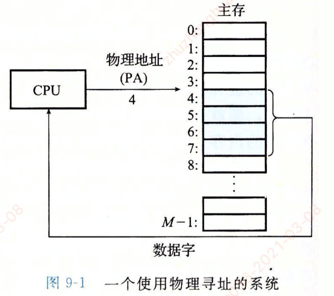
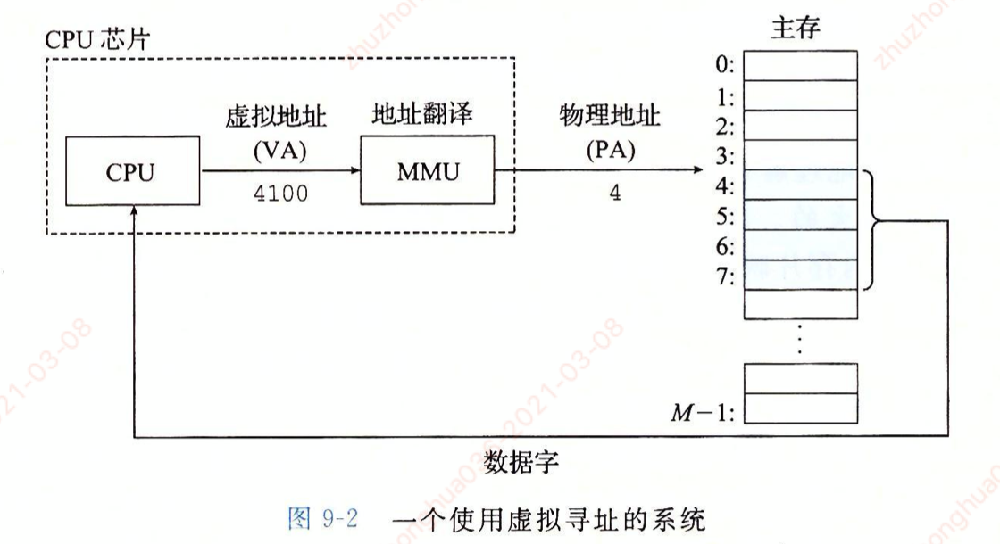
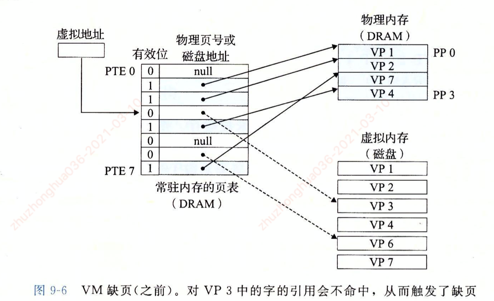
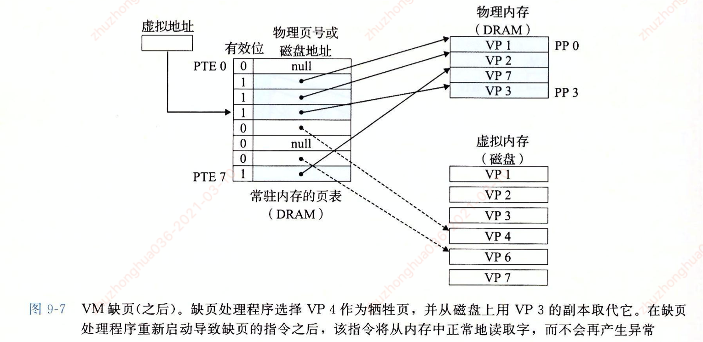

0.虚拟内存

- 一个系统中的进程是与其他进程共享CPU和主存资源的

##### 虚拟内存（VM）

- 虚拟内存是一种对主存的抽象概念，它为每个进程提供了一个大的，一致的和私有的地址空间。

- 虚拟内存提供了三个重要的能力：
  - 它将主存看成是一个存储在磁盘上的地址空间的高速缓存，在主存中只保存活动区域，并根据需要在磁盘和主存之间来回传送数据，通过这种方式，它高效地使用了主存。
  - 它为每个进程提供了一致的地址空间，从而简化了内存管理
  - 它保护了每个进程的地址空间不被其他进程破坏

#### 1.物理寻址和虚拟寻址

##### 1.1.物理寻址

- 计算机系统的**主存**被组织成一个由**M个连续的字节大小**的单元组成的**数组**，每个字都有一个唯一的物理地址。根据这种结构，CPU使用物理地址访问内存的方式称为物理寻址。
- 物理寻址示例：加载一条指令，读取从物理地址4处开始的4字节字。
  - 当cpu执行这条加载指令时，会生成一个有效物理地址，通过内存总线，将物理地址传递给主存。
  - 主存取出从物理地址4处开始的4字节字，并将它返回给CUP，cpu会将他存放在一个寄存器里。

##### 1.2.虚拟寻址

- 使用虚拟寻址，CPU通过生成一个虚拟地址来访问主存，这个虚拟地址在被送到内存之前先转换成适当的物理地址。
- 将一个虚拟地址转换成物理地址的任务叫做地址翻译。地址翻译由CPU芯片上的内存管理单元来实现。
  - 内存管理单元（MMU）：利用存放在主存中的查询表来动态翻译虚拟地址，该表的内容由操作系统管理

#### 2.地址空间

- 地址空间是一个非负整数地址的有序集合
- 在一个带虚拟内存的系统中，CPU从一个有N=2^n个地址的地址空间中生成虚拟地址，这个地址空间称为虚拟地址空间
- 一个系统还有一个物理地址空间，对应于系统中物理内存的M个字节

##### 主存中的每个字节都有一个选自虚拟地址空间的虚拟地址和一个选自物理地址空间的物理地址

#### 3.虚拟内存作为缓存的工具

- 虚拟内存也是被组织为一个由存放在磁盘上的N个连续的字节大小的单元组成的数组。每个字节都有一个唯一的虚拟地址，作为到数组的索引
- 磁盘上的数据被分割为块，块作为磁盘和主存之间的传输单元 — 对应的，虚拟系统将虚拟内存分割为**虚拟页（Virtual Page，VP）** —》 物理内存也被分割为**物理页（Physical Page，PP）**

##### 虚拟页面的集合都分为三个不相交的子集：

- 未分配的：VM系统还未分配的页。未分配的块没有任何数据和他么相关联，因此也就不占用任何磁盘空间
- 缓存的：当前已缓存在物理内存中的**已分配页**
- 未缓存的：未缓存在物理内存中的**已分配页**

##### 3.1.DRAM缓存的组织结构

- 使用术语SRAM缓存来表示位于CPU和主存之间的L1，L2和L3高速缓存，用DRAM缓存来表示虚拟内存系统的缓存，他在主存中缓存虚拟页
- 如果DRAM缓存没有命中，则系统通过访问磁盘来获取数据，访问磁盘开销很大，所以DRAM缓存非常重要。

- 因为大的不命中处罚和访问第一个字节的开销，虚拟页往往很大，通常是4KB～2MB。
  - 因为对磁盘的访问时间很长，DRAM缓存总是使用写回，而不是直写
  - 写回：当CPU要将数据写入内存时，**只会先更新缓冲内存上的数据**，随后再让缓冲内存在**总线不塞车的时候，才把数据写回DRAM**，所以速度自然快得多
  - 直写：当CPU要将数据写入内存时，除了**更新缓冲内存上的数据外，也将数据写在DRAM中**，以维持主存于缓冲内的一致性

##### 3.2.页表

- 虚拟内存系统必须有某种方法来判定一个虚拟页是否缓存在DRAM中的某个地方。
  - 如果有缓存，系统必须确定这个虚拟页存放在那个对应的物理页中。
  - 如果没有命中，系统必须判断这个虚拟页存在磁盘的那个位置，在物理内存中选择一个牺牲页，并将虚拟页从磁盘复制到DRAM中，替换这个牺牲页

**页表：**

- 是一个存放在物理内存中一个数据结构，页表将虚拟页映射到物理页。
  - 每次地址翻译硬件将一个虚拟地址转换为物理地址时，都会读取页表
  - 操作系统负责维护页表的内容，以及在磁盘与DRAM之间来回传送页

- 页表是一个页表条目（Page Table Entry,PTE）的数组
  - 虚拟地址空间中的每个页在页表中一个固定偏移量处都有一个PTE

##### 3.3.页命中

##### 3.4.缺页

- DRAM缓存不命中称为缺页（page fault）
- 例如：cpu引用了VP3（虚拟页）中的一个字，VP3并未缓存在DRAM中。
  - 地址翻译硬件从内存中读取PTE3（内存的页表），从有效位推断出VP3未被缓存，并且触发一个缺页异常
  - 缺页异常调用内核中的缺页异常处理程序，该程序会选择一个牺牲页，就是存在PP3中的VP4。如果VP4已经被修改了，那么内核就会将它复制会磁盘
  - 内核会修改VP4的页表条目，反映出VP4不再缓存在主存中

- 接下来，内核从磁盘复制VP3到内存中的PP3，更新PTE3，随后返回。
  - 当一场处理程序返回时，他会重新启动导致缺页的指令，该指令会把导致缺页的虚拟地址重发送到地址翻译硬件。
  - 现在，VP3已经缓存在主存中了，那么页命中也能由地址翻译硬件正常处理了

##### 页面分配与局部性

