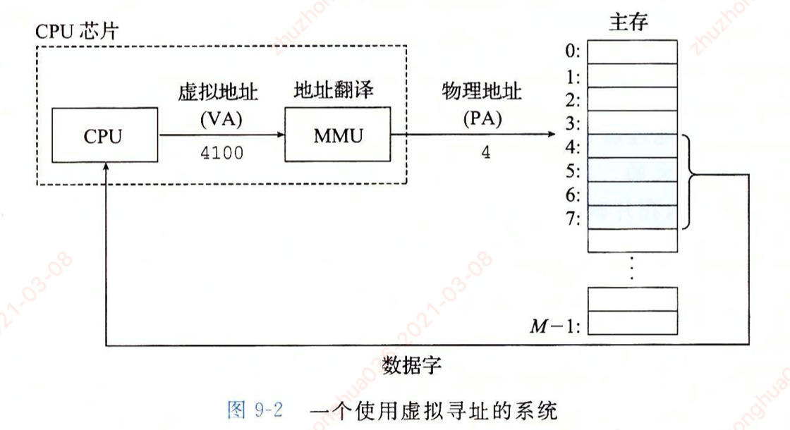

1. 虚拟内存是什么？为什么要设计虚拟内存
2. 虚拟内存的结构
3. 分页，页表
4. 程序运行时需要使用内存数据，当没有时的处理。缺页中断
5. 内存映射，- 文件映射，匿名映射
6. mmap - 零拷贝

#### 1.物理内存与虚拟内存

##### 物理内存：

- 物理内存指的是真实的内存条，当磁盘中的程序被加载执行时，该程序的数据和代码都是先被加载到内存中
  - 内存像一个数组，每个存储单元被分配了一个地址，这个地址就是物理地址，所有的物理地址构成物理地址空间
  - CPU使用物理地址寻址，这条指令中的地址就是数据真实存放的地址

##### 虚拟内存：

- 虚拟内存是一种对物理内存的抽象概念
  - 它为每个进程提供了以大的，一致和私有的连续地址空间，这个虚拟的空间甚至还可以比内存的容量还大
  - 让每个进程都以为拥有一个巨大的连续内存可以使用，这是一种假象
- **虚拟地址寻址：**
  - CPU使用虚拟地址向内存寻址，是通过专用的**内存管理单元（MMU）**把虚拟地址转换为真实的物理地址，这种转换叫**地址翻译**
  - 操作系统把虚拟地址和物理地址转换使用的映射关系维护在**页表**中

#### 2.重要概念：

- 每个进程有独立的虚拟地址空间，进程访问的虚拟地址空间并不是真正的物理地址
- 虚拟地址可通过每个进程上页表与物理地址进行映射，获得真正的物理地址
- 如果虚拟地址所对应的物理地址不在物理内存中，则产生缺页中断，操纵系统捕获到缺页中断后，会真正分配物理地址，同时更新进程的页表。
  - 如果此时物理内存已经耗尽，则根据内存替换算法淘汰部分页面至物理磁盘中
  - **缺页中断如何产生，已经如何进行物理内存的分配 ？？？**
- **内存核心概念：** 物理内存一定要映射才能被访问，CPU不认物理内存，CPU只认虚拟内存，访问物理内存是MMU的事情。
- 理论上可以一次性把所有的物理内存都提前映射好（通过页表记录映射关系），但是考虑到大部分内存不会被访问到，所以随用随建才更合理。  ----《深入理解linux内核》

#### 3.虚拟地址空间

- 程序要运行需要先加载到内存中，而cpu只认虚拟内存，所以当程序运行时，需要将程序的各种数据和代码等都存放在虚拟地址空间中。

##### 3.1.虚拟地址的空间分布如下(32位)：

- 对于32位操作系统，它的寻址空间（虚拟地址空间）为4G（2^32次方大小）
- 操作系统的核心是内核，它独立于普通的应用程序，操作系统的作用有：
  - 可以访问受保护的内存空间，也有访问底层硬件设备的所有权限
- 为了保护用户进程不能直接操作内核，操作系统将虚拟空间划分为两部分，**内核空间和用户空间，**
- linux操作系统下，将最高位的1G字节（从虚拟地址0xC0000000 到 0xFFFFFFFF）,供内核使用，称为内核空间，而将较低的3G字节（从虚拟地址0x00000000 到 0xBFFFFFFF）,供各个进程使用，称为用户空间

##### 3.2.一个Linux进程的虚拟内存

- 每个运行的程序就是一个进程，程序运行过程中需要使用到各种数据和代码，这些都放在当前进程的虚拟地址的用户空间中，同时程序运行也需要与内核打交道，所以当前进程的虚拟地址空间中也有一部分空间为内核空间。

##### Linux为每个进程维护了一个单独的虚拟地址空间，其中包含了：

- **内核虚拟内存：** 包含了内核中的代码和数据结构
  - 内核虚拟内存的某些区域被映射到所有进程共享的物理页面。例如每个进程共享的代码和全局数据结构（如glib.so库文件）
  - 内核虚拟内存的其他区域包含了每个进程都不相同的数据。比如页表，内核在进程的上下文中执行代码时使用的栈（程序计数器吗？？？）

- **进程虚拟内存，** 由低地址到高地址分别是：
  - **1.只读段:** 该部分空间只能读，不能写，包括代码段（.text），rodata段（C常量字符和 #define定义的常量）
  - **2.数据段：** 保存全局变量，静态变量
  - **3.堆Heap：** 动态内存，malloc/new所申请的内存空间，其中堆顶的位置可以通过brk，和sbrk进行动态调整
  - **4.文件映射区域（mapping file）：** 如动态库，共享内存等映射物理空间的内存，一般是mmap函数所分配的虚拟地址空间
  - **5.栈Stack：** 用于维护函数调用的上下文空间，一般为8M。

##### 3.3.验证进程地址空间分布

~~~c
#include <stdio.h>
#include <unistd.h>
#include <stdlib.h>
#include <string.h>

int global_num = 0;  //全局变量-未初始化
char global_str_arr[65535] = {'a'};  //全局变量-已初始化

int main() {
    printf("process address space....... \n");

    //局部变量-未初始化
    char *heap_var = NULL;
    int local_var = 0;
//    printf("Address of function main 0x%lx\n", main);
    printf(" Address of function main: 0x%08x\n", main);
    //求全局变量在虚拟地址空间中的地址
    printf("    Address of global_num: 0x%08x\n", &global_num);
    // 已初始化变量地址（.data） 在 未初始化变量地址（.bss）下面
    printf("Address of global_str_arr: 0x%08x\n", global_str_arr);

    //栈空间，局部变量 --高地址
    printf("          Top of stack is: 0x%08x\n", &local_var);
    //堆空间首地址
    printf("           Top of Heap is: 0x%08x\n", heap_var);
    heap_var = malloc(sizeof(char) * 4);
    printf("           Top of Heap is: 0x%08x\n", heap_var);
    
    return 0;
}
~~~

#### 4.分页，页表

##### 虚拟地址和物理地址的映射关系是以“页”为单位的。

- 分页就是把整个虚拟内存和物理内存分割成大小固定的块（4kb），以一个页作为映射的最小单位。
- CPU访问一个虚拟地址，虚拟地址被翻译为物理地址，从而确定数据在内存中的那个位置。虚拟地址的页和物理地址的页的映射关系存在于页表中。

##### CPU寻址时，这个映射有三种可能：

- **未分配：** 虚拟地址所在的那一页并未被分配，代表没有数据和他们关联，这部分也不会占用内存
- **未缓存：** 虚拟地址所在的那一页被分配了，但在物理内存中没有对应映射
- **已缓存：** 虚拟地址所在的那一页就在物理地址中

##### 4.2.缺页中断

- 当访问一个未缓存的区域时，系统将产生缺页中断
  - 然后进程被阻塞，等待操作系统将缺失的那一页从磁盘复制到内存
  - 当复制完成后，CPU继续执行导致缺页中断的那条指令，此时就会正常执行了。
- 这种仅在需要的时候才将页面拷贝到内存中的策略叫做按需调度页面
- 所以当程序被装入内存的时候，开始时仅有很小一部分内容被放入内存。程序在执行过程中不断缺页，不断的把需要的部分拷贝进内存

#### 5.内存映射

