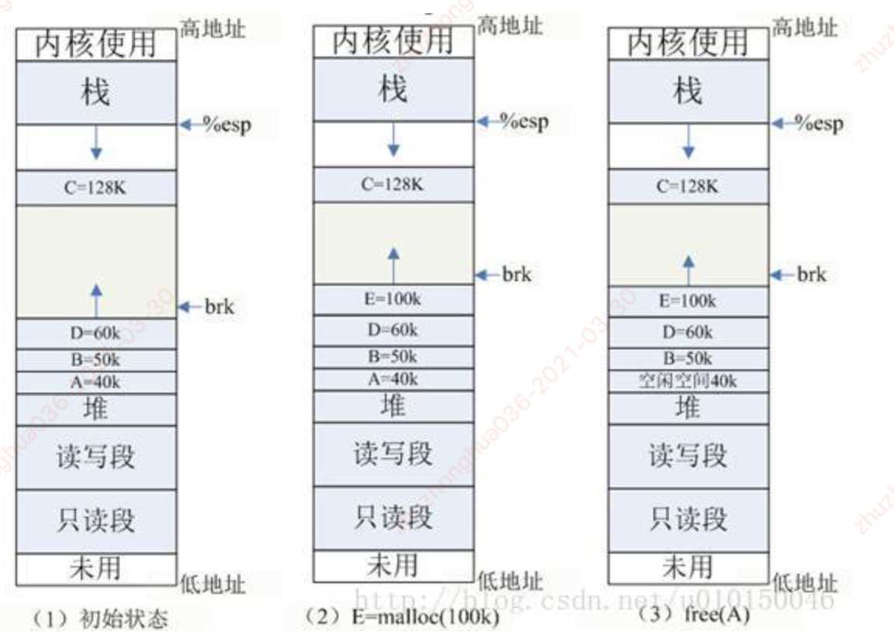
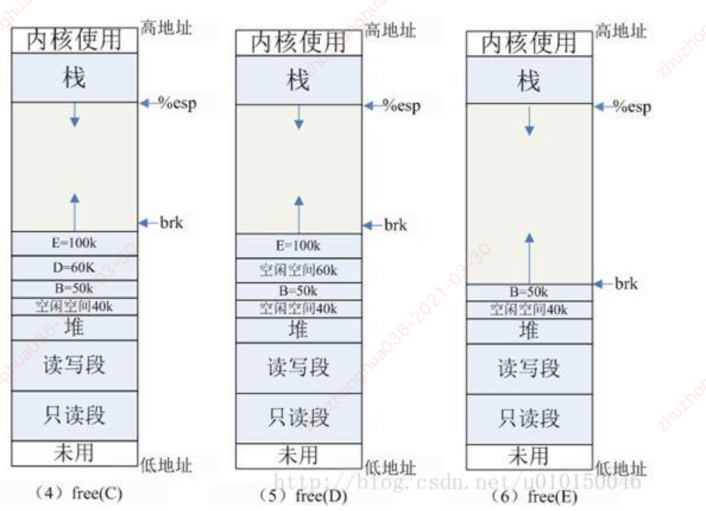

1. 内存分配相关的api
2. malloc详解

#### 1.内存分配api

##### 1.1.常见的内存分配api包括：kmalloc，kzalloc，vmalloc，malloc，和get_free_page

- **malloc：**用于**用户空间**申请内存。除非被阻塞否则他执行的速度非常快，而且不对获得空间清零。
  - 申请的空间在进程虚拟地址空间的用户态Heap区域分配
- **vmalloc：** 用于**申请较大的内存空间**，**虚拟内存是连续的**，但是在**物理上他们不要求连续**
- **kmalloc：** 申请的是较小的连续的物理内存，虚拟地址上也是连续的。除非被阻塞否则他执行的速度非常快，而且不对获得空间清零
- **get_free_page:** 申请的内存是一整页，一页的大小一般是128k
- kzalloc 先是用kmalloc申请空间，然后用memset清零来初始化，所有申请的元素都被初始化为0

##### 1.2 malloc内存分配源码解析

- malloc的底层是通过brk来实现的，brk是syscall
- path：mm/mmap.c

~~~c
void	*malloc(size_t __size)
~~~

- 解析：
  - 功能：分配长度为_size 字节的内存块
  - 如果分配成功则返回指向被分配内存的指针，否则返回空指针NULL
  - 当内存不再使用时，应使用free函数将内存块释放

#### 1.3.堆内分配：

- malloc分配空间时是在Heap上分配的，Linux维护了一个break指针，这个指针指向堆空间的某个地址。
  - 从堆起始地址道break之间的地址空间为映射好的，可以供进程访问；
  - 而从break往上，是未映射的地址空间，如果访问这段空间则程序回报错

- 要增加一个进程实际的可用堆大小，需要将break指针向高地址移动，Linux中通过brk和sbrk系统调用操作break指针

~~~c
void	*brk(const void *addr)
void	*sbrk(int increment);
~~~

- 解析：
  - brk是将break指针直接设置为某个地址（addr位置），而sbrk将break从当前位置移动increment所指定的增量
  - brk在执行成功时返回0，否则返回-1
  - sbrk成功时返回break移动之前所指向的地址，否则返回(void*)-1
- 将increment设置为0，调用sbrk可以获得当前break的地址

##### 1.4.brk源码解析

#### 2.内存分配相关问题

##### 2.1.思考题：malloc是如何分配内存的？

- malloc是glibc中的内存分配函数，也是最常用的动态内存分配函数，其内存必须通过free进行释放，否则导致内存泄漏
- malloc分配逻辑：
  - 若申请的内存**小于128k，调用sbrk()**,将堆顶指针向高地址移动，获得新的虚拟空间；
    - sbrk只是修改栈顶指针位置
  - 若申请的内存**大于128K，调用mmap(),**在文件映射区域中分配匿名虚拟空间；
    - mmap可用于生成文件的映射以及修改匿名页面的内存

##### 2.2.思考题：malloc分配多大的内存，就会占用多大的物理内存吗？

- malloc申请分配的内存是虚拟地址空间，而虚拟地址空间和物理地址空间使用进程表（在内核态）进行映射。
- **malloc申请内存后，并不会马上占用实际内存，而是第一次使用时发现虚拟内存对应的物理页面未分配，就会产生缺页中断，系统接收到中断信号后，才真正分配物理页面，同时更新进程表的映射关系，这是Linux虚拟内存管理的核心概念之一。**

##### 2.3.free的内存真的就释放了吗？

- 原则上所有malloc/new 分配的内存，都需要free/delete 来进行释放，但是free了的内存真的释放了吗？

- 根据不同的例子进行分析：

  - 1.初始状态：如图 (1) 所示，系统已分配 ABCD 四块内存，其中 ABD 在堆内分配， C 使用 mmap 分配。为简单起见，图中忽略了如共享库等文件映射区域的地址空间。
  - 2.E=malloc(100K)：分配 100k 内存，小于 128k ，从堆内分配，堆内剩余空间不足，扩展堆顶 (brk) 指针。
  - 3.free(A)：释放 A 的内存，在 glibc 中，仅仅是标记为可用，形成一个内存空洞 ( 碎片 ) ，并没有真正释放。如果此时需要分配 40k 以内的空间，可重用此空间，剩余空间形成新的小碎片。

  

  - 4.free(C)：C 空间大于 128K ，使用 mmap 分配，如果释放 C ，会调用 munmap 系统调用来释放，并会真正释放该空间，还给 OS ，如图 (4) 所示。
  - 5.free(D)：与释放 A 类似，释放 D 同样会导致一个空洞，获得空闲空间，但并不会还给 OS 。此时，空闲总空间为 100K ，但由于虚拟地址不连续，无法合并，空闲空间无法满足大于 60k 的分配请求。
  - 6.free(E)：释放 E ，由于与 D 连续，两者将进行合并，得到 160k 连续空闲空间。同时 E 是最靠近堆顶的空间，glibc 的 free 实现中，只要堆顶附近释放总空间（包括合并的空间）超过 128k ，即会调用 sbrk(-SIZE) 来回溯堆顶指针，将原堆顶空间还给 OS ，如图 (6) 所示。而堆内的空闲空间还是不会归还 OS 的。

##### 总结：

- malloc使用mmap分配的内存（大于128K），调用free释放最终会调用unmap系统调用，会马上将内存还给OS，实现真正的释放
- 堆内的内存，只有释放堆顶的空间，同时堆顶总连续空间大于128K才使用sbrk进行回收，真正归还OS
- 堆内的空闲空间，是不会归还给OS的

