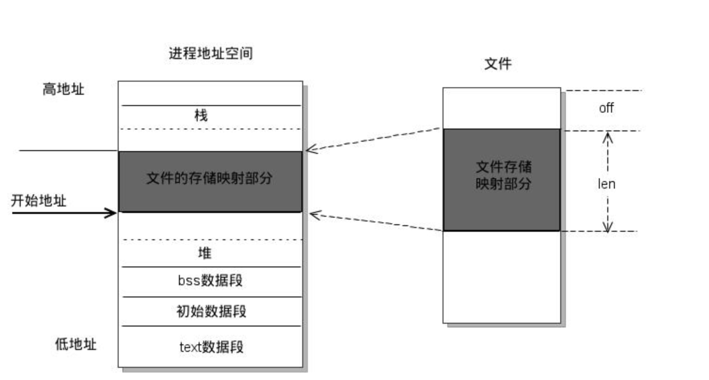
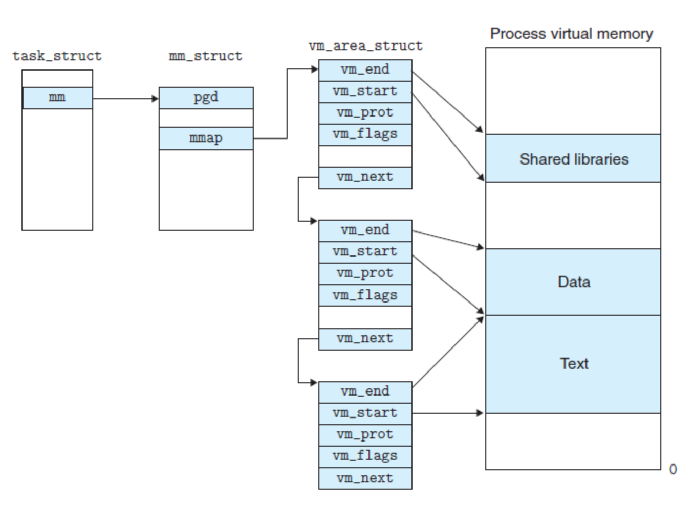

1. 内存映射，- 文件映射，匿名映射
3. mmap - 零拷贝

#### 1.内存映射

- 内存映射分为文件映射和匿名映射

##### 1.1.文件映射

- 文件映射是指代表这个映射的vma对应到一个文件中的某个区域。
- 应用程序获取某个文件的数据，通常做法是open一个文件，然后调用read/write去读写文件，很少使用文件映射的方式。
- 底层native开发中，用户程序也可以使用mmap系统调用将一个文件的某个部分映射到内存上（对应到一个vma），然后以访问内存的方式去读写文件。
  - 用户程序很少使用mmap，但是用户进程中正在执行的可执行代码（包括可执行文件，lib库文件），都是以mmap的方式进行映射的。

##### 1.2.零拷贝

- 文件映射是将文件的磁盘高速缓存中的页面直接映射到了**用户空间（mapping file区）**，用户可以0拷贝地对文件进行读写。
- 而使用read/write的话，则会在用户空间的内存和磁盘高速缓存间发生一次拷贝

##### 1.3.匿名映射

- 匿名映射相对于文件映射，代表这个映射的vma没有对应到文件。
- 用户空间普通的内存分配（堆空间，栈空间），都属于匿名映射。
- 每个进程可能通过各自的文件映射来映射到同一个文件上（比如glibc的so文件），匿名映射是在多个进程中通过各自的匿名映射来映射同一段无力内存。
  - 比如fork之后父子进程共享原来的无力内存（copy on write）

#### 2.mmap

##### 2.1.mmap基本概念

- mmap是一种内存映射文件的方法，即将一个文件或者其他对象映射到进程的地址空间（用户态），实现文件磁盘地址（物理地址）和进程虚拟地址空间中一段虚拟地址（虚拟地址用户态）的一一对应关系。
- 实现这样的映射关系后，进程就可以采用指针的方式读写操作这一段内存，而系统会自动回写脏页面到对应的文件磁盘上（即以访问内存的方式操作文件），完成对文件的操作而不必再调用read，write等系统调用函数。
- 内核空间对这段区域的修改也直接反映到用户控件，从而可以实现不同进程间的文件共享。

##### 进程的地址空间划分

- 由上图可以看出，**进程的虚拟地址空间，由多个虚拟内存区域构成。**
- **虚拟内存区域**是进程的虚拟地址空间中的一个同质区间（即具有同样特性的连续地址范围）
- 虚拟内存区域种类包括：text数据段（代码段），初始数据段（data段），bss数据段，堆，栈和内存映射，他们都是一个独立的虚拟内存区域
  - 内存映射服务的地址空间处于堆栈之间的空余部分

##### vm_area_struct结构

- Linux内核使用vm_arem_struct结构来表示 一个独立的虚拟内存区域，由于每个不同质的虚拟内存区域功能和内部机制都不同，因此一个进程使用多个 vm_arem_struct 结构来分别表示不同类型的虚拟内存区域。
- 各个vm_arem_struct 结构使用链表或树形结构链接，方便进程快速访问

- vm_area_struct 结构中包含区域起始和终止地址以及其他相关信息，同时包含一个v m_ops指针，mmap函数就是要创建一个新的vm_area_struct结构，并将其与文件的物理磁盘地址相连。

#### 3.mmap内存映射原理

mmap内存映射的实现过程，总的来说可以分为三个阶段：

##### （一）进程启动映射过程，并在虚拟地址空间中为映射创建虚拟映射区域

- 1.进程在用户空间调用库函数mmap，原型为：

~~~c
void *	mmap(void *start, size_t length, int prot, int flag, int fd, off_t offset);
~~~

- 2.调用了mmap函数后，会在当前进程的虚拟地址空间中，寻找一段空闲的满足要求的连续的虚拟地址
- 3.为此虚拟区分配一个vm_area_struct结构，接着对这个结构的各个域进行初始化（vm_start,vm_end地址空间）
- 4.将新建的虚拟区结构vm_area_struct 插入到进程的虚拟地址区域链表或树中

#####（二）调用内核空间的系统调用函数mmap（不同于用户空间函数），实现文件的物理地址和进程虚拟地址的一一映射关系

- 5.为映射分配了新的虚拟地址区域后，通过待映射的文件指针，在文件描述符表（fd）中找到对应的文件描述符，通过文件描述符，链接到内核“已打开文件集”中该文件的文件结构题（struct file），每个文件结构体维护者和这个已打开文件相关各项信息
- 6.通过该文件的文件结构体，链接到file_operations模块，调用内核mmap函数，原型为：

~~~c
int mmap(struct file *flip, struct vm_area_struct *vma)
~~~

- 7.内核mmap函数通过虚拟文件系统inode模块定位到文件磁盘物理地址
- 8.通过remap_pfn_rang函数建立页表，即实现了文件地址和虚拟地址区域的映射关系。此时，这片虚拟地址并没有任何数据关联到主存中。

**注：** 前面两个阶段只是创建一个虚拟内存区域，并完成物理地址到虚拟地址的一一映射，但是并没有将任何文件数据拷贝到主存。真正的文件读取是当进程发起读或写操作时。

##### （三）进程发起对这片映射空间的访问，引发缺页异常，实现文件内容到物理内存（主存）的拷贝

- 9.进程的读或写操作会访问虚拟地址空间这一段映射地址，通过查询页表，发现这一段地址并不在物理页面上。因为目前只建立了地址映射，真正的硬盘数据还没有拷贝到内存中，因此引发缺页异常。
- 10.缺页异常进行一系列判断，确定无非法操作后，内核发起请求调页过程。
- 11.调页过程先在交换缓存空间（swap cache）中寻找需要访问 的内存页，如果没有则调用nopage函数把所缺的页从磁盘装入到主存中。
- 12.之后进程即可对这片主存进行读或者写的操作，如果写操作改变了其内容，一定时间后系统会自动回写脏页面到对应磁盘地址，也即完成了写入到文件的过程

**注：** 修改过的脏页面并不会立即更新回文件中，而是有一段时间的延迟，可以调用msync()来强制同步，这样所写的内容就能立即保存到文件里了

#### 4.常规文件操作

##### 4.1.常规文件系统操作（调用read/fread等类函数）中，函数的调用过程：

- 1.进程发起读文件请求
- 2.内核通过查找进程文件符表，定位到内核已打开文件集上的文件信息，从而找到此文件的inode
- 3.inode在addrss_space 上查找要请求的文件页是否已经缓存在页缓存中（进程的内核态）。如果存在，则直接返回这片文件页的内容
- 4.如果不存在，则通过inode定位到文件磁盘地址，将数据从磁盘复制到页缓存。之后再次发起读页面过程，进而将页缓存中的数据发给用户进程

**总结：** 

- 常规文件操作为了提高读写效率和保护磁盘，使用页缓存机制。这样造成读文件时需要先将文件页从磁盘拷贝到页缓存中，由于页缓存处于内核空间，不能被用户进程直接寻址，所以还需要将页缓存中数据页再次拷贝到内存中对应的用户空间来。
- 这样，通过两次数据拷贝过程，才能完成进程对文件内容的获取任务。写操作也一样，必须先拷贝至内核空间对应的主存，再写回磁盘中（延迟写回），页需要两次数据拷贝

#### 5.mmap函数使用

##### 5.1.mmap函数原型：

~~~c
void *mmap(void *start, size_t length, int prot, int flags, int fd, off_t offset);
~~~

**参数解析：**

- 返回值： 成功执行时，mmap返回被映射区的指针。失败时，mmap返回MAP_FAILED(其值为-1)

~~~c
error被设为以下的某个值：
 1 EACCES：访问出错
 2 EAGAIN：文件已被锁定，或者太多的内存已被锁定
 3 EBADF：fd不是有效的文件描述词
 4 EINVAL：一个或者多个参数无效
 5 ENFILE：已达到系统对打开文件的限制
 6 ENODEV：指定文件所在的文件系统不支持内存映射
 7 ENOMEM：内存不足，或者进程已超出最大内存映射数量
 8 EPERM：权能不足，操作不允许
 9 ETXTBSY：已写的方式打开文件，同时指定MAP_DENYWRITE标志
10 SIGSEGV：试着向只读区写入
11 SIGBUS：试着访问不属于进程的内存区
~~~

- start ： 映射区的开始地址
- length： 映射区的长度
- prot： 期望的内存保护标志，不能与文件的打开模式冲突，是以下的某个值，可以通过or运算符组合使用

~~~c
1 PROT_EXEC ：页内容可以被执行
2 PROT_READ ：页内容可以被读取
3 PROT_WRITE ：页可以被写入
4 PROT_NONE ：页不可访问
~~~

- flags: 指定映射对象的类型，映射选项和映射页是否可以共享。可以组合使用

~~~c
 1 MAP_FIXED //使用指定的映射起始地址，如果由start和len参数指定的内存区重叠于现存的映射空间，重叠部分将会被丢弃。如果指定的起始地址不可用，操作将会失败。并且起始地址必须落在页的边界上。
 2 MAP_SHARED //与其它所有映射这个对象的进程共享映射空间。对共享区的写入，相当于输出到文件。直到msync()或者munmap()被调用，文件实际上不会被更新。
 3 MAP_PRIVATE //建立一个写入时拷贝的私有映射。内存区域的写入不会影响到原文件。这个标志和以上标志是互斥的，只能使用其中一个。
 4 MAP_DENYWRITE //这个标志被忽略。
 5 MAP_EXECUTABLE //同上
 6 MAP_NORESERVE //不要为这个映射保留交换空间。当交换空间被保留，对映射区修改的可能会得到保证。当交换空间不被保留，同时内存不足，对映射区的修改会引起段违例信号。
 7 MAP_LOCKED //锁定映射区的页面，从而防止页面被交换出内存。
 8 MAP_GROWSDOWN //用于堆栈，告诉内核VM系统，映射区可以向下扩展。
 9 MAP_ANONYMOUS //匿名映射，映射区不与任何文件关联。
10 MAP_ANON //MAP_ANONYMOUS的别称，不再被使用。
11 MAP_FILE //兼容标志，被忽略。
12 MAP_32BIT //将映射区放在进程地址空间的低2GB，MAP_FIXED指定时会被忽略。当前这个标志只在x86-64平台上得到支持。
13 MAP_POPULATE //为文件映射通过预读的方式准备好页表。随后对映射区的访问不会被页违例阻塞。
14 MAP_NONBLOCK //仅和MAP_POPULATE一起使用时才有意义。不执行预读，只为已存在于内存中的页面建立页表入口。
~~~

- fd: 有效的文件描述词。为了兼容文件，其值设为-1
- offset：被映射对象内容的起点

##### 5.2.munmap函数

- munmap函数用于在进程地址空间中解除一个映射关系

~~~c
int munmap( void * addr, size_t len ) 
~~~

- addr： 是调用mmap函数时返回的地址
- len：是映射区的大小

**注：** 当映射关系解除后，对原来映射地址的访问将导致段错误发生

##### 5.3.msync函数

~~~c
int msync( void *addr, size_t len, int flags )
~~~

- 进程在映射空间对共享内容的改变并不直接写回到磁盘文件中，往往在调用munmap后才执行该操作
- 可以通过msync实现磁盘上文件内容与共享内存区的内容一致

#### 6.使用mmap的优缺点

- 优势
  - 读写文件避免了read() 和 wtie() 系统调用，页避免了数据的拷贝
  - 除了潜在的页错误，读写map后的文件不引起系统调用或者上下文切换，就像访问内存一样简单
  - 多个进程map同一个对象，可以共享数据
  - 可以直接使用指针来跳转到文件某个位置，不必使用lseek() 系统调用
- 劣势
  - 内存浪费，必须使用整数页的内存
  - 导致难以找到连续的内存区域
  - 创建和维护映射和相关的数据结构的额外开销

#### 7.mmap使用细节

 

https://blog.csdn.net/bbzhaohui/article/details/81665370

https://www.cnblogs.com/huxiao-tee/p/4660352.html

