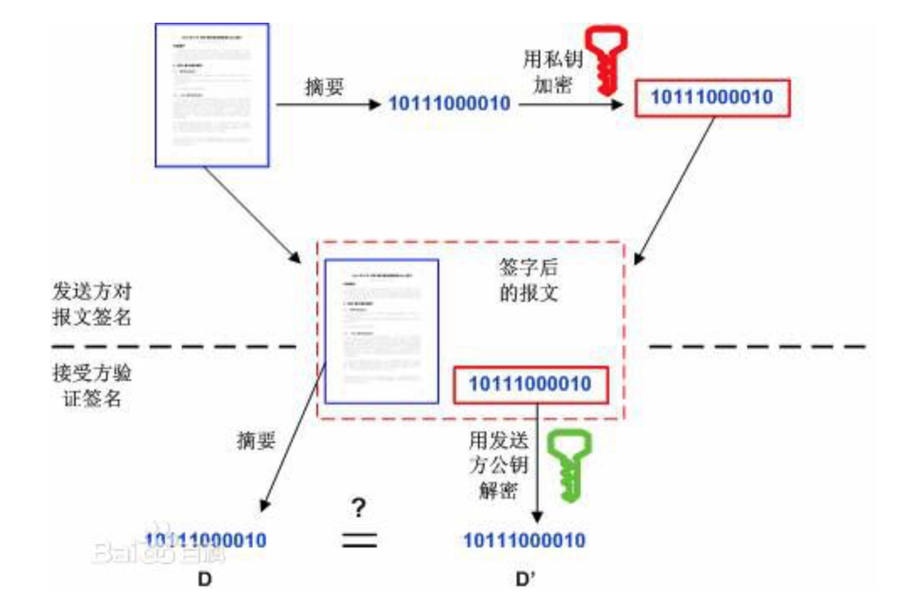
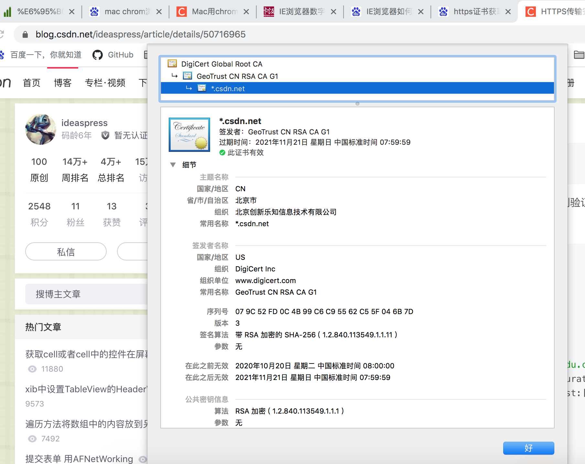
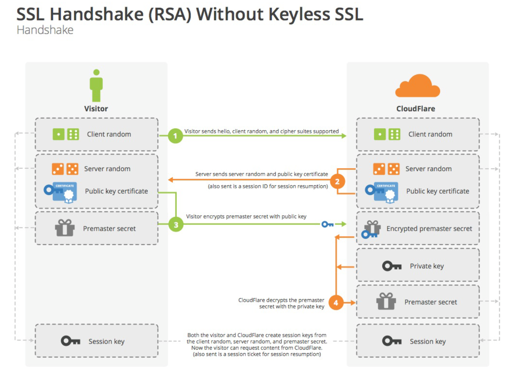
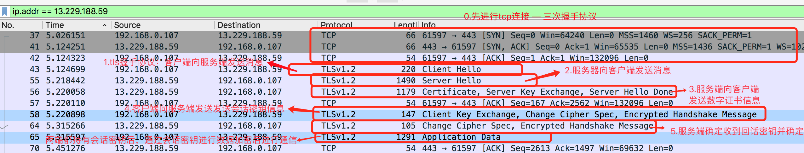
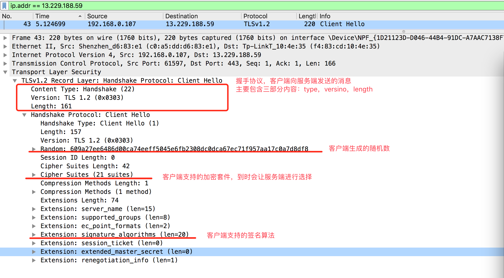
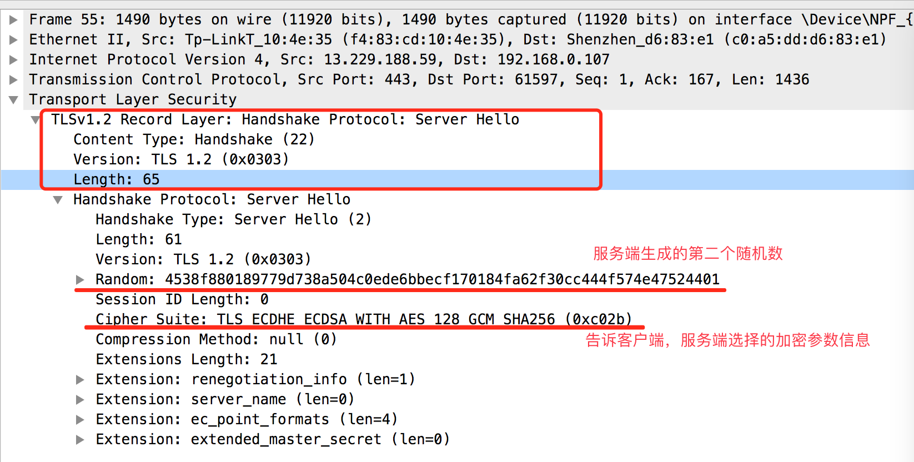
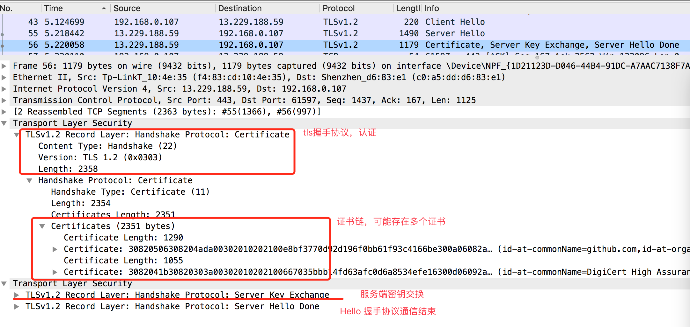
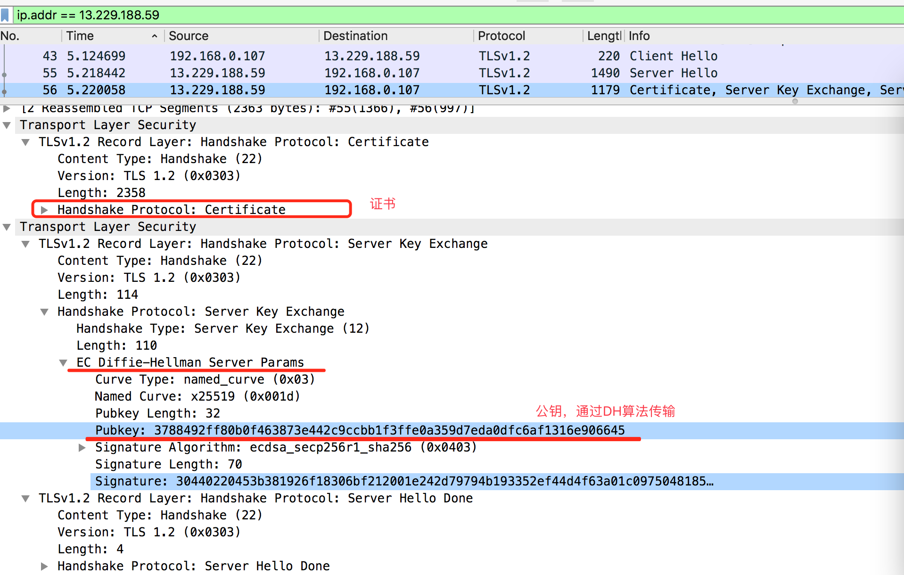
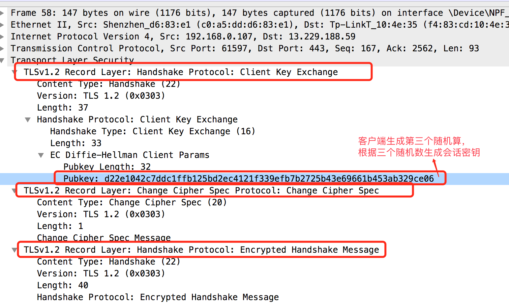
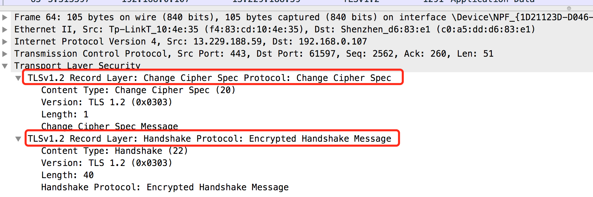

https://www.jianshu.com/p/031fb34a05bd?utm_campaign=maleskine&utm_content=note&utm_medium=seo_notes&utm_source=recommendation

### HTTPS

#### 1.密码学基础

##### 1.1.对称加密

- 加密与解密使用同一个密钥，

特点：

- 在使用对称加密算法时，要求发送方和接收方在安全通信之前，商定一个密钥。
- 优点：算法公开，计算量小，加密速度快，加密效率高。

- 缺点：交易双方使用同样的钥匙，安全性不高

##### 常见对称加密算法

- **DES：** 数据加密标准（Data Encoding Standard）是一种使用密钥加密的块密码，基于56位秘钥对称算法
- **AES：** 高级加密标准（Advanced Encryption Standard），用来替代原先的DES，AES的区块长度固定为128比特，密钥长度则可以为128，192或256比特
- **RC4：** 
- **IDEA：**

##### 1.2.非对称加密

- 一对秘钥，公钥-私钥
- 特点：
  - 对于一个公钥，有且只有一个对应的私钥
  - 公钥匙公开的，并且不能通过公钥反推出私钥
  - 通过公钥机密的密文只能通过私钥解密，通过私钥加密的密文也只能通过公钥解密

##### 非对称加密用途

- **1.对信息保密，防止中间人攻击：** 将明文使用公钥加密，传输给接收者，这样确保信息只能被拥有私钥的一方解密，其他人即使获取到密文也无法解密（因为没有私钥），该方法一般用于**交换对称密钥**
- **2.身份验证和防止信息篡改：** 私钥拥有者使用私钥加密一段授权明文，并将授权明文和加密后的密文，以及公钥一并发送出去，接收方只需要通过公钥将密文解密后与授权明文比对是否一致，就可以判断明文在中途是否被篡改过。**此方法用于数字签名**

##### 常见非对称加密算法

- **RSA:** 应用最广泛的非对称加密算法，1024位的RSA密钥基本安全，2048位的密钥及其安全。适用于数字签名和密钥交换。
- **DSA:** 数字签名算法（Digital Signature Algorithm）,该算法之用于签名，不能用于加解密，使用离散算法实现
- **Diffie-Hellmen:** 一种确保共享key安全穿越不安全网络的方法，用于网络上秘钥的交换
  - 在三次握手时，需要使用DH算法用于秘钥交换
- **EC：** 椭圆加密，非线性

#### 2.摘要算法

- 摘要算法原理是使用散列算法的单向数学函数应用于数据；将任意长度的一块数据转换为一个定长的，不可逆的数字（通常在128～256位之间）
- 特性：
  - 只要源文件不同，计算得到的结果，必然不同
  - 无法从结果反推出源数据

##### 2.1.常见摘要算法

- **MD5:**  用来将不同长度的数据块进行暗码运算成一个固定位的数值（通常是128位）
- **SHA-1:** 产生一个160位的散列值，用于创建数字签名的单向散列算法
- **MAC：**消息认证码
- **CRC：** 循环冗余校验，用于纠错

###### 应用场景：

- 如发件人生成邮件的散列值并加密它，然后将它与邮件本身一起发送。
- 而收件人同时收到邮件和散列值的密文，解密出原先的散列值；并由接收到的邮件生成另一个散列值，将两个散列值进行比较。如果两者相同，可以知道邮件在传输期间没有发生改变

##### 2.2.数字签名

- 数字签名就是非对称加密和摘要算法的一种应用，能够确保信息在发布后不会被篡改（摘要算法特性）。保证数据的完整性和可信性；同时也可以防止数据被他人伪造（非对称加密特性）

- 假如有一段授权文本需要发布，为了防止中途篡改，保证发布文本的完整性，以及文本是由指定的发布者发布的。
  - 先通过摘要算法得到发布内容的摘要，得到摘要之后，发布者使用私钥加密得到密文（签名），这时将源文本，密文（签名）以及公钥一起发布出去
  - 验证过程：首先验证公钥是否是发布者的公钥，然后用公钥对密文进行解密，得到摘要，使用发布者对文本同样的摘要算法得到摘要文本，对比摘要是否一致，即可确认信息是否被篡改或者是指定发布者发布的。
- 总结：
  - 根据源文件生成摘要信息，然后使用私钥对摘要信息进行加密得到密文（签名）
  - 接收者使用公钥对密文进行解密得到摘要，并根据摘要算法生成一个摘要，两个摘要进行比对。

#### 3.数字证书

##### 3.1.数字证书解决了什么问题？

- 发送方是我希望的发送方
- 得到公钥

##### 3.2.数字证书的内容

- 1.查看浏览器总的证书
  - 点击链接地址最左边的钥匙图标
  - 然后点击证书，即可查看证书内容
- 2.如果要下载证书，直接将证书拖入到文件中即可

##### 3.3.在Android中的应用：X509

#### 4.数字证书的校验过程

##### 4.1.数字证书的验证

- 数字证书的授权链

##### 4.2.SSL/TLS

- 目的：
  - 1.所有信息都是加密传播，第三方无法窃听
  - 2.具有校验机制，一旦被篡改，通信双方会立刻发现
  - 3.配备身份证书，防止身份被冒充

- SSL/TLS的实现思路：公钥加密发

**客户端先向服务器端索要公钥，然后用公钥解密信息，服务器收到密文后，用自己的私钥进行解密**

- 存在的问题？
  - 如何保证公钥不被篡改
    - 将公钥放在数字证书中，只要证书是可信的，公钥就是可信的
  - 如果传输数据太大，使用非对称加密太耗时？
    - 每一次对话（session），客户端和服务端都生成一个“对话密钥（session key）”，用它来加密信息。
    - 由于对话密钥是对称加密，所以运算速度非常快，而服务器公钥只用于加密对话密钥本身
    - 总结：使用对称加密算法对原文进行加密，非对称加密算法对密钥进行加密

ssl/tls握手过程：

#### 5.JCE -- java代码实现

- java加密框架 
- Clipher

#### 6.Okhttp框架中的http2的加密处理

#### 7.Https的网络通信流程

- https的本质是http + ssl，http是建立在tcp之上的，所以https通信首先要进行tcp三次握手，建立tcp连接，（syn --> ack + syn --> ack），然后在ssl/tls 层对数据进行加密

1. 客户端输入https链接首先与服务端建立tcp链接（三次握手）
2. 链接建立后，服务端会给客户端发送一个证书（包含公钥）
3. 客户端收到证书后，与服务端协商加密等级和加密算法，并且由客户端生成一个会话密钥（对称加密算法），接着使用公钥对会话密钥进行加密后发送给服务端
4. 服务端收到后，使用私钥进行解密，得到会话密钥，然后使用会话密钥对数据进行加解密进行通信

#### 7.2.通过WireShark抓取https通信过程的包内容查看

- 设置过滤条件： ip.addr == 13.229.188.59

下面根据wireshark抓包流程进行https通信流程的分析：

##### -1. 先进行TCP连接（三次握手协议）

##### -2.客户端向服务端发送消息，内容包括客户端生成的第一个随机数，和客户端支持的加密算法（加密套件 - Clipher Suites）

##### -3.服务端向客户端发送消息，告诉客户端服务端选择的加密套件，并生成第二个随机数

##### -4.服务端接着向客户端发送数字证书的信息

###### 4.2.Server Key Exchange 交换密钥信息

##### -5.客户端向服务端发送密钥交换信息，客户端会生成第三个随机数，然后根据前面生成的两个随机数，一共三个随机数生成会话密钥，并将会话密钥发送给服务端

##### -6.服务端收到会话密钥并验证通过，这样客户端和服务端都拥持有了会话密钥，后面的通过只需要通过会话密钥进行对称加密数据通信即可

#### 7.3.总结：

- https通信是使用非对称加密进行密钥（对称加密算法）传递，然后使用对称加密进行后面的业务数据的传输
  - 先进行TCP连接（SYN >>> SYN,ACK >>> ACK）,三次握手
  - 客户端与服务端线进行加密协议协商，并生成随机数  -- 确定加密算法（Cipher Suites）和两个随机数
  - 服务端将证书和公钥发送给客户端
    - 数字证书验证：数字签名认证，证书链
  - 客户端使用公钥对随机数进行加密后发送给服务端 -- 客户端根据加密算法和三个随机数得到会话密钥
  - 服务端使用私钥进行解密得到随机数 -- 服务端私钥解密拿到第三个随机数，再根据协商好的加密算法得到会话密钥
  - 最后两端根据会话密钥和协商算法进行对称加密数据通信

#### 8.Android apk签名原理

- 三个文件：
  - 原始数据消息摘要后，
- 数字签名：
  - 算法：非对称算法
  - 验证签名

