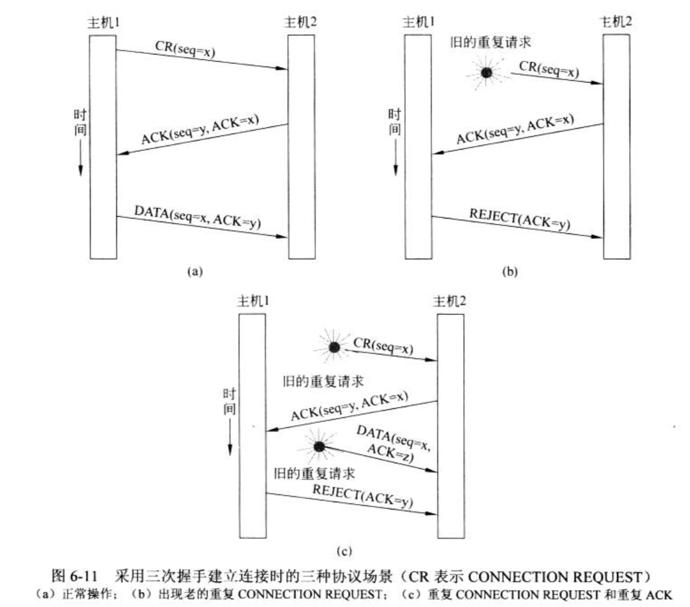

#### 传输协议的要素

- 传输层与数据链路层的差别
  - 1.在数据链路层，两台路由器通过一条有线或者无线物理信道直接进行通信；而在传输层，该物理信道被整个网络所替代

#### 1.寻址

- 当一个应用（一个用户）进程希望与另一个远程应用进程建立连接时，他必须指定要连接到那个应用进程上。
  - 通常使用的方法是为那些能够监听连接请求的进程定义相应的传输地址，**不同进程对应不同端口（port），也叫传输服务访问点（TSAP）**
  - 网络层上的端点称为**网络服务访问点（NSAP），即IP地址**

##### 1.1.传输连接的场景如下：

- 1.主机2上的邮件服务器进程将自己关联到TSAP 1522上，等待入境连接请求的到来。（Socket中的listen方法可以实现将进程关联到TSAP上）
- 2.主机1上的应用程序希望发送一个邮件消息，所以他把自己关联到TSAP 1208上，并且发送一个Connect请求，该请求消息指定主机1上的TSAP1208 作为源，主机2上的TSAP 1522作为目标。这个动作最终导致在应用进程和服务器之间建立了一个连接
- 3.应用进程发送邮件信息
- 4.作为响应，邮件服务器表示它将传递该消息
- 5.传输连接被释放

- 在网络中，每台计算机只有一个NSAP，但是可以有多个传输端点共享此网络服务访问点，那么如何区分这些传输端点呢？

##### 1.2.端口映射器

- 一个特殊的进程，为了找到一个给定服务名字（比如“BitTorrent”）相对应的TSAp地址（传输服务访问点）
  - 用户需要与端口映射器建立一个连接
  - 然后用户通过该连接发送一条信息指定它想要的服务名字；端口映射器返回相应的TSAP地址。
- 当一个新的服务被创建时，它必须向端口映射器注册，把它的服务名字（字符串）和TSAP告诉端口映射器。端口映射器会将该信息记录到他的内部数据库中，方便后续查询调用。

#### 2.连接建立

- 建立连接正常流程是：
  - 传输实体给接收方发送一个connection request 段，然后等待connnection accepted应该就可以。
- 当网络出现数据包丢失，延迟，损坏和重复时，将会导致严重的问题
- 例子：
  - 假如网络非常拥塞，以至于几乎所有的确认数据包都无法及时地返回发送端，因为每个数据包都超时，因此被迫重传或者三传。
  - 网络使用数据包技术，数据包可能受到网络流量拥挤的影响，从而需要很长时间才能到达目的地，也就是被网络延迟了，许久以后才被送到接收端。

##### 2.1.三次握手

#### 3.连接释放

- 终止连接的方式有两种：非对称释放和对称释放
  - 非对称释放：是电话系统的工作方式，会导致数据丢失
  - 对称释放：是把连接看成两个独立的单向连接，要求单独释放每一个单向连接。
- 

