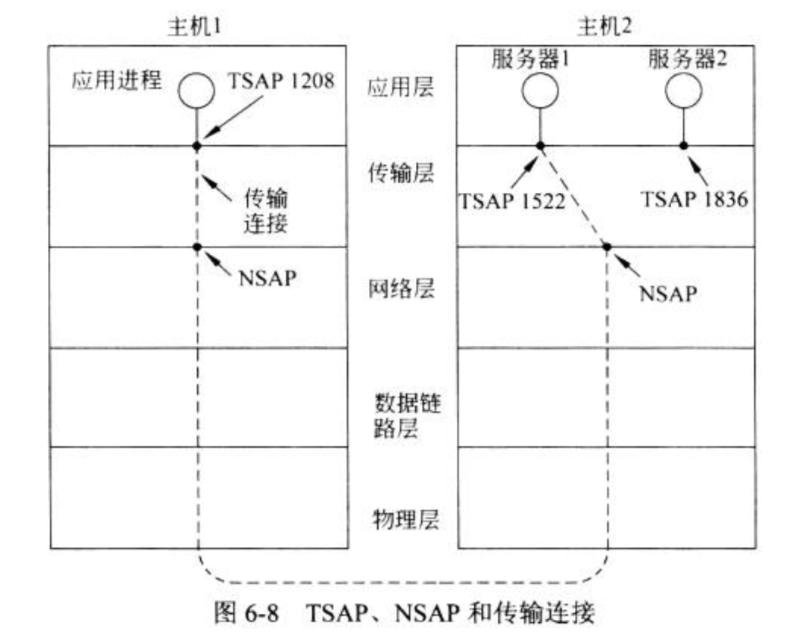

#### 传输协议的要素

- 传输层与数据链路层的差别
  - 1.在数据链路层，两台路由器通过一条有线或者无线物理信道直接进行通信；而在传输层，该物理信道被整个网络所替代
  - 2.

##### 1.寻址

- 当一个应用（一个用户）进程希望与另一个远程应用进程建立连接时，他必须指定要连接到那个应用进程上。
  - 通常使用的方法是为那些能够监听连接请求的进程定义相应的传输地址，**不同进程对应不同端口（port），也叫传输服务访问点（TSAP）**
  - 网络层上的端点称为**网络服务访问点（NSAP），即IP地址**

- 在网络中，每台计算机只有一个NSAP，但是可以有多个传输端点共享此网络服务访问点，那么如何区分这些传输端点呢？

##### 端口映射器

- 一个特殊的进程，为了找到一个给定服务名字（比如“BitTorrent”）相对应的TSAp地址（传输服务访问点）
  - 用户需要与端口映射器建立一个连接
  - 然后用户通过该连接发送一条信息指定它想要的服务名字；端口映射器返回相应的TSAP地址。
- 当一个新的服务被创建时，它必须向端口映射器注册，把它的服务名字（字符串）和TSAP告诉端口映射器。端口映射器会将该信息记录到他的内部数据库中，方便后续查询调用。

##### 2.连接建立

