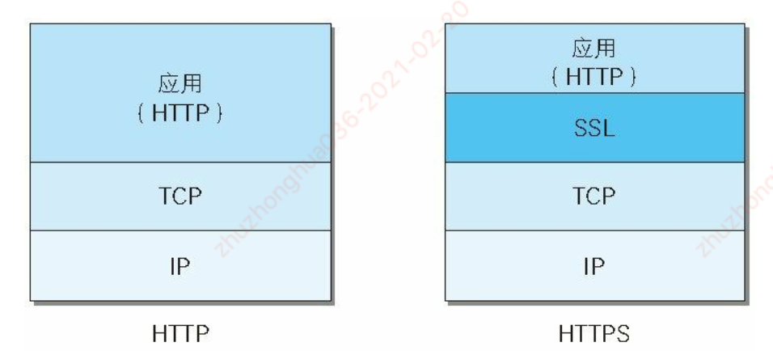

1. https

#### 1.HTTP缺点

- 通信使用明文（不加密），内容可能会被窃听
- 不验证通信方的身份，因此有可能遭遇伪装
- 无法证明保文的完整性，所以有可能已遭篡改

##### 加密处理：

- 通信的加密
  - HTTP协议中没有加密机制，但可以通过和SSL（Secure Socket Layer，安全套接层）或TLS（Transport Layer Security,安全层传输协议）的组合使用，加密HTTP的通信内容
  - 用SSL建立安全通信线路之后，就可以在这条线路上进行HTTP通信了。与SSL组合使用的HTTP被称为HTTPS（HTTP Secure，超文本传输安全协议）
- 内容的加密
  - 对HTTP协议传输的内容本身加密，即把HTTP报文里所含的内容进行加密处理，客户端对HTTP报文进行加密处理后再发送请求

#### 2.HTTPS = HTTP + 加密 + 认证 + 完整性保护

- http加上加密处理和认证以及完整性保护后即是https
- https是身披ssl外壳的http

##### 2.1.相互交换密钥的公开密钥加密技术

- 共享密钥加密
  - 加密和解密使用同一个密钥的方式称为共享密钥加密，也叫做对称密钥加密
- 使用两把密钥的公开密钥加密
  - 公开密钥加密使用一对非对称的密钥，一把叫做私有密钥，另一把叫做公开密钥；私有密钥不能让其他任何人知道，而公开密钥则可以随意发布，任何人读可以获得
  - 发送密文的一方使用对方的公开密钥进行加密处理，对方收到被加密的信息后，再使用自己的私有密钥进行解密。

##### 2.2.HTTPS采用混合加密机制

- 公开密钥加密与共享密钥加密相比，公开密钥加密的处理速度更慢，为发挥两者各自的优势进行组合使用，在交换密钥环节使用公开密钥加密方式，之后的建立通信交换保文阶段则使用共享密钥加密方式。

##### 2.3.证明公开密钥正确性的证书

#### 3.HTTP方式与Web服务器通信时的步骤

- 1.客户使用https的URL访问Web服务器，要求与Web服务器建立SSL连接
- 2.Web服务器收到客户端请求后，会将网站的证书信息传送一份给客户端
  - 证书中包含服务器公钥（非对称加密）
  - HTTPS中，服务端将公钥发给数字证书认证机构进行安全认证并对公钥进行数字签名，完成后公钥和签名组合成数字证书
  - 在和客户端通信时，服务端将数字证书发给客户端，客户端通过第三方安全认证机构（内置在浏览器中）对数字证书上的签名进行验证
- 3.客户端的浏览器与Web服务器开始协商SSL连接的安全等级，也就是信息加密的等级
- 4.客户端的浏览器根据双方同意的安全等级，建立会话密钥(对称加密)，然后利用服务器公钥将会话密钥加密，并传送给网站
- 5.Web服务器利用自己的私钥解密出会话密钥
- 6.Web服务器利用会话密钥加密与客户端之间的通信

