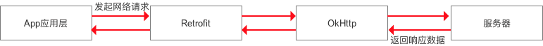

https://blog.csdn.net/carson_ho/article/details/73732115

https://www.jianshu.com/p/768b2c2ab9e4

1. Retrofit

   - Retrofit是什么？
   - 为什么设计出来

2. Retrofit的基本使用

3. Retrofit 注解

   - 标示请求方法	

   - 参数类注解调用过程解析

4. 原理解析

5. 设计模式

#### 1.Retrofit

##### 1.1.Retrofit是什么？

- Retrofit是一个RESTful的HTTP网络请求框架的封装
- 网络请求的工作本质上是OkHttp框架完成的，而Retrofit仅负责网络请求接口的封装
  - App应用程序通过Retrofit请求网络，实际上是使用Retrofit接口层封装请求参数，Header，Url等信息，之后由OkHttp完成后续的请求操作
  - 在服务端返回数据之后，OkHttp将原始的结果交给Retrofit，Retrofit根据用户的需求对结果进行解析

##### 1.2.为什么要设计Retrofit框架

- 之前分析了OkHttp框架原理，单OkHttp本质上是一个HTTP层面的框架。它的核心关注点在于HTTP协议的实现。
  - 包括封装请求报文Request，将Request通过TCP连接传输到服务器并接收服务器返回的响应报文Response。
  - 实际开发中使用okhttp实现网络请求，但每次都要处理HTTP相关的东西，例如okhttp框架最后返回的数据是一个ResponseBody对象实例，但业务开发中需要的是一个JavaBean的封装对象，这个时候就需要自己处理。
- Retrofit是一个API层面的框架，通过Retrofit实现网络请求
  - 只需要**声明一个接口，来代表访问的服务模块**，**接口里面的函数代表某个具体的网络请求**
  - Retrofit提供了一系列的注解，可以添加到函数和请求参数上，来提供HTTP请求的关键信息。
    - 引入注解的目的，相当于将Java接口变成了一个配置文件，通过注解提供的关键信息，Retrofit会进行配置的解析，并完成HTTP层面的工作
  - 函数里的请求参数就是发送给服务器的数据，函数的返回值就是服务器给我们返回的数据
  - 当我们要发起网络请求时，可以像普通的面向编程一样，拿到对象，传入参数，然后调用相应的函数。

#### 2.Retrofit的基本使用

- 添加依赖

~~~java
    implementation("com.squareup.okhttp3:okhttp:3.9.0")
    implementation 'com.squareup.retrofit2:retrofit:2.1.0'
    implementation 'com.squareup.retrofit2:converter-gson:2.1.0'
~~~

- 定义访问服务器的API

~~~java
public interface ApiServer {
    /**
     * 1.2 首页banner
     * https://www.wanandroid.com/banner/json
     * 方法：GET
     */
    @GET("banner/json")
    Call<HttpResult<List<Banner>>> getBanner();
}
~~~

- 创建Retrofit对象实例，并发起网络请求

~~~java
public class RetrofitStu {
    public void testRetrofit() {
      //1.创建Retrofit对象实例
        Retrofit retrofit = new Retrofit.Builder()
                .baseUrl("https://www.wanandroid.com/")
                .addConverterFactory(GsonConverterFactory.create())
                .build();
      //2.调用Retrofit的create方法获取ApiServer对象实例
        ApiServer apiServer = retrofit.create(ApiServer.class);
        Call<HttpResult<List<Banner>>> bannerCall = apiServer.getBanner();
      //3.发起异步请求
        bannerCall.enqueue(new Callback<HttpResult<List<Banner>>>() {
            @Override
            public void onResponse(Call<HttpResult<List<Banner>>> call, 
                                   Response<HttpResult<List<Banner>>> response) {
                HttpResult<List<Banner>> body = response.body();
                List<Banner> bannerList = body.data;
                System.out.println(bannerList.toString());
            }

            @Override
            public void onFailure(Call<HttpResult<List<Banner>>> call, Throwable t) {

            }
        });
    }
}

结果打印：
[Banner{desc='扔物线', id=29, imagePath='https://wanandroid.com/blogimgs/04d6f53b-65e8-4eda-89c0-5981e8688576.png', isVisible=1, order=0, type=0, title='我用 Jetpack Compose 写了个春节版微信主题，带炸弹特效', url='http://i0k.cn/4KryA'}, Banner{desc='', id=6, imagePath='https://www.wanandroid.com/blogimgs/62c1bd68-b5f3-4a3c-a649-7ca8c7dfabe6.png', isVisible=1, order=1, type=1, title='我们新增了一个常用导航Tab~', url='https://www.wanandroid.com/navi'}, Banner{desc='一起来做个App吧', id=10, imagePath='https://www.wanandroid.com/blogimgs/50c115c2-cf6c-4802-aa7b-a4334de444cd.png', isVisible=1, order=1, type=1, title='一起来做个App吧', url='https://www.wanandroid.com/blog/show/2'}, Banner{desc='', id=20, imagePath='https://www.wanandroid.com/blogimgs/90c6cc12-742e-4c9f-b318-b912f163b8d0.png', isVisible=1, order=2, type=1, title='flutter 中文社区 ', url='https://flutter.cn/'}]

~~~

##### 2.2Retrofit网络通信过程：

- 通过动态代理生成网络请求服务模块（create方法）
- 通过解析网络请求接口的注解，配置网络请求参数（服务模块中每个方法，会生成一个对应的请求）
- 通过网络请求适配器将网络请求对象进行平台适配 （CallAdapter）
- 通过网络请求执行器发起网络请求（默认是okhttp3.Call）
- 通过数据转换器解析服务器返回的数据（Converter）
- 通过回调执行器切换线程（子线程-》主线程）（CallBackExecutor-内部通过Handler进行线程切换）
- 用户在主线程处理返回结果

#### 3.Retrofit的注解

##### 3.1.HTTP请求方法的注解

- http请求方法注解支持有八种：GET，POST，PUT，DELETE，HEAD，PATCH，OPTIONS，HTTP

##### 3.2.标记类注解

- FormUrlEncoded：指请求体是一个Form表单
- Multipart：指请求体是一个支持文件上传的Form表单
- Streaming：指响应体的数据以流的形式放回

##### 3.3.参数类注解

- Headers：添加请求头，作用于方法
- Header：用于动态添加头部，作用域方法参数
- Body：用于非表单请求体，作用域方法参数
- Url：用于动态改变Url，作用域方法参数
- Path：用于替换请求地址，作用域方法参数
- Field：用于表单字段参数
- FieldMap：用于表单字段参数，接收Map实现多个参数
- Part：用于表单字段参数，适用于文件上传
- PartMap：用于表单字段参数，适用于文件上传
- Query：用于条件字段参数，作用域方法参数
- QueryMap：用于条件字段参数，作用域方法参数

#### 4.Retrofit的配置

##### 4.1.为Retrofit添加Converter转换器

- Retrofit中提供了Converter的概念，直译为转换器，Retrofit正常请求下来后，响应体为ResponseBody类型，我们需要将ResponseBody解析后才能得到我们想要的数据

| 依赖库                                                       | Gradle引用 | 来源 |
| ------------------------------------------------------------ | ---------- | ---- |
| [Gson](https://link.jianshu.com?t=https://github.com/google/gson) com.squareup.retrofit2:converter-gson 官方 [Jackson](https://link.jianshu.com?t=http://wiki.fasterxml.com/JacksonHome) com.squareup.retrofit2:converter-jackson 官方   [Moshi](https://link.jianshu.com?t=https://github.com/square/moshi) com.squareup.retrofit2:converter-moshi 官方    [Protobuf](https://link.jianshu.com?t=https://developers.google.com/protocol-buffers/) com.squareup.retrofit2:converter-protobuf 官方    [Wire](https://link.jianshu.com?t=https://github.com/square/wire) com.squareup.retrofit2:converter-wire 官方    [Simple Framework](https://link.jianshu.com?t=http://simple.sourceforge.net/) com.squareup.retrofit2:converter-simpleframework 官方   Scalars com.squareup.retrofit2:converter-scalars 官方    [LoganSquare](https://link.jianshu.com?t=https://github.com/aurae/retrofit-logansquare) com.github.aurae.retrofit2:converter-logansquare 第三方    FastJson org.ligboy.retrofit2:converter-fastjson 或org.ligboy.retrofit2:converter-fastjson-android 第三方 |            |      |

##### 3.2.也可以为Retrofit添加RxJava支持

#### 5.Retrofit源码解析

##### 5.1.Retrofit通过Builder设计模式构建Retrifit对象

~~~java
        Retrofit retrofit = new Retrofit.Builder()
                .baseUrl("https://www.wanandroid.com/")
                .addConverterFactory(GsonConverterFactory.create())
                .build();
~~~

- Retrofit构造函数

~~~java
public final class Retrofit {
    //网络请求配置对象，
    //ServiceMethod：网络请求接口（请求服务模块）中方法，进行注解后得到的对象（包含网络请求的所有信息）
  private final Map<Method, ServiceMethod> serviceMethodCache = new LinkedHashMap<>();
	//网络请求器的工厂，默认使用OkHttp
  private final okhttp3.Call.Factory callFactory;
    //域名
  private final HttpUrl baseUrl;
    //数据转换工厂集合
  private final List<Converter.Factory> converterFactories;
    //网路请求适配器工厂集合
  private final List<CallAdapter.Factory> adapterFactories;
    //回调方法执行器
  private final Executor callbackExecutor;
  private final boolean validateEagerly;

  Retrofit(okhttp3.Call.Factory callFactory, HttpUrl baseUrl,
           List<Converter.Factory> converterFactories, 
           List<CallAdapter.Factory> adapterFactories,
      Executor callbackExecutor, boolean validateEagerly) {
    this.callFactory = callFactory;
    this.baseUrl = baseUrl;
    this.converterFactories = unmodifiableList(converterFactories); 
    this.adapterFactories = unmodifiableList(adapterFactories); 
    this.callbackExecutor = callbackExecutor;
    this.validateEagerly = validateEagerly;
  }

  public static final class Builder {
    private Platform platform;
    private okhttp3.Call.Factory callFactory;
    private HttpUrl baseUrl;
    private List<Converter.Factory> converterFactories = new ArrayList<>();
    private List<CallAdapter.Factory> adapterFactories = new ArrayList<>();
    private Executor callbackExecutor;
    private boolean validateEagerly;

    Builder(Platform platform) {
      this.platform = platform;
      converterFactories.add(new BuiltInConverters());
    }

      //Builder的构造函数，确定了平台Platform对象
    public Builder() {
      this(Platform.get());
    }
    
    public Builder baseUrl(String baseUrl) {
      HttpUrl httpUrl = HttpUrl.parse(baseUrl);
      this.baseUrl = baseUrl;
      return this;
    }
    
    	//转换器工厂是保存在集合中的
    public Builder addConverterFactory(Converter.Factory factory) {
      converterFactories.add(checkNotNull(factory, "factory == null"));
      return this;
    }
		//调用适配器也是保存在集合中
    public Builder addCallAdapterFactory(CallAdapter.Factory factory) {
      adapterFactories.add(checkNotNull(factory, "factory == null"));
      return this;
    }
    
      //最后通过build方法创建Retrofit实例
    public Retrofit build() {
      //配置网络请求执行器，如果没有设置，则使用默认的OkHttpClinet
      okhttp3.Call.Factory callFactory = this.callFactory;
      if (callFactory == null) {
        callFactory = new OkHttpClient();
      }

      // 配置回调方法执行器，Android端默认为MainThreadExecutor，使用Handler进行线程切换
      Executor callbackExecutor = this.callbackExecutor;
      if (callbackExecutor == null) {
        callbackExecutor = platform.defaultCallbackExecutor();
      }
      //配置网路请求适配器工厂（CallAdapterFactory），Android端默认使用ExecutorCallAdapterFactory
      List<CallAdapter.Factory> adapterFactories = 
        new ArrayList<>(this.adapterFactories);
      adapterFactories.add(platform.defaultCallAdapterFactory(callbackExecutor));

      //配置数据转换工厂，默认使用BuiltInConverters
      List<Converter.Factory> converterFactories = new ArrayList<>(this.converterFactories);
      return new Retrofit(callFactory, baseUrl, converterFactories, adapterFactories,
          callbackExecutor, validateEagerly);
    }
  }
}
~~~

#### 5.2.创建网络请求接口

~~~java
		//2.调用Retrofit的create方法获取ApiServer对象实例
        ApiServer apiServer = retrofit.create(ApiServer.class);
		//对具体的请求进行封装，并生成最终的网络请求对象okhttp3.Call
        Call<HttpResult<List<Banner>>> bannerCall = apiServer.getBanner();
~~~

- create方法

~~~java
public final class Retrofit {
  private final Map<Method, ServiceMethod> serviceMethodCache = new LinkedHashMap<>();

  private final okhttp3.Call.Factory callFactory;
  private final HttpUrl baseUrl;
  private final List<Converter.Factory> converterFactories;
  private final List<CallAdapter.Factory> adapterFactories;
  private final Executor callbackExecutor;
  private final boolean validateEagerly;

  public <T> T create(final Class<T> service) {
      //判断是否需要提前验证
    if (validateEagerly) {
      eagerlyValidateMethods(service);
    }
      //通过动态代理模式，创建网络请求接口的动态代理对象并返回（即生成请求接口的实例）
    return (T) Proxy.newProxyInstance(
        service.getClassLoader(), 	//接口的类加载器ClassLoader
        new Class<?>[] { service },	//
        new InvocationHandler() {	//将代理类的实现交给InvocationHandler类作为具体的实现
          private final Platform platform = Platform.get();

          @Override public Object invoke(Object proxy, Method method, Object... args)
              throws Throwable {
            ...
              // 核心方法：
            ServiceMethod serviceMethod = loadServiceMethod(method);
            OkHttpCall okHttpCall = new OkHttpCall<>(serviceMethod, args);
            return serviceMethod.callAdapter.adapt(okHttpCall);
          }
        });
  }
    
    //遍历接口中的每个方法，对该方法进行解析，并得到一个ServiceMethod对象
    //最后以Method为键，ServiceMethod对象为value，保存到LinkedHashMap集合中
  private void eagerlyValidateMethods(Class<?> service) {
    Platform platform = Platform.get();
    for (Method method : service.getDeclaredMethods()) {
      if (!platform.isDefaultMethod(method)) {
        loadServiceMethod(method);
      }
    }
  }

  ServiceMethod loadServiceMethod(Method method) {
    ServiceMethod result;
    synchronized (serviceMethodCache) {
      result = serviceMethodCache.get(method);
      if (result == null) {
        result = new ServiceMethod.Builder(this, method).build();
        serviceMethodCache.put(method, result);
      }
    }
    return result;
  }
}
~~~

- 动态代理Proxy.newProxyInstance
  - 通过动态代理模式，动态生成网络请求接口的代理类，并将代理类的实例创建交给InvocationHandler类作为具体的实现，并最总返回一个动态代理对象
- 当调用ApiServer.getBanner()方法时，方法会被拦截，调用会集中转发到InvocationHandler#invoke中，在这里可以集中进行处理
  - 获取getBanner方法上的所有注解，并进行解析
  - 最后生成ServiceMethod对象

~~~java
public class Proxy implements java.io.Serializable {

    private static final Class<?>[] constructorParams =
        { InvocationHandler.class };
    private static final WeakCache<ClassLoader, Class<?>[], Class<?>>
        proxyClassCache = new WeakCache<>(new KeyFactory(), new ProxyClassFactory());
    protected InvocationHandler h;

    private Proxy() {
    }

    protected Proxy(InvocationHandler h) {
        Objects.requireNonNull(h);
        this.h = h;
    }
    
    public static Object newProxyInstance(ClassLoader loader,
                                          Class<?>[] interfaces,
                                          InvocationHandler h){
        final Class<?>[] intfs = interfaces.clone();
        //???
        Class<?> cl = getProxyClass0(loader, intfs);
        try {
            //创建动态代理ProxyClass的Constructor构造器对象
            final Constructor<?> cons = cl.getConstructor(constructorParams);
            final InvocationHandler ih = h;
            if (!Modifier.isPublic(cl.getModifiers())) {
                cons.setAccessible(true);
            }
            //通过反射创建动态代理类ProxyClass实例，并将InvocationHandler h最为入参实例化
            return cons.newInstance(new Object[]{h});
        } ...
    }
}
~~~

##### 获取ServiceMethod， loadServiceMethod(method);

~~~~java
public final class Retrofit {
  private final Map<Method, ServiceMethod> serviceMethodCache = new LinkedHashMap<>();

  ServiceMethod loadServiceMethod(Method method) {
    ServiceMethod result;
    synchronized (serviceMethodCache) {
        //通过method获取缓存中对应的ServiceMethod
      result = serviceMethodCache.get(method);
      if (result == null) {
          //缓存中不存在的话，则创建一个对应的ServiceMethod对象
        result = new ServiceMethod.Builder(this, method).build();
          //缓存
        serviceMethodCache.put(method, result);
      }
    }
    return result;
  }
}
~~~~

##### ServiceMethod对象创建：new ServiceMethod.Builder(this, method).build();

~~~~java
final class ServiceMethod<T> {
  // Upper and lower characters, digits, underscores, and hyphens, starting with a character.
  static final String PARAM = "[a-zA-Z][a-zA-Z0-9_-]*";
  static final Pattern PARAM_URL_REGEX = Pattern.compile("\\{(" + PARAM + ")\\}");
  static final Pattern PARAM_NAME_REGEX = Pattern.compile(PARAM);

  final okhttp3.Call.Factory callFactory;
  final CallAdapter<?> callAdapter;

  private final HttpUrl baseUrl;
  private final Converter<ResponseBody, T> responseConverter;
  private final String httpMethod;
  private final String relativeUrl;
  private final Headers headers;
  private final MediaType contentType;
  private final boolean hasBody;
  private final boolean isFormEncoded;
  private final boolean isMultipart;
  private final ParameterHandler<?>[] parameterHandlers;

  ServiceMethod(Builder<T> builder) {
    this.callFactory = builder.retrofit.callFactory();
    this.callAdapter = builder.callAdapter;
    this.baseUrl = builder.retrofit.baseUrl();
    this.responseConverter = builder.responseConverter;
    this.httpMethod = builder.httpMethod;
    this.relativeUrl = builder.relativeUrl;
    this.headers = builder.headers;
    this.contentType = builder.contentType;
    this.hasBody = builder.hasBody;
    this.isFormEncoded = builder.isFormEncoded;
    this.isMultipart = builder.isMultipart;
    this.parameterHandlers = builder.parameterHandlers;
  }

    
  static final class Builder<T> {
    final Retrofit retrofit;
    final Method method;
    final Annotation[] methodAnnotations;
    final Annotation[][] parameterAnnotationsArray;
    final Type[] parameterTypes;

    Type responseType;
    boolean gotField;
    boolean gotPart;
    boolean gotBody;
    boolean gotPath;
    boolean gotQuery;
    boolean gotUrl;
    String httpMethod;
    boolean hasBody;
    boolean isFormEncoded;
    boolean isMultipart;
    String relativeUrl;
    Headers headers;
    MediaType contentType;
    Set<String> relativeUrlParamNames;
    ParameterHandler<?>[] parameterHandlers;
    Converter<ResponseBody, T> responseConverter;
    CallAdapter<?> callAdapter;

    public Builder(Retrofit retrofit, Method method) {
      this.retrofit = retrofit;
      this.method = method;
      this.methodAnnotations = method.getAnnotations();
      this.parameterTypes = method.getGenericParameterTypes();
      this.parameterAnnotationsArray = method.getParameterAnnotations();
    }

    public ServiceMethod build() {
      callAdapter = createCallAdapter();
      responseType = callAdapter.responseType();
      if (responseType == Response.class || responseType == okhttp3.Response.class) {
        throw methodError("'"
            + Utils.getRawType(responseType).getName()
            + "' is not a valid response body type. Did you mean ResponseBody?");
      }
      responseConverter = createResponseConverter();

      for (Annotation annotation : methodAnnotations) {
        parseMethodAnnotation(annotation);
      }

      if (httpMethod == null) {
        throw methodError("HTTP method annotation is required (e.g., @GET, @POST, etc.).");
      }

      if (!hasBody) {
        if (isMultipart) {
          throw methodError(
              "Multipart can only be specified on HTTP methods with request body (e.g., @POST).");
        }
        if (isFormEncoded) {
          throw methodError("FormUrlEncoded can only be specified on HTTP methods with "
              + "request body (e.g., @POST).");
        }
      }

      int parameterCount = parameterAnnotationsArray.length;
      parameterHandlers = new ParameterHandler<?>[parameterCount];
      for (int p = 0; p < parameterCount; p++) {
        Type parameterType = parameterTypes[p];
        if (Utils.hasUnresolvableType(parameterType)) {
          throw parameterError(p, "Parameter type must not include a type variable or wildcard: %s",
              parameterType);
        }

        Annotation[] parameterAnnotations = parameterAnnotationsArray[p];
        if (parameterAnnotations == null) {
          throw parameterError(p, "No Retrofit annotation found.");
        }

        parameterHandlers[p] = parseParameter(p, parameterType, parameterAnnotations);
      }

      if (relativeUrl == null && !gotUrl) {
        throw methodError("Missing either @%s URL or @Url parameter.", httpMethod);
      }
      if (!isFormEncoded && !isMultipart && !hasBody && gotBody) {
        throw methodError("Non-body HTTP method cannot contain @Body.");
      }
      if (isFormEncoded && !gotField) {
        throw methodError("Form-encoded method must contain at least one @Field.");
      }
      if (isMultipart && !gotPart) {
        throw methodError("Multipart method must contain at least one @Part.");
      }

      return new ServiceMethod<>(this);
    }
}
~~~~

#### 5.3.获取网络请求Call

#### 5.4.发起网络请求

