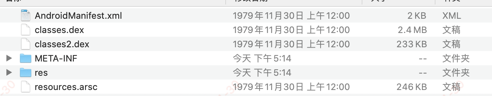
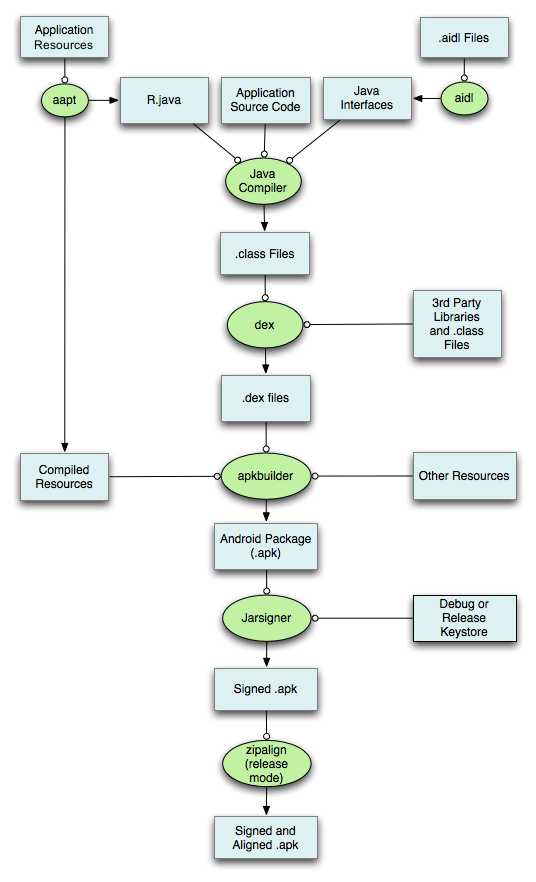

#### 1.APK文件内容

- .apk文件是一个Android应用程序压缩包，可以将apk文件转换成.zip文件并解压查看，如下：

- 解析
  - .dex文件：.classs字节码文件打包后生成
  - res：资源文件，在android项目中res目录下所有的文件生成
  - resources.arsc : 资源映射文件
  - AndroidManifest.xml：清单文件
  - META-INF：签名文件，包含有三个文件
    - MANIFEST.MF : 版本号以及每一个文件的哈希值
    - CERT.SF : 对每个文件的头3行进行SHA1 hash
    - CERT.RSA : 保存了签名和公钥证书

#### 2.APK打包流程

##### 2.1.aapt阶段：

- 使用aapt来打包res资源文件，生成R.java,resources.arsc和res文件

  - res文件夹下有9种目录

  ~~~java
  --color / --drawable / --animator / --anim / --layout / --menu / --raw / --xml / --values
  ~~~

  - 其中raw目录下资源和assets类资源一样，都市原封不动地打包在apk文件中
    - raw下文件会被赋予资源id
    - assets下文件没有资源id，只能通过AssetManager加载
  - R.java文件
    - R.java的源文件里面，拥有很多静态内部类，比如layout，string等

  ~~~java
  public final class R {
    public static final class anim {
      public static final int abc_fade_in=0x7f010000;
      public static final int abc_fade_out=0x7f010001;
      public static final int abc_grow_fade_in_from_bottom=0x7f010002;
      ...
    }
    
    public static final class layout {
      public static final int abc_action_bar_title_item=0x7f0a0000;
      public static final int abc_action_bar_up_container=0x7f0a0001;
      public static final int abc_action_menu_item_layout=0x7f0a0002;
      public static final int abc_action_menu_layout=0x7f0a0003;
      ...
    }
  
    public static final class mipmap {
      public static final int ic_launcher=0x7f0b0000;
      public static final int ic_launcher_round=0x7f0b0001;
    }
    
    public static final class string {
      public static final int abc_action_bar_home_description=0x7f0c0000;
      public static final int abc_action_bar_up_description=0x7f0c0001;
      public static final int abc_action_menu_overflow_description=0x7f0c0002;
      public static final int abc_action_mode_done=0x7f0c0003;
      ...
    }
  }
  ~~~

  - resources.arsc文件
    - 该文件记录了所有的应用程序资源目录的信息，包括每一个资源名称，类型，值等；可以将这个resources.arsc文件想象成是一个资源索引表。

##### 2.2.aidl阶段

- 主要处理.aidl文件，生成对应的Java接口文件

##### 2.3.Java Compiler阶段

- 通过Java Compiler编译R.java，Java接口文件，Java源文件，生成.class文件

##### 2.4.dex阶段

- 通过dex命令，将.class文件和第三方库中的.class文件处理生成class.dex文件

##### 2.5.apkbuilder阶段

- 将classes.dex，resources.arsc，res文件夹；other resources（assets文件夹），AndroidManifest.xml打包成apk文件
  - res文件夹下/raw资源会被原封不动打包进apk文件，其他资源都会被编译或处理
- res/raw 和 assets的区别
  - 相同点：两者目录下的文件在打包后会原封不动的保存在apk包中，不会被编译成二进制
  - 不同点：
    - res/raw中的文件会被映射到R.java文件中，访问的时候直接使用资源id
    - assets文件夹下的文件不会被影射到R.java中，访问的时候需要AssetsManager类
    - res/raw不可以有目录结构，而assets可以有目录结构

##### 2.6.Jarsigner阶段

- 对apk进行签名，可以进行debug和release签名

##### 2.7.zipalign阶段

- release modle下使用zipalign进行对齐处理
  - Zipalign是一个android平台上整理apk文件的工具，他对apk中未压缩的数据进行4字节对齐，对齐后可以使用mmap函数读取文件，可以像读取内存一样对普通文件进行操作
  - 如果没有4字节对齐，就必须显示的读取，这样比较缓慢并且会耗费额外的内存。
  - zipalign.exe工具能够对打包后的app进行优化，其位于sdk的build-tools目录下

