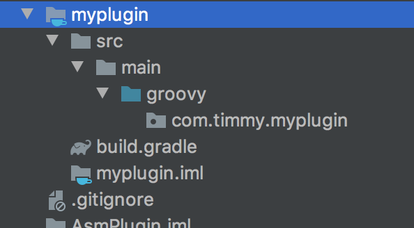
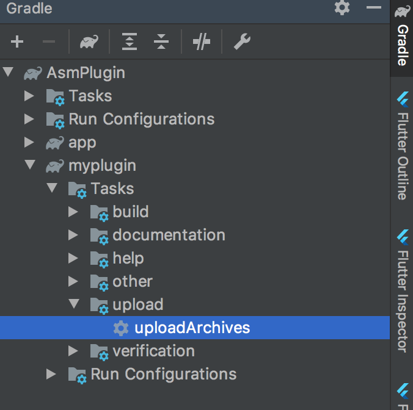
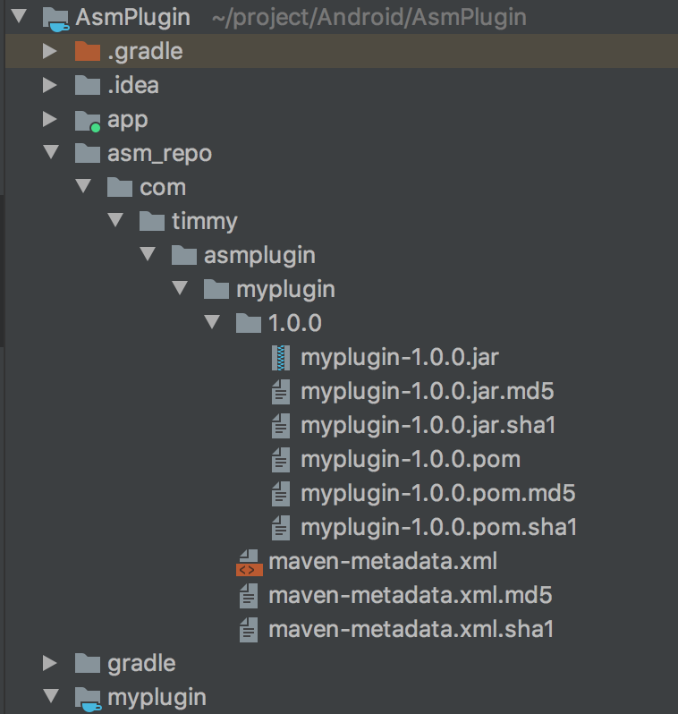
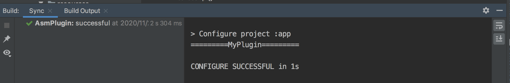

##### 前言

- 做Android开发大多遇到到这种需求：
  - 记录每一个页面的打开和关闭事件，并通过各种DataTracking框架上传到服务器，用来日后做数据分析
- 面对这样的需求，一般人会想到在每一个Activity的 onCreate 和 onDestory 方法中，分别添加页面打开和页面关闭的逻辑，常见做法如下：
  - 修改项目中现有的每一个Activity，这样存在的问题是，项目以后添加新的页面，这套逻辑需要重新拷贝一遍，很容易遗漏
  - 将项目中所有的Activity继承自BaseActivity，将页面打开和关闭的逻辑添加在BaseActivity中，这种方案看起来比第1种方案高级很多，并且后续项目有新的Activity，直接继承BaseActvity即可。
    - 但是这种方案对第三方依赖库种的界面则无能为力，因为我们没有第三方依赖库的源码

#### 编译插桩

- 编译插桩就是在代码编译期间修改已有的代码或者生成新代码。

- 编译插桩的时机

理解编译插桩之前，先回顾一下Android项目中.java文件的编译过程：

- 从上图可以看出，可以在1，2处对代码进行改造
  - 在.java文件编译成.class文件时，APT，AndroidAnnotation等就是在此处触发代码生成的。
  - 在.class文件进一步优化成.dex文件时，也就是直接操作字节码。这种方式功能更加强大，应用场景也更多。但是门槛比较高，需要对字节码有一定的理解。

使用一张图来描述ASM框架对字节码操作的流程：

##### 案例实现

使用ASM实现在每一个Activity打开时输出相应的log日志

**实现思路**

1. 遍历项目中所有的.class文件
   - 如何找到项目中编译生成的.class文件，这是我们需要解决的第一个问题。
   - 可以自定义Transform，来获取所有的.class文件引用，但是Transform的使用需要依赖Gradle Plugin。
   - 因此第一步需要创建一个单独的Gradle Plugin，并在Gradle Plugin中使用自定义的Transform找出所有的.class文件。
2. 遍历到目标.class文件（Activity）之后，通过ASM动态注入需要被插入的字节码
   - 如果第一步进行顺利，可以找出所有的.class文件。
   - 接下来就需要过滤出目标Activity文件，并在目标Activity文件的onCreate 方法中，通过ASM插入相应的log日志字节码

#### 具体实现：

1.新建项目

2.新建module

- 删除module目录下文件，除了保留src/main 和build.gradle文件
- 因为插件使用groovy语言编写，所以在main目录下心间groovy目录用于存放.groovy文件，并且在build.gradle文件中，添加groovy插件和sdk依赖

- build.gradle文件内容

~~~groovy
apply plugin:'groovy'

repositories {
    mavenCentral()
    jcenter()
}

dependencies {
    implementation gradleApi()
    implementation localGroovy()
    implementation 'com.android.tools.build:gradle:3.6.3'
}
~~~

3.编码

- 在groovy目录下新建.groovy文件，并实现Plugin接口

~~~groovy
package com.timmy.myplugin

import org.gradle.api.Plugin
import org.gradle.api.Project

public class MyPlugin implements Plugin<Project>{
    @Override
    void apply(Project project) {
        System.out.println("=========MyPlugin=========")
    }
}
~~~

- 在main目录下，新建resources目录，接着在resources目录下新建 META-INF/gradle-plugins目录
  - 在该目录下新建xxx.properties文件,文件内容为指定Plugin插件路径
  - 其中xxx为使用时，设置的插件名

~~~java
implementation-class=com.timmy.myplugin.MyPlugin
~~~

- 生成本地maven库，编辑build.gradle文件内容为

~~~groovy
apply plugin: 'groovy'

repositories {
    mavenCentral()
    jcenter()
}

dependencies {
    implementation gradleApi()
    implementation localGroovy()
    implementation 'com.android.tools.build:gradle:3.6.3'
}

apply plugin: 'maven'
group = 'com.timmy.asmplugin'
version = '1.0.0'
uploadArchives {
    repositories {
        mavenDeployer {
						//生成的插件放在上层目录的asm_repo文件夹下
            repository(url: uri('../asm_repo'))
        }
    }
}
~~~

- gradle任务自动生成

module目录结构：

生成的本地插件内容：

4.使用

- 在app module中使用，编辑app模块下.gradle文件，设置插件依赖，新增如下代码：

~~~groovy
apply plugin: 'asmplugin'

buildscript {
    repositories {
        maven { url uri('../asm_repo') }
        google()
        jcenter()
    }
    dependencies {
        //group + module名 + 版本号
        classpath 'com.timmy.asmplugin:myplugin:1.0.0'
    }
}
~~~

- 验证插件是否生效，clean项目查看build输出

#### 自定义Transform

- 实现遍历所有的.class文件的功能，主要依赖Transform API

##### Transform

- Transform可以被看作是Gradle在编译项目时的一个task，在.class文件转换成.dex的流程中会执行这些task。
- 对所有的.class文件（包括第三方库的.class）进行转换，转换的逻辑定义在Transform的transform方法中。
- 在平常app开发过程中常用的的功能很多都是通过Transform实现的，如混淆（proguard），分包（multi-dex）,jar包合并（jarMerge）

在groovy目录中，新建LifeCycleTransform.groovy文件，并继承Transform类

~~~groovy
package com.timmy.myplugin

public class LifeCycleTransform extends Transform {
  
    @Override
    String getName() {
        return "LifeCycleTransform"
    }
  
    @Override
    Set<QualifiedContent.ContentType> getInputTypes() {
        return TransformManager.CONTENT_CLASS
    }

    @Override
    Set<? super QualifiedContent.Scope> getScopes() {
        return TransformManager.PROJECT_ONLY
    }

    @Override
    boolean isIncremental() {
        return false
    }

    @Override
    void transform(TransformInvocation transformInvocation) throws TransformException, InterruptedException, IOException {
        Collection<TransformInput> transformInputs = transformInvocation.inputs
        TransformOutputProvider outputProvider = transformInvocation.outputProvider

        transformInputs.each { TransformInput transformInput ->
            transformInput.directoryInputs.each { DirectoryInput directoryInput ->
                File dir = directoryInput.file
                if (dir) {
                    dir.traverse(type: FileType.FILES, nameFilter: ~/.*\.class/) { File file ->
                        System.out.println("find class: " + file.name)
                    }
                }
            }
        }
    }
}
~~~

**Transform主要作用是检索项目编译过程中的所有文件，通过复写他的方法可以设置一些遍历规则**

- getName：
  - 自定义Transform对应的Task名称。Gradle在编译的时候，会将这个名称显示在控制台上。比如：Task :app:transformClassesWith**XXX**ForDebug

- getInputTypes
  - getInputTypes方法主要设置LifeCycleTransform接收的文件类型，返回的类型为Set<QualifiedContent.ContentType>集合。
  - ContentType有2种取值
    - CLASSES：代表只检索.class文件
    - RESOURCES：代表检索java标准资源文件
- getScopes：
  - 该方法规定了自定义Transform检索的范围，有如下取值：
    - PROJECT(1),   -- 只有项目内容
    - SUB_PROJECTS(4), -- 只有子项目内容
    - EXTERNAL_LIBRARIES(16), --只有外部类
    - TESTED_CODE(32), -- 由当前变量（包括依赖项）测试的代码
    - PROVIDED_ONLY(64), -- 只提供本地或远程依赖项
    - PROJECT_LOCAL_DEPS(2) --只有项目的本地依赖项（本地jar）
    - SUB_PROJECTS_LOCAL_DEPS(8); --只有子项目的本地依赖项（本地jar）
- isIncremental：
  - 表示当前Transform是否支持增量编译，不需要增量编译，直接返回false即可
- transform
  - 自定义Transform中最重要的方法就是transform，在这个方法中，可以获取到两个数据的流向
    - inputs：inputs中是传递过来的输入流，有两种格式，一种是jar包格式，一种是directory（目录格式）
    - outputProvider：输出目录，将修改的文件复制到输出目录，这一步必须做，否则编译会报错
  - 上诉代码可遍历打印出所有的.class文件

自定义Transform使用和日志输出内容如下：

~~~groovy
public class MyPlugin implements Plugin<Project>{

    @Override
    void apply(Project project) {
        System.out.println("=========MyPlugin start=========")
        def android = project.extensions.getByType(AppExtension)
        LifeCycleTransform transform = new LifeCycleTransform()
        android.registerTransform(transform)
        System.out.println("=========MyPlugin end=========")
    }
}
~~~

命令行执行build，输出LifeCycleTransform检索到的所有.class文件：

~~~java
> Task :app:transformClassesWithLifeCycleTransformForDebug
=========transform=========
find class: R.class
...
find class: R$integer.class
find class: R$layout.class
find class: R$attr.class
find class: R$drawable.class
find class: R.class
find class: R$interpolator.class
find class: MainActivity.class
...
~~~

#### 使用ASM，插入字节码到Activity文件

- ASM是一套开源框架，有如下常用几个API	
  - ClassReader: 负责解析.class文件中的字节码，并将所有字节码传递给ClassWriter
  - ClassVisitor：负责访问.class文件中各个元素，解析.classs文件结构；当解析到特定结构时（如变量，方法），会自动调用内部相应的FieldVistot或者MethodVisitor的方法，进一步解析或修改.class文件内容
  - ClassWriter：继承自ClassVisitor，主要生成字节码，负责将修改后的字节码输出为byte数组

- 在java目录下，新建ClassVisitor类处理，
  - 在visit() 方法中获取到.class文件的类名称和基类名称
  - 在visitMethod() 方法中判断解析的方法是否是onCreate() 方法，如果是则返回自定义的MethodVisitor类

~~~java
package com.timmy.myplugin;

import org.objectweb.asm.*;

public class LifecycleClassVistor extends ClassVisitor {

    private String className;
    private String superName;

    public LifecycleClassVistor(ClassVisitor cv) {
        super(Opcodes.ASM5, cv);
    }

    @Override
    public void visit(int version, int access, String name, String signature, String superName, String[] interfaces) {
        super.visit(version, access, name, signature, superName, interfaces);
        this.className = name;
        this.superName = superName;
    }

    @Override
    public MethodVisitor visitMethod(int access, String name, String desc, String signature, String[] exceptions) {
        MethodVisitor methodVisitor = cv.visitMethod(access, name, desc, signature, exceptions);
        if (superName.equals("androidx/appcompat/app/AppCompatActivity")) {
            if (name.startsWith("onCreate")) {
                return new LifecycleMethodVisitor(methodVisitor,className,name);
            }
        }
        return methodVisitor;
    }

    @Override
    public void visitEnd() {
        super.visitEnd();
    }
}
~~~

- 新建MethodVisitor类，在执行到onCreate() 方法前插入Log打印字节码

~~~java
package com.timmy.myplugin;

import org.objectweb.asm.*;

public class LifecycleMethodVisitor extends MethodVisitor {

    private String className;
    private String methodName;

    public LifecycleMethodVisitor(MethodVisitor mv, String className, String methodName) {
        super(Opcodes.ASM5, mv);
        this.className = className;
        this.methodName = methodName;
    }

    @Override
    public void visitCode() {
        super.visitCode();
        mv.visitLdcInsn("TAG");
        mv.visitLdcInsn(className + "---->" + methodName);
        mv.visitMethodInsn(Opcodes.INVOKESTATIC, "android/util/Log", "i",
                "(Ljava/lang/String;Ljava/lang/String;)I", false);
        mv.visitInsn(Opcodes.POP);
    }
}
~~~

- 在自定义Tranform中使用ASM,主要看transform方法

~~~groovy
    @Override
    void transform(TransformInvocation transformInvocation) throws TransformException, InterruptedException, IOException {
        Collection<TransformInput> transformInputs = transformInvocation.inputs
        TransformOutputProvider outputProvider = transformInvocation.outputProvider
        if (outputProvider != null) {
            outputProvider.deleteAll()
        }

        transformInputs.each { TransformInput transformInput ->

            transformInput.directoryInputs.each { DirectoryInput directoryInput ->
                File dir = directoryInput.file
                if (dir) {
                    dir.traverse(type: FileType.FILES, nameFilter: ~/.*\.class/) { File file ->
                        System.out.println("find class: " + file.name)

                        //对class文件进行读取与解析
                        ClassReader classReader = new ClassReader(file.bytes)
                        //对class文件的写入
                        ClassWriter classWriter = new ClassWriter(classReader, ClassWriter.COMPUTE_MAXS)
                        //访问class文件相应的内容，解析到某一个结构就会通知到ClassVisitor的相应方法
                        ClassVisitor classVisitor = new LifecycleClassVistor(classWriter)
                        //依次调用 ClassVisitor接口的各个方法
                        classReader.accept(classVisitor, ClassReader.EXPAND_FRAMES)
                        //toByteArray方法会将最终修改的字节码以 byte 数组形式返回。
                        byte[] bytes = classWriter.toByteArray()

                        //通过文件流写入方式覆盖掉原先的内容，实现class文件的改写。
                        //FileOutputStream outputStream = new FileOutputStream( file.parentFile.absolutePath + File.separator + fileName)
                        FileOutputStream outputStream = new FileOutputStream(file.path)
                        outputStream.write(bytes)
                        outputStream.close()
                    }
                }

                //处理完输入文件后把输出传给下一个文件
                def dest = outputProvider.getContentLocation(directoryInput.name, directoryInput.contentTypes,
                        directoryInput.scopes, Format.DIRECTORY)
                FileUtils.copyDirectory(directoryInput.file, dest)
            }
        }
    }
~~~

- 重新部署自定义Gradle插件，并运行项目
  - 查看控制台是否有插入的Log打印日志输出？

~~~java
/com.timmy.asmplugin I/TAG: com/timmy/asmplugin/MainActivity---->onCreate
/com.timmy.asmplugin I/TAG: com/timmy/asmplugin/SecondActivity---->onCreate
~~~

- 查看.class文件，验证ASM插码是否成功
  - 查看项目app module/build/intermediates/javac/debug/packagename/SecondActivity.class

原始.java文件,发现并没有Log.i() 方法

~~~java
public class SecondActivity extends AppCompatActivity {

    @Override
    protected void onCreate(Bundle savedInstanceState) {
        super.onCreate(savedInstanceState);
        setContentView(R.layout.activity_second);
    }
}
~~~

asm插码后：

~~~java
public class SecondActivity extends AppCompatActivity {
    public SecondActivity() {
    }

    protected void onCreate(Bundle savedInstanceState) {
        Log.i("TAG", "com/timmy/asmplugin/SecondActivity---->onCreate");
        super.onCreate(savedInstanceState);
        this.setContentView(2131361821);
    }
}
~~~

