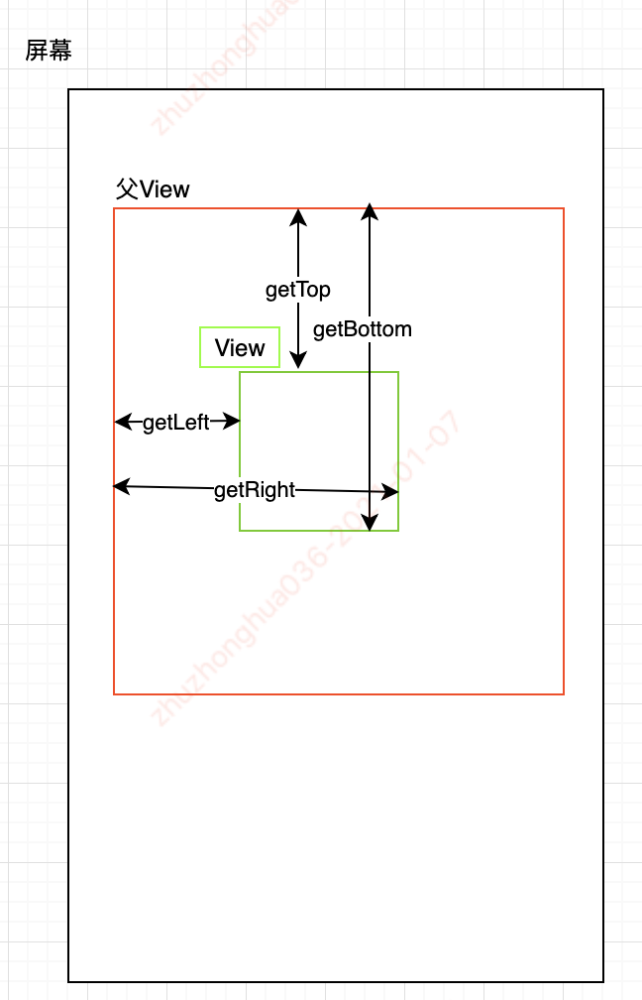
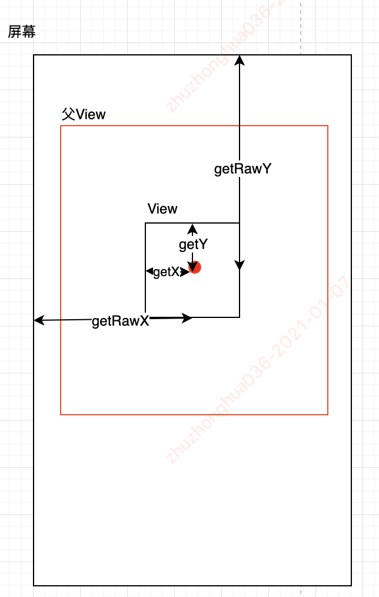

##### 源码解析：

- 因为LinearLayout也是继承自ViewGroup，所以对该类中的三个自定义方法进行分析
  - onMeasure,onLayout,onDraw
  - 因此主要研究LinearLayout控件是如何测量和排放子控件的

#### 1.LinearLayout

##### 1.1.onMeasure方法实现

- 因为LinearLayout容器有两个方向用于摆放子控件，我们选择垂直方向进行分析，重点关注高度的计算
- onMeasure方法的作用是先遍历子控件，并对子控件进行测量
  - 最后根据子控件的累加高度，确定LinearLayout的高度，最终调用setMeasuredDimension方法

~~~java
public class LinearLayout extends ViewGroup {
  
    protected void onMeasure(int widthMeasureSpec, int heightMeasureSpec) {
        if (mOrientation == VERTICAL) {
            measureVertical(widthMeasureSpec, heightMeasureSpec);
        } else {
            measureHorizontal(widthMeasureSpec, heightMeasureSpec);
        }
    }

    void measureVertical(int widthMeasureSpec, int heightMeasureSpec) {
        mTotalLength = 0;
        float totalWeight = 0;
        final int count = getVirtualChildCount();
        final int widthMode = MeasureSpec.getMode(widthMeasureSpec);
        final int heightMode = MeasureSpec.getMode(heightMeasureSpec);
        ...
        for (int i = 0; i < count; ++i) {
          // 遍历子控件，并获取子控件的LayoutParams
            final View child = getVirtualChildAt(i);
            ...
            final LayoutParams lp = (LayoutParams) child.getLayoutParams();
            totalWeight += lp.weight;

          // 如果高度的mode是EXACTLY，mTotalLength使用父控件的剩余高度
            if (heightMode == MeasureSpec.EXACTLY && useExcessSpace) {
                final int totalLength = mTotalLength;
                mTotalLength = Math.max(totalLength, totalLength + lp.topMargin + 
                                        lp.bottomMargin);
                skippedMeasure = true;
            } else {
                if (useExcessSpace) {
                    lp.height = LayoutParams.WRAP_CONTENT;
                }

              // 对子控件进行测量
                final int usedHeight = totalWeight == 0 ? mTotalLength : 0;
                measureChildBeforeLayout(child, i, widthMeasureSpec, 0,
                        heightMeasureSpec, usedHeight);

              // 拿到子控件测量后的高度
                final int childHeight = child.getMeasuredHeight();
                if (useExcessSpace) {
                    lp.height = 0;
                    consumedExcessSpace += childHeight;
                }

              // 将所有子控件的高度进行累加
                final int totalLength = mTotalLength;
                mTotalLength = Math.max(totalLength, totalLength + childHeight + 
                                        lp.topMargin +
                       lp.bottomMargin + getNextLocationOffset(child));
            }
        }

        if (nonSkippedChildCount > 0 && hasDividerBeforeChildAt(count)) {
            mTotalLength += mDividerHeight;
        }

        ...
          // 如果子控件设置列weight参数，则需要重新对子控件进行测量
        if (skippedMeasure || ((sRemeasureWeightedChildren || remainingExcess != 0) &&
                              totalWeight > 0.0f)) {
            float remainingWeightSum = mWeightSum > 0.0f ? mWeightSum : totalWeight;
            mTotalLength = 0;
            for (int i = 0; i < count; ++i) {
                final View child = getVirtualChildAt(i);
                final LayoutParams lp = (LayoutParams) child.getLayoutParams();
                final float childWeight = lp.weight;
                if (childWeight > 0) {
                    ...
                    final int childHeightMeasureSpec = MeasureSpec.makeMeasureSpec(
                            Math.max(0, childHeight), MeasureSpec.EXACTLY);
                    final int childWidthMeasureSpec = getChildMeasureSpec(widthMeasureSpec,
                            mPaddingLeft + mPaddingRight + lp.leftMargin + lp.rightMargin,
                            lp.width);
                  // 测量子控件，传递计算后的固定值，并设置高的mode为EXACTLY
                    child.measure(childWidthMeasureSpec, childHeightMeasureSpec);

                    // Child may now not fit in vertical dimension.
                    childState = combineMeasuredStates(childState, child.getMeasuredState()
                            & (MEASURED_STATE_MASK>>MEASURED_HEIGHT_STATE_SHIFT));
                }
              ...
              // 累加计算得到LinearLayout的高度mTotalLength
                final int totalLength = mTotalLength;
                mTotalLength = Math.max(totalLength, totalLength + 
                                        child.getMeasuredHeight() +
                        lp.topMargin + lp.bottomMargin + getNextLocationOffset(child));
            }
            mTotalLength += mPaddingTop + mPaddingBottom;
        } else {
            ...
        // 最终调用setMeasuredDimension方法确定LinearLayout的宽高
        setMeasuredDimension(resolveSizeAndState(maxWidth, widthMeasureSpec, childState),
                heightSizeAndState);
    }
}
~~~

- 解析
- LinearLayout的测量方法onMeasure中，只要做的事情是遍历子控件，对子控件进行测量，然后拿到子控件的累加高度，最后调用setMeasuredDimension方法设置自身的高度
- 如果子控件中有设置weight属性，则需要重新二次测量

##### 1.2.onLayout

~~~java
public class LinearLayout extends ViewGroup {
  
    protected void onLayout(boolean changed, int l, int t, int r, int b) {
        if (mOrientation == VERTICAL) {
            layoutVertical(l, t, r, b);
        } else {
            layoutHorizontal(l, t, r, b);
        }
    }
  
    void layoutVertical(int left, int top, int right, int bottom) {
        final int paddingLeft = mPaddingLeft;
        int childTop;
        int childLeft;
        final int width = right - left;
        int childRight = width - mPaddingRight;
        int childSpace = width - paddingLeft - mPaddingRight;
        final int count = getVirtualChildCount();
      
      // 根据LinearLayout的layout_gravity属性，确定第一个子控件的left和top值
        final int majorGravity = mGravity & Gravity.VERTICAL_GRAVITY_MASK;
        final int minorGravity = mGravity & Gravity.RELATIVE_HORIZONTAL_GRAVITY_MASK;
        switch (majorGravity) {
           case Gravity.BOTTOM:
               childTop = mPaddingTop + bottom - top - mTotalLength;
               break;
           case Gravity.CENTER_VERTICAL:
               childTop = mPaddingTop + (bottom - top - mTotalLength) / 2;
               break;
           case Gravity.TOP:
           default:
               childTop = mPaddingTop;
               break;
        }

      // 遍历子控件，根据子控件设置的gravity属性，确定每个子控件的布局左上右下四个参数
        for (int i = 0; i < count; i++) {
            final View child = getVirtualChildAt(i);
            if (child == null) {
                childTop += measureNullChild(i);
            } else if (child.getVisibility() != GONE) {
                final int childWidth = child.getMeasuredWidth();
                final int childHeight = child.getMeasuredHeight();

                final LinearLayout.LayoutParams lp =
                        (LinearLayout.LayoutParams) child.getLayoutParams();

              // 获取子控件的gravity属性
                int gravity = lp.gravity;
                if (gravity < 0) {
                    gravity = minorGravity;
                }
                final int layoutDirection = getLayoutDirection();
                final int absoluteGravity = Gravity.getAbsoluteGravity(gravity, 
                                                                       layoutDirection);
                switch (absoluteGravity & Gravity.HORIZONTAL_GRAVITY_MASK) {
                    case Gravity.CENTER_HORIZONTAL:
                        childLeft = paddingLeft + ((childSpace - childWidth) / 2)
                                + lp.leftMargin - lp.rightMargin;
                        break;
                    case Gravity.RIGHT:
                        childLeft = childRight - childWidth - lp.rightMargin;
                        break;
                    case Gravity.LEFT:
                    default:
                        childLeft = paddingLeft + lp.leftMargin;
                        break;
                }

                if (hasDividerBeforeChildAt(i)) {
                    childTop += mDividerHeight;
                }

                childTop += lp.topMargin;
              // 调用子控件的layout方法
                setChildFrame(child, childLeft, childTop + getLocationOffset(child),
                        childWidth, childHeight);
                childTop += childHeight + lp.bottomMargin + getNextLocationOffset(child);
                i += getChildrenSkipCount(child, i);
            }
        }
    }
  
    private void setChildFrame(View child, int left, int top, int width, int height) {
        child.layout(left, top, left + width, top + height);
    }
}
~~~

- 解析：遍历子控件调用子控件的layout方法

##### 1.3.onDraw

~~~java
public class LinearLayout extends ViewGroup {
  
    protected void onDraw(Canvas canvas) {
        if (mDivider == null) {
            return;
        }

        if (mOrientation == VERTICAL) {
            drawDividersVertical(canvas);
        } else {
            drawDividersHorizontal(canvas);
        }
    }
}
~~~

- 默认ViewGroup不复写onDraw方法，但是当LinearLayout设置了分割线，则需要进行绘制

#### 2.控件获取各种宽高的方法

##### 2.1.getLeft(),getTop,getRight,getBottom

##### 如上图，调用View的方法，获取的是在父VIew中的相对坐标位置：

- View.getLeft() ：获取的是子View的左边界到父View的左边界距离
- View.getRight() : 获得的是子View的右边界到父View的左边界距离
- View.getTop() : 子View的顶部到父View的顶部距离
- View.getBottom() : 子View的底部到父View的顶部距离
- View.getHeight() : 表示的是当前控件的高度，即getBottom() - getTop()； getWidth()方法类似
- View.getTranslationX() : 计算的是该View在X轴的偏移量。初始值为0，向右偏移值为正，向左偏移值为负
- View.getTranslationY()：与X轴类似

##### 2.2.屏幕触摸事件获得的相关值

- event.getX() : 触摸点距离自身左边界的距离
- event.getY() : 触摸点距离自身上边界的距离
- event.getRawX() : 触摸点距离屏幕左边界的距离，绝对坐标
- event.getRawY() : 触摸点距离屏幕上边界的距离

##### 2.3.获取View在屏幕中的绝对位置

- getLocalVisibleRect
- getGlobalVisibleRect
- getLocationOnScreen
- getLocationInWindow

##### 2.4.scrollTo(),scrollBy

- scrollTo(x,y) ：表示设置自己的View滚动的位置，即移动到（x,y）坐标点，移动的是绝对距离
- scrollBy(x,y) ：内部会调用scrollTo方法，移动的是相对距离

~~~java
public class View implements ... {
    protected int mScrollX;
    protected int mScrollY;
  
    public final int getScrollX() {
        return mScrollX;
    }

    public final int getScrollY() {
        return mScrollY;
    }
  
    public void scrollTo(int x, int y) {
        if (mScrollX != x || mScrollY != y) {
            int oldX = mScrollX;
            int oldY = mScrollY;
            mScrollX = x;
            mScrollY = y;
            invalidateParentCaches();
            onScrollChanged(mScrollX, mScrollY, oldX, oldY);
            if (!awakenScrollBars()) {
                postInvalidateOnAnimation();
            }
        }
    }

    public void scrollBy(int x, int y) {
        scrollTo(mScrollX + x, mScrollY + y);
    }
}
~~~

##### scrollTo(x,y)是将View中的内容滑动到相应的位置，参考的坐标系原点为父View的左上角

- 所以如果想通过上面两个方法来拖动当前View，要在View的父控件调用scrollTo方法来移动当前这个VIew

~~~java
((View)getParent()).scrollTo(officeX,officeY);
~~~

