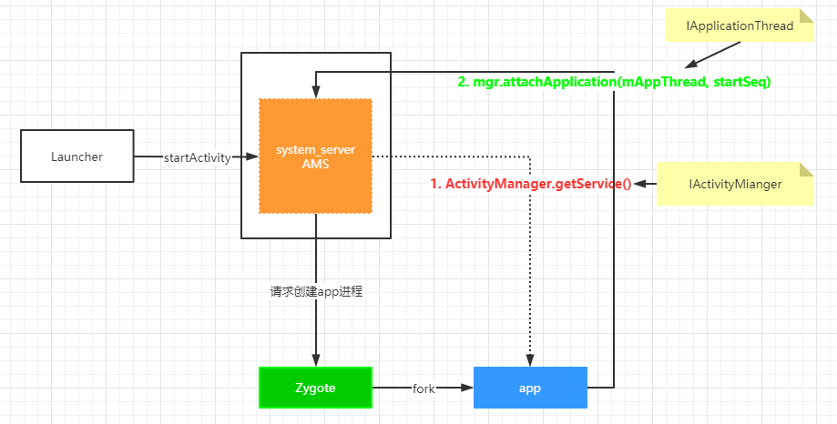

##### 与Activity管理相关类

ActivityRecord:一个代表Activity

TaskRecord （ArrayList<ActivityRecord> Activity栈）

ActivityStack（ArrayList<TaskRecord>）

ActivityStackSupervisor （管理ActivityStack）

##### startActivity调用流程

- 分两种情况，应用进程是否已启动

~~~java
Activity.class
	public void startActivity()
	public void startActivityForResult()
  
Instrumentation.class
	public ActivityResult execStartActivity()
  
IActivityManager.class
  public int startActivity()
  
ActivityManagerService.class
	public final int startActivity()
  public final int startActivityAsUser()
  
ActivityStarter.class
	int execute()
  private int startActivityMayWait()
  private int startActivity()	--创建ActivityRecord对象
  private int startActivityUnchecked()  --判断LauncherModule，判断任务栈
  
ActivityStackSupervisor.class
	boolean resumeFocusedStackTopActivityLocked()
  
ActivityStack.class
	boolean resumeTopActivityUncheckedLocked()
  private boolean resumeTopActivityInnerLocked(
  
ActivityStackSupervisor.class
	void startSpecificActivityLocked()
--进程已创建
  realStartActivityLocked(r, app, andResume, checkConfig);

ClientLifecycleManager.class
	void scheduleTransaction()
  
ActivityThread$ApplicationThrad.class
	public void scheduleTransaction()
  
ActivityThread.class extends ClientTransactionHandler.class
	void scheduleTransaction()
  sendMessage(ActivityThread.H.EXECUTE_TRANSACTION, transaction);
  
LaunchActivityItem.class
	public void execute()
  
Activity.class extends ClientTransactionHandler
	public Activity handleLaunchActivity()
  private Activity performLaunchActivity()
  
--进程未创建
ActivityManagerService.class
	final ProcessRecord startProcessLocked()

Process.java
	public static final ProcessStartResult start()
  
~~~

