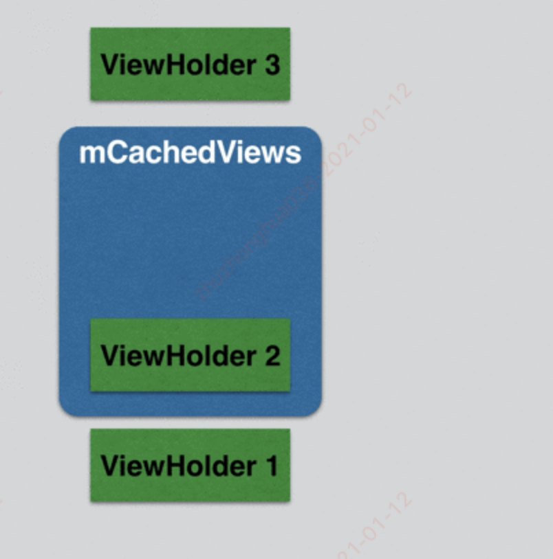

#### 1.Recycler

- RecyclerView的缓存复用是一个非常重要的机制，这套机制主要实现了ViewHolder的缓存以及复用
- 核心代码在Recycler类中，该类是RV的一个内部类，主要用来缓存屏幕内ViewHolder以及部分屏幕外ViewHolder，部分代码如下：

~~~java
public class RecyclerView extends ViewGroup implements ... {
          
    private final RecyclerViewDataObserver mObserver = new
      												RecyclerViewDataObserver();
    final Recycler mRecycler = new Recycler();
  
    public final class Recycler {
        final ArrayList<ViewHolder> mAttachedScrap = new ArrayList<>();
        ArrayList<ViewHolder> mChangedScrap = null;
      
        final ArrayList<ViewHolder> mCachedViews = new ArrayList<ViewHolder>();
      
        RecycledViewPool mRecyclerPool;
      
        private ViewCacheExtension mViewCacheExtension;
    }
}
~~~

解析：

- 在RecyclerView中有一个Recycler的缓存变量，该类中有很多容器，这些容器变量就是用来实现缓存机制的，且这些缓存根据访问优先级从上到下分为4级
  - RV的缓存之所以要分成这么多块，是为了在功能上进行一些区分，并分别对应不同的使用场景

##### 1.1.第一级缓存 mAttachedScrap & mChangedScrap

- 这个容器都是ArrayList，这两者主要用来缓存屏幕内的ViewHolder
- 场景：下拉刷新，访问后台获取新的数据源展示
  - 当下拉刷新获取了新的数据，只需要在原有的ViewHolder基础上进行重新绑定新的数据data即可，而这些旧的ViewHolder就是被保存在mAttachedScrap和mChangedScrap中。
  - 当调用mAdapter的notifyXXX方法时，就会向这两个列表进行填充，将旧的ViewHolder缓存起来

##### 1.2.第二级缓存 mCachedViews

- 该容器主要用来缓存移除屏幕之外的ViewHolder，默认情况下缓存个数是2，可以通过setViewCacheSize方法来修改改缓存的容量大小。
  - 如果mCachedViews的容量已满，则会根据FIFO的规则将旧的ViewHolder抛弃，然后添加新的ViewHolder



- 通常情况下刚被移出屏幕的ViewHolder有可能接下来马上就会使用到，所以RV不会立即将其设置为无效的ViewHolder，而是会将他们保存到mCachedViews中，但又不能将所有移出屏幕的ViewHolder都视为有效ViewHolder，所以他的默认容量只有2个

##### 1.3.第三级缓存 mViewCacheExtension

- 这是RV预留给开发人员的一个抽象类，开发人员可以通过继承该类腹泻抽象方法来实现自己的缓存机制

```java
public abstract static class ViewCacheExtension {
    @Nullable
    public abstract View getViewForPositionAndType(@NonNull Recycler recycler, 
                                                   int position,int type);
}
```

##### 1.4.第四级缓存 RecyclerViewPool

- RecyclerViewPool同样是用来缓存屏幕外的ViewHolder，当mCachedViews中的个数已满（默认为2），则从mCachedViews中淘汰出来的ViewHolder会先缓存到RecyclerViewPool中。
  - ViewHolder在被缓存到RecyclerViewPool时，会将内部的数据清理，因此从RecyclerViewPool中取出来的ViewHolder需要重新调用onBindViewHolder绑定数据，
  - 这同最早的ListView中使用ViewHolder复用convertView的道理是一样的。

- RecyclerViewPool还有一个重要功能
  - 多个RV之间可以共享一个RecyclerViewPool
  - RecyclerViewPool是根据type来获取ViewHolder，每个type默认最大缓存是5个

#### 2.RV获取缓存的ViewHolder：layoutState.next(recycler)

- 在接受RV的onLayout方法中，该方法会调用LayoutManager的onLayoutChildren方法，最后会调用layoutChunk方法，该方法中会不断获取ItemView并调用addView方法添加到RV中。
  - layoutChunk方法中通过layoutState.next 方法拿到某个ItemView，源码如下：

~~~java
        View next(RecyclerView.Recycler recycler) {
            if (mScrapList != null) {
                return nextViewFromScrapList();
            }
          //调用Recycler的方法，获取某个位置需要展示的View
            final View view = recycler.getViewForPosition(mCurrentPosition);
          //将当前绘制的child的索引下移一位，配合whild循环
            mCurrentPosition += mItemDirection;
            return view;
        }
~~~

##### Recycler.getViewForPosition

~~~java
    public final class Recycler {
      
        final ArrayList<ViewHolder> mAttachedScrap = new ArrayList<>();
        ArrayList<ViewHolder> mChangedScrap = null;
        final ArrayList<ViewHolder> mCachedViews = new ArrayList<ViewHolder>();
        int mViewCacheMax = DEFAULT_CACHE_SIZE;
        RecycledViewPool mRecyclerPool;
        private ViewCacheExtension mViewCacheExtension;
        static final int DEFAULT_CACHE_SIZE = 2;
      
        public View getViewForPosition(int position) {
            return getViewForPosition(position, false);
        }

        View getViewForPosition(int position, boolean dryRun) {
            return tryGetViewHolderForPositionByDeadline(position, 
                                                         dryRun, FOREVER_NS).itemView;
        }
      
        ViewHolder tryGetViewHolderForPositionByDeadline(int position,
                boolean dryRun, long deadlineNs) {
            ...
            ViewHolder holder = null;
          	if (mState.isPreLayout()) {
              //1.1.isPreLayout预布局，从mChangedScrap缓存中获取ViewHolder，动画相关
                holder = getChangedScrapViewForPosition(position);
            }
            // 1.2.从mAttachedScrap 或 mCachedViews缓存中获取ViewHolder
            if (holder == null) {
                holder = getScrapOrHiddenOrCachedHolderForPosition(position, dryRun);
                ...
            }
            if (holder == null) {
                ...
                  // 获取这个位置的数据类型-ItemViewType
                final int type = mAdapter.getItemViewType(offsetPosition);
                if (mAdapter.hasStableIds()) {
                // 2.Adapter的hasStableIds方法返回true，从mAttachedScrap 或 mCachedViews中查找ViewHolder
                    holder = getScrapOrCachedViewForId(mAdapter.getItemId(offsetPosition),
                            type, dryRun);
                    ...
                }
                if (holder == null && mViewCacheExtension != null) {
                    // 3.如果mViewCacheExtension不为空，从mViewCacheExtension中获取
                    final View view = mViewCacheExtension
                            .getViewForPositionAndType(this, position, type);
                    ...
                }
                if (holder == null) { 
                  //4.从RecycledViewPool获取，根据viewType获取
                    holder = getRecycledViewPool().getRecycledView(type);
                    ...
                }
                if (holder == null) {
                    ...
                      //5.如果各级缓存都没有，则调用Adapter.createViewHolder方法创建ViewHolder
                    holder = mAdapter.createViewHolder(RecyclerView.this, type);
                    ...
                }
            }

            //执行动画
            if (fromScrapOrHiddenOrCache && !mState.isPreLayout() && holder
                    .hasAnyOfTheFlags(ViewHolder.FLAG_BOUNCED_FROM_HIDDEN_LIST)) {
                holder.setFlags(0, ViewHolder.FLAG_BOUNCED_FROM_HIDDEN_LIST);
                if (mState.mRunSimpleAnimations) {
                    int changeFlags = ItemAnimator
                            .buildAdapterChangeFlagsForAnimations(holder);
                    changeFlags |= ItemAnimator.FLAG_APPEARED_IN_PRE_LAYOUT;
                    final ItemHolderInfo info = 
                      mItemAnimator.recordPreLayoutInformation(mState,
                            holder, changeFlags, holder.getUnmodifiedPayloads());
                    recordAnimationInfoIfBouncedHiddenView(holder, info);
                }
            }

            boolean bound = false;
            if (mState.isPreLayout() && holder.isBound()) {
                holder.mPreLayoutPosition = position;
            } else if (!holder.isBound() || holder.needsUpdate() || holder.isInvalid()) {
                final int offsetPosition = mAdapterHelper.findPositionOffset(position);
              // 6.根据条件，调用Adapter的onBindViewHolder方法，重新绑定数据
                bound = tryBindViewHolderByDeadline(holder, offsetPosition, 
                                                    position, deadlineNs);
            }

          //为ItemView设置LayoutParams，并将viewHolder赋值给rvLayoutParams中的属性中
            final ViewGroup.LayoutParams lp = holder.itemView.getLayoutParams();
            final LayoutParams rvLayoutParams;
            if (lp == null) {
                rvLayoutParams = (LayoutParams) generateDefaultLayoutParams();
                holder.itemView.setLayoutParams(rvLayoutParams);
            } else if (!checkLayoutParams(lp)) {
                rvLayoutParams = (LayoutParams) generateLayoutParams(lp);
                holder.itemView.setLayoutParams(rvLayoutParams);
            } else {
                rvLayoutParams = (LayoutParams) lp;
            }
            rvLayoutParams.mViewHolder = holder;
            rvLayoutParams.mPendingInvalidate = fromScrapOrHiddenOrCache && bound;
            return holder;
        }
      
    }
~~~

解析：

- 最终调用的方法是tryGetViewHolderForPositionByDeadline，该方法主要用来查找相应位置上的ViewHolder，主要通过上面介绍的4级缓存依次查找，获取获取步骤如下：
  - mChangedScrap
  - mAttachedScrap
  - mViewCacheExtension
  - RecycledViewPool

##### Adapter调用onCreateViewHolder创建ViewHolder的时机

- 如果上面各级缓存都找不到，就会调用Adapter的createViewHolder方法创建一个新的ViewHolder
  - 并调用Adapter的onBindViewHolder方法绑定数据
  - 接着设置ItemView的LayoutParams，并将ViewHolder设置为赋值给LayoutParams中的属性mViewHolder

#### 3.何时将ViewHolder存入缓存中？

##### 3.1.场景1 第一次layout

- 当调用setLayoutManager和setAdapter之后，RV会调用requestLayout，该方法会调用整个控件树的渲染流程，最后会调用RV的onLayout方法
  - RV的onLayout方法会调用LayoutManager的onLayoutChilder方法，接着会调用Recycler的tryGetViewHolderForPositionByDeadline获取ViewHodler
  - 此时不会有任何ViewHolder的缓存，所有的ViewHolder都是通过Adapter的createViewHolder方法创建的。

##### 3.2.场景2 ：RV页面滑动

- 该场景下屏幕中已经填充满了ItemView，当手指触摸屏幕时，RV会拦截事件，并将事件传递到自己的事件消费方法onTouchEvent，一起看下滑动事件场景下，RV是如何从缓存中复用ViewHolder

~~~java
public class RecyclerView extends ViewGroup implements ... {
  
  // 该方法最后返回true，说明RV会消费传递过来的事件
  // 重点查看MOVE事件的逻辑
    @Override
    public boolean onTouchEvent(MotionEvent e) {
        ...
        switch (action) {
            case MotionEvent.ACTION_DOWN: {
                ...
            } break;
            case MotionEvent.ACTION_MOVE: {
                final int x = (int) (e.getX(index) + 0.5f);
                final int y = (int) (e.getY(index) + 0.5f);
                int dx = mLastTouchX - x;
                int dy = mLastTouchY - y;
                ...
                if (mScrollState == SCROLL_STATE_DRAGGING) {
                    ...
                    mLastTouchX = x - mScrollOffset[0];
                    mLastTouchY = y - mScrollOffset[1];

                  //根据滑动距离调用scrollByInternal方法
                    if (scrollByInternal(canScrollHorizontally ? dx : 0,
                                         canScrollVertically ? dy : 0,e)) {
                        getParent().requestDisallowInterceptTouchEvent(true);
                    }
                }
            } break;
            case MotionEvent.ACTION_UP: {
                ...
                resetScroll();
            } break;
            case MotionEvent.ACTION_CANCEL: {
                cancelScroll();
            } break;
        }
        return true;
    }

    boolean scrollByInternal(int x, int y, MotionEvent ev) {
        int unconsumedX = 0;
        int unconsumedY = 0;
        int consumedX = 0;
        int consumedY = 0;
        if (mAdapter != null) {
            mReusableIntPair[0] = 0;
            mReusableIntPair[1] = 0;
          // 当Adapter不为空时，调用scrollStep方法，传入滑动方向滑动的间隔
            scrollStep(x, y, mReusableIntPair);
            consumedX = mReusableIntPair[0];
            consumedY = mReusableIntPair[1];
            unconsumedX = x - consumedX;
            unconsumedY = y - consumedY;
        }
        if (!mItemDecorations.isEmpty()) {
            invalidate();
        }
      ...
        return consumedNestedScroll || consumedX != 0 || consumedY != 0;
    }

    void scrollStep(int dx, int dy, @Nullable int[] consumed) {
        int consumedX = 0;
        int consumedY = 0;
        if (dx != 0) {
            consumedX = mLayout.scrollHorizontallyBy(dx, mRecycler, mState);
        }
      // 当垂直方向滑动时，dy为空0，会调用LayoutManager的scrollVerticallyBy
        if (dy != 0) {
            consumedY = mLayout.scrollVerticallyBy(dy, mRecycler, mState);
        }
        ...
    }
}
~~~

**解析：**

- 在MOVE事件中会调用scrollByInternal方法
- 最后调用LayoutManager的scrollVerticallyBy方法，假设布局管理器是LinearLayoutManager时调用如下

~~~java
public class LinearLayoutManager extends RecyclerView.LayoutManager ... {

    public int scrollVerticallyBy(int dy, RecyclerView.Recycler recycler,
                                  RecyclerView.State state) {
        if (mOrientation == HORIZONTAL) {
            return 0;
        }
      //调用scrollBy方法
        return scrollBy(dy, recycler, state);
    }
  
    int scrollBy(int delta, RecyclerView.Recycler recycler, RecyclerView.State state) {
        if (getChildCount() == 0 || delta == 0) {
            return 0;
        }
      //创建LayoutState对象
        ensureLayoutState();
        mLayoutState.mRecycle = true;
      //根据delta的值确定布局开始的方向
        final int layoutDirection = delta > 0 ? LayoutState.LAYOUT_END : 
      LayoutState.LAYOUT_START;
        final int absDelta = Math.abs(delta);
        updateLayoutState(layoutDirection, absDelta, true, state);
      // 核心：当RV垂直向上滑动时，会调用fill方法填充底部空出来的区域
        final int consumed = mLayoutState.mScrollingOffset
                + fill(recycler, mLayoutState, state, false);
        ...
        mLayoutState.mLastScrollDelta = scrolled;
        return scrolled;
    }
}
~~~

**解析：**

- 当RV垂直向上滑动时，会调用fill方法填充底部空出来的区域，在fill方法中使用while循环调用layoutChunk方法不断从缓存中获取ViewHolder，并将ItemView通过addView方法添加到RV中

##### 3.3.LayoutManager.onLayoutChildren()方法

##### 分析到这里我们还是没有发现创建的ViewHolder保存到各个缓存中的实现，在界面滑动的过程中会不断的调用RV的布局方法onLayout，在该方法中会调用LayoutManager的onLayoutChildren()方法

~~~java
public class LinearLayoutManager extends RecyclerView.LayoutManager ... {

    public void onLayoutChildren(RecyclerView.Recycler recycler, RecyclerView.State state) {
        //计算布局方向
        ....
      //1.重点，缓存处理，将已经在界面中的ViewHolder保存到Scrap 和Attach缓存中
        detachAndScrapAttachedViews(recycler);
      
        ...
        if (mAnchorInfo.mLayoutFromEnd) {            
          // fill towards start
            mLayoutState.mExtraFillSpace = extraForStart;
          //2.接着调用fill方法进行不同方向的布局填充
            fill(recycler, mLayoutState, state, false);
            ...
            // fill towards end
            ...
            fill(recycler, mLayoutState, state, false);
            ...
        } else {
            // fill towards end
            updateLayoutStateToFillEnd(mAnchorInfo);
            mLayoutState.mExtraFillSpace = extraForEnd;
            fill(recycler, mLayoutState, state, false);
            ...
            // fill towards start
            ...
            fill(recycler, mLayoutState, state, false);
            ...
        }
        ...
    }
  
        public void detachAndScrapAttachedViews(@NonNull Recycler recycler) {
            final int childCount = getChildCount();
            for (int i = childCount - 1; i >= 0; i--) {
                final View v = getChildAt(i);
              // 遍历拿到RV所有的子View，就是ViewHolder中的ItemView
                scrapOrRecycleView(recycler, i, v);
            }
        }
  
        private void scrapOrRecycleView(Recycler recycler, int index, View view) {
          //根据View的LayoutParams获取相应的ViewHolder
            final ViewHolder viewHolder = getChildViewHolderInt(view);
          
          //如果当前ViewHolder已经废弃了，
          //则将该ViewHolder保存到mCachedViews或者RecyclerViewPool缓存中
            if (viewHolder.isInvalid() && !viewHolder.isRemoved()
                    && !mRecyclerView.mAdapter.hasStableIds()) {
                removeViewAt(index);
                recycler.recycleViewHolderInternal(viewHolder);
            } else {
              //如果该ViewHolder还在使用中，则将该ViewHolder放到 scrap 缓存中
                detachViewAt(index);
                recycler.scrapView(view);
                mRecyclerView.mViewInfoStore.onViewDetached(viewHolder);
            }
        }
}
~~~

**解析：**

- onLayoutChildren方法中做的操作是，调用detachAndScrapAttachedViews方法遍历获取RV所有的子View
- 接着调用scrapOrRecycleView方法，判断：
  - 如果是废弃的ViewHolder则调用Recycler的recycleViewHolderInternal方法，将ViewHolder保存到mCachedViews或者RecyclerViewPool缓存中
  - 如果界面中还存在的ViewHolder，则调用Recycler的scrapView方法保存到Scrap 和Attach缓存中

##### Recycler.recycleViewHolderInternal 和 scrapView方法

~~~java
    public final class Recycler {
        final ArrayList<ViewHolder> mAttachedScrap = new ArrayList<>();
        ArrayList<ViewHolder> mChangedScrap = null;
        final ArrayList<ViewHolder> mCachedViews = new ArrayList<ViewHolder>();
        private final List<ViewHolder>  mUnmodifiableAttachedScrap 
          								= Collections.unmodifiableList(mAttachedScrap);
        private int mRequestedCacheMax = DEFAULT_CACHE_SIZE;
        int mViewCacheMax = DEFAULT_CACHE_SIZE;
        RecycledViewPool mRecyclerPool;
        private ViewCacheExtension mViewCacheExtension;
        static final int DEFAULT_CACHE_SIZE = 2;

       void recycleViewHolderInternal(ViewHolder holder) {
            ...
            final boolean forceRecycle = mAdapter != null
                    && transientStatePreventsRecycling
                    && mAdapter.onFailedToRecycleView(holder);
            boolean cached = false;
            boolean recycled = false;
         
            if (forceRecycle || holder.isRecyclable()) {
                if (mViewCacheMax > 0
                        && !holder.hasAnyOfTheFlags(ViewHolder.FLAG_INVALID
                        | ViewHolder.FLAG_REMOVED
                        | ViewHolder.FLAG_UPDATE
                        | ViewHolder.FLAG_ADAPTER_POSITION_UNKNOWN)) {
                  
                    // 1.获取mCachedViews的大小，如果超过最大容量（默认2），则调用
                  	// recycleCachedViewAt方法,接着调用addViewHolderToRecycledViewPool方法
                  	// 该方法中会将mCachedViews的超过容量的ViewHolder移除，
                    // 并添加到RecyclerViewPool中
                    int cachedViewSize = mCachedViews.size();
                    if (cachedViewSize >= mViewCacheMax && cachedViewSize > 0) {
                        recycleCachedViewAt(0);
                        cachedViewSize--;
                    }

                    ...
                    mCachedViews.add(targetCacheIndex, holder);
                    cached = true;
                }
                if (!cached) {
                    addViewHolderToRecycledViewPool(holder, true);
                    recycled = true;
                }
            } else {
                ...
        }

        void recycleCachedViewAt(int cachedViewIndex) {
          // 从mCachedViews缓冲中取出，交给RecycledViewPool处理，处理结束后从mCachedViews缓冲中移除
            ViewHolder viewHolder = mCachedViews.get(cachedViewIndex);
            addViewHolderToRecycledViewPool(viewHolder, true);
            mCachedViews.remove(cachedViewIndex);
        }
         
        void addViewHolderToRecycledViewPool(@NonNull ViewHolder holder, 
                                             boolean dispatchRecycled) {
            clearNestedRecyclerViewIfNotNested(holder);
            View itemView = holder.itemView;
           ...
            if (dispatchRecycled) {
                dispatchViewRecycled(holder);
            }
            holder.mOwnerRecyclerView = null;
          // 存入RecycledViewPool缓存中
            getRecycledViewPool().putRecycledView(holder);
        }
         
			--------------------当前还是使用的ViewHolder处理逻辑-------------------
        void scrapView(View view) {
            final ViewHolder holder = getChildViewHolderInt(view);
            if (holder.hasAnyOfTheFlags(ViewHolder.FLAG_REMOVED | ViewHolder.FLAG_INVALID)
                    || !holder.isUpdated() || canReuseUpdatedViewHolder(holder)) {
              // 如果该ViewHolder已经废弃了，则抛出异常
                if (holder.isInvalid() && !holder.isRemoved() && !mAdapter.hasStableIds()) {
                    throw new IllegalArgumentException(...);
                }
                holder.setScrapContainer(this, false);
              // 1.保存到mAttachedScrap缓冲中
                mAttachedScrap.add(holder);
            } else {
                if (mChangedScrap == null) {
                    mChangedScrap = new ArrayList<ViewHolder>();
                }
                holder.setScrapContainer(this, true);
              // 保存到mChangedScrap缓存中
                mChangedScrap.add(holder);
            }
        }
        
        
    }
~~~

##### RecyclerViewPool

~~~java
    public static class RecycledViewPool {
        private static final int DEFAULT_MAX_SCRAP = 5;
      
        static class ScrapData {
            final ArrayList<ViewHolder> mScrapHeap = new ArrayList<>();
            int mMaxScrap = DEFAULT_MAX_SCRAP;
            long mCreateRunningAverageNs = 0;
            long mBindRunningAverageNs = 0;
        }
        SparseArray<ScrapData> mScrap = new SparseArray<>();
        private int mAttachCount = 0;
      
        public void putRecycledView(ViewHolder scrap) {
          // 获取ViewHolder的viewType
            final int viewType = scrap.getItemViewType();
          // 根据viewType获取对应的mScrapHeap 集合
            final ArrayList<ViewHolder> scrapHeap = 
                           getScrapDataForType(viewType).mScrapHeap;
          // 如果mScrapHeap 集合数量大于最大容量（默认5），则不缓存，否则保存到该集合中
            if (mScrap.get(viewType).mMaxScrap <= scrapHeap.size()) {
                return;
            }
            scrap.resetInternal();
            scrapHeap.add(scrap);
        }
      
        private ScrapData getScrapDataForType(int viewType) {
            ScrapData scrapData = mScrap.get(viewType);
            if (scrapData == null) {
                scrapData = new ScrapData();
                mScrap.put(viewType, scrapData);
            }
            return scrapData;
        }
    }
~~~

**解析：**

- RecyclerViewPool缓存比较特殊：内部有一个属性mScrap，该对象是SparseArray类型，
  - SparseArray类型是一种健值对类型，其中key为Interger为viewType，
  - value保存的是ScrapData数据，ScrapData中保存有ViewHolder的ArrayList集合对象mScrapHeap
  - mScrapHeap集合的默认最大值为5，所以RecyclerViewPool可以保存每种viewType对应5个ViewHolder数量

##### 总结：

- RV滑动时，会调用onLayout方法，接着调用LayoutManager的onLayoutChildren方法（核心方法）

- 先调用detachAndScrapAttachedViews方法，遍历RV所有子View的ViewHolder

  - 如果当前ViewHolder已经废弃了，则将该ViewHolder保存到mCachedViews或者RecyclerViewPool缓存中
    - mCachedViews的大小超过最大容量，则会将ViewHolder保存到RecyclerViewPool中，并从mCachedViews缓存中移除
    - RecyclerViewPool中会判断ViewHolder的viewType，没有viewType默认缓存5个ViewHolder

  - 如果ViewHolder还在使用中，则将该ViewHolder保存到AttachedScrap或mChangedScrap缓冲中

##### 3.4.刷新列表

- 通过下拉刷新获取到新的数据后，调用notifyXXX方法通知RV数据发生改变，此时RV会先将屏幕内的所有ViewHolder保存在Scrap中
- 当缓存执行完之后，后续通过Recycler可以从缓存中获取相应position的ViewHolder，然后将刷新后的数据设置到这些ViewHolder上


##### 疑问

- preLayout 预布局


https://blog.csdn.net/singwhatiwanna/article/details/106977215