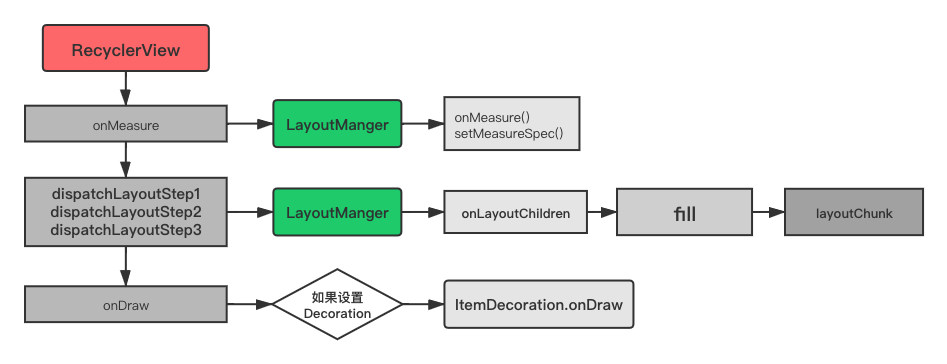

1. 绘制流程
2. setAdapter 刷新操作 notifySetDataChange
3. 复用与缓存操作
4. 滑动操作

##### 前言

- RecyclerView是作为ListView和GridView的加强版出现的，功能主要是在有限的屏幕上展示大量的列表内容，所以RecyclerView的核心是它的复用机制

##### 1.RecyclerView的使用

~~~java
//1.设置LayoutManager
recyclerView.setLayoutManager(new LinearLayoutManager(this));
//2.设置Adapter适配器
recyclerView.setAdapter(new SimpleAdapter());
//3.设置列表分割线
recyclerView.addItemDecoration();
//4.设置item动画
recyclerView.setItemAnimator();
~~~

解析：

- setLayoutManager：设置RecyclerView的布局管理器，决定RecyclerView的限时风格，必选项
  - 常用的有：线性布局管理器（LinearLayoutManager）；网格布局管理器（GridLayoutManager）；瀑布流布局管理器（StaggeredGridLayoutManager）
- setAdapter：设置RecyclerView的数据适配器，必选项。当数据发生改变时，以通知者的身份，通知RecyclerView数据改变进行列表的刷新操作
- addItemDecoration：设置RV中Item装饰器，用来设置Item的分割线，非必选项
- setItemAnimator：设置RV中Item的动画，非必选项

源码：

~~~java
public class RecyclerView extends ViewGroup implements ... {

    private final RecyclerViewDataObserver mObserver = 
      new RecyclerViewDataObserver();
    final Recycler mRecycler = new Recycler();
  
    public void setLayoutManager(@Nullable LayoutManager layout) {
        if (layout == mLayout) {
            return;
        }
        stopScroll();
      
      //1. mLayout != null说明RecyclerView之前绑定过LayoutManager，需要进行解绑
        if (mLayout != null) {
            // end all running animations
            if (mItemAnimator != null) {
                mItemAnimator.endAnimations();
            }
            mLayout.removeAndRecycleAllViews(mRecycler);
            mLayout.removeAndRecycleScrapInt(mRecycler);
            mRecycler.clear();
            if (mIsAttached) {
                mLayout.dispatchDetachedFromWindow(this, mRecycler);
            }
            mLayout.setRecyclerView(null);
            mLayout = null;
        } else {
            mRecycler.clear();
        }
      
      // 2.将新的LayoutManager赋值给mLayout
        mChildHelper.removeAllViewsUnfiltered();
        mLayout = layout;
        if (layout != null) {
          // 新设置的布局管理器layout不能绑定过RecyclerView
            if (layout.mRecyclerView != null) {
                throw new IllegalArgumentException("LayoutManager " + layout
                        + " is already attached to a RecyclerView:"
                        + layout.mRecyclerView.exceptionLabel());
            }
          // 3.LayoutManager与RecyclerView绑定
            mLayout.setRecyclerView(this);
            if (mIsAttached) {
                mLayout.dispatchAttachedToWindow(this);
            }
        }
        mRecycler.updateViewCacheSize();
      // 4.重新触发绘制流程
        requestLayout();
    }
  
    public void setAdapter(@Nullable Adapter adapter) {
        setLayoutFrozen(false);
        setAdapterInternal(adapter, false, true);
        processDataSetCompletelyChanged(false);
        requestLayout();
    }
  
  //设置适配器Adapter
    private void setAdapterInternal(@Nullable Adapter adapter, 
                                    boolean compatibleWithPrevious,
                                    boolean removeAndRecycleViews) {
      //1.之前老的mAdapter 取消监听，并调用mAdapter的detache方法
        if (mAdapter != null) {mObserver
            mAdapter.unregisterAdapterDataObserver(mObserver);
            mAdapter.onDetachedFromRecyclerView(this);
        }
        if (!compatibleWithPrevious || removeAndRecycleViews) {
            removeAndRecycleViews();
        }
        mAdapterHelper.reset();
      //2.保存老的Adapter后面要用，并给新的mAdapter赋值
        final Adapter oldAdapter = mAdapter;
        mAdapter = adapter;
        if (adapter != null) {
          //3.监听mObserver
            adapter.registerAdapterDataObserver(mObserver);
            adapter.onAttachedToRecyclerView(this);
        }
      // 4.布局管理器不为空，调用onAdapterChanged 切换Adapter的引用
        if (mLayout != null) {
            mLayout.onAdapterChanged(oldAdapter, mAdapter);
        }
        mRecycler.onAdapterChanged(oldAdapter, mAdapter, compatibleWithPrevious);
        mState.mStructureChanged = true;
    }
}
~~~

#### 2.RecyclerView绘制流程

- RecyclerView本质上也是一个自定义ViewGroup，然后通过Adapter不断获取ItemView然后添加，在滑动的时候通过缓存复用来提升整体性能

##### 2.1.RecyclerView的onMeasure方法

~~~java
public class RecyclerView extends ViewGroup implements ... {
  
    final State mState = new State();
  
    @Override
    protected void onMeasure(int widthSpec, int heightSpec) {
        if (mLayout == null) {
          // 1.如果没有设置布局管理器，调用默认的测量方法defaultOnMeasure
            defaultOnMeasure(widthSpec, heightSpec);
            return;
        }
        if (mLayout.isAutoMeasureEnabled()) {
            final int widthMode = MeasureSpec.getMode(widthSpec);
            final int heightMode = MeasureSpec.getMode(heightSpec);

            //2.调用的是布局管理器的onMeasure方法
            mLayout.onMeasure(mRecycler, mState, widthSpec, heightSpec);
          
          //3.如果RecyclerView在xml中设置了宽高的mode为EXACTLY，
          // measureSpecModeIsExactly为true，且后面的流程直接return
            final boolean measureSpecModeIsExactly =
              widthMode == MeasureSpec.EXACTLY && heightMode == MeasureSpec.EXACTLY;
            if (measureSpecModeIsExactly || mAdapter == null) {
                return;
            }
            if (mState.mLayoutStep == State.STEP_START) {
              // 4.第一步
                dispatchLayoutStep1();
            }
            mLayout.setMeasureSpecs(widthSpec, heightSpec);
            mState.mIsMeasuring = true;
          //5.第二步
            dispatchLayoutStep2();
            mLayout.setMeasuredDimensionFromChildren(widthSpec, heightSpec);
            ...
        }
    }
  
  //主要是对配置项进行初始化设置，和数据清空操作
    private void dispatchLayoutStep1() {
        mState.assertLayoutStep(State.STEP_START);
        fillRemainingScrollValues(mState);
        mState.mIsMeasuring = false;
        startInterceptRequestLayout();
        mViewInfoStore.clear();
        onEnterLayoutOrScroll();
        processAdapterUpdatesAndSetAnimationFlags();
        saveFocusInfo();
        mState.mTrackOldChangeHolders = mState.mRunSimpleAnimations && mItemsChanged;
        mItemsAddedOrRemoved = mItemsChanged = false;
        mState.mInPreLayout = mState.mRunPredictiveAnimations;
        mState.mItemCount = mAdapter.getItemCount();
        findMinMaxChildLayoutPositions(mMinMaxLayoutPositions);
        ...
        onExitLayoutOrScroll();
        stopInterceptRequestLayout(false);
        mState.mLayoutStep = State.STEP_LAYOUT;
    }
  
    private void dispatchLayoutStep2() {
        startInterceptRequestLayout();
        onEnterLayoutOrScroll();
      //1.对mState变量赋值
        mState.assertLayoutStep(State.STEP_LAYOUT | State.STEP_ANIMATIONS);
        mAdapterHelper.consumeUpdatesInOnePass();
        mState.mItemCount = mAdapter.getItemCount();
        mState.mDeletedInvisibleItemCountSincePreviousLayout = 0;

        //2.调用LayoutManager的onLayoutChildren方法
        mState.mInPreLayout = false;
        mLayout.onLayoutChildren(mRecycler, mState);
        mState.mStructureChanged = false;
        mPendingSavedState = null;
        mState.mRunSimpleAnimations = mState.mRunSimpleAnimations && mItemAnimator != null;
      //修改mState的步骤为STEP_ANIMATIONS
        mState.mLayoutStep = State.STEP_ANIMATIONS;
        onExitLayoutOrScroll();
        stopInterceptRequestLayout(false);
    }
}
~~~

解析：

- 在xml中，如果RecyclerView的宽高设置为match_parent或固定值时，则measureSpecModeIsExactly的值为true，接着调用LayoutManager的onMeasure方法测量自身的宽高即可。
- 如果RV的宽高设置为warp_content,则会执行下面的dispatchLayoutStep2方法，该方法中主要调用LayoutManager的onLayoutChildren，由各个布局管理器自己实现

##### 2.2.onLayout

~~~java
public class RecyclerView extends ViewGroup implements ... {
  
	protected void onLayout(boolean changed, int l, int t, int r, int b) {
        dispatchLayout();
        mFirstLayoutComplete = true;
    }

    void dispatchLayout() {
      // 还有设置适配器或布局管理器，直接返回
        if (mAdapter == null) {
            return;
        }
        if (mLayout == null) {
            return;
        }
        mState.mIsMeasuring = false;
        if (mState.mLayoutStep == State.STEP_START) {
            dispatchLayoutStep1();
            mLayout.setExactMeasureSpecsFrom(this);
          // 1.重新调用dispatchLayoutStep2
            dispatchLayoutStep2();
        } else if (mAdapterHelper.hasUpdates() || mLayout.getWidth() != getWidth()
                || mLayout.getHeight() != getHeight()) {
            mLayout.setExactMeasureSpecsFrom(this);
          //1.
            dispatchLayoutStep2();
        } else {
            mLayout.setExactMeasureSpecsFrom(this);
        }
      //2.
        dispatchLayoutStep3();
    }
}
~~~

解析：

- 如果在onMeasure阶段没有执行dispatchLayoutStep2方法去测量子View，则会在onLayout阶段重新执行
- 在dispatchLayoutStep2方法中会执行mLayout.onLayoutChildren()方法，这个方法的核心逻辑就是测量RV内的子View大小，并确定他们所在的位置。
  - 布局管理器的子类都复写了这个方法，并实现了不同方式的布局

##### 2.3.LinearLayoutManager的onLayoutChildren方法

~~~java
public class LinearLayoutManager extends RecyclerView.LayoutManager ...{

  //1.布局管理器中onLayoutChildren方法根据不同的布局方向调用fill方法
    public void onLayoutChildren(RecyclerView.Recycler recycler, RecyclerView.State state) {
        ...
        if (mAnchorInfo.mLayoutFromEnd) {
            ...
            fill(recycler, mLayoutState, state, false);
            ...
        } else {
            ...
            fill(recycler, mLayoutState, state, false);
            ...
        }
        ...
        layoutForPredictiveAnimations(recycler, state, startOffset, endOffset);
        ...
    }
  
    int fill(RecyclerView.Recycler recycler, LayoutState layoutState,
            RecyclerView.State state, boolean stopOnFocusable) {
        ...
        LayoutChunkResult layoutChunkResult = mLayoutChunkResult;
      // while循环判断remainingSpace还有剩余空间来绘制一个item，
      // 调用layoutChunk方法真正的对子View进行测量布局
        while ((layoutState.mInfinite || remainingSpace > 0) &&
               layoutState.hasMore(state)) {
            layoutChunkResult.resetInternal();
            layoutChunk(recycler, state, layoutState, layoutChunkResult);
            ...
            if (!layoutChunkResult.mIgnoreConsumed || layoutState.mScrapList != null
                    || !state.isPreLayout()) {
                layoutState.mAvailable -= layoutChunkResult.mConsumed;
                remainingSpace -= layoutChunkResult.mConsumed;
            }
            ...
        }
        return start - layoutState.mAvailable;
    }
}
~~~

解析：

- 在onLayoutChildren方法中调用fill方法，完成子View的测量布局工作
- 在fill方法中通过while循环判断是否还有剩余足够空间来绘制一个完整的子View
- layoutChunk方法中是子View测量布局的真正实现，每次执行完之后需要重新计算remainingSpace大小

#####layoutChunk方法

 ~~~java
public class LinearLayoutManager extends RecyclerView.LayoutManager ...{

    void layoutChunk(RecyclerView.Recycler recycler, RecyclerView.State state,
            LayoutState layoutState, LayoutChunkResult result) {
      //1.从缓存中取出ItemView
        View view = layoutState.next(recycler);
        RecyclerView.LayoutParams params = (RecyclerView.LayoutParams) 
          view.getLayoutParams();
      //2.调用addView()或者addDisappearingView()方法将ItemView添加到RecyclerView中
        if (layoutState.mScrapList == null) {
            if (mShouldReverseLayout == (layoutState.mLayoutDirection
                    == LayoutState.LAYOUT_START)) {
                addView(view);
            } else {
                addView(view, 0);
            }
        } else {
            if (mShouldReverseLayout == (layoutState.mLayoutDirection
                    == LayoutState.LAYOUT_START)) {
                addDisappearingView(view);
            } else {
                addDisappearingView(view, 0);
            }
        }
      //3.测量子ItemView的宽高
        measureChildWithMargins(view, 0, 0);
        ...
       //4.根据设置的Decoration，Margins等选项，确定子ItemView的实际位置，会调用子view的layout方法
        layoutDecoratedWithMargins(view, left, top, right, bottom);
        ...
    }
}
 ~~~

解析：

- layoutState.next(recycler)方法，从缓存Recycler中取出子ItemView，然后调用addView或者addDisappearingView方法将子ItemView添加到RV中
- measureChildWithMargins方法测量被添加到RV中的子ItemVIew的宽高
- layoutDecoratedWithMargins确定子ItemView的现实位置，调用的是子View的layout方法

##### 2.4.onDraw

~~~java
    public void onDraw(Canvas c) {
        super.onDraw(c);

        final int count = mItemDecorations.size();
        for (int i = 0; i < count; i++) {
            mItemDecorations.get(i).onDraw(c, this, mState);
        }
    }
~~~

解析：

- 测量和布局完成之后，最后的就是绘制操作，该方法中非常简单，如果有设置分割线，会循环调用所有的ItemDecoration的onDraw方法。
- 而所有的子ItemView则会通过Android渲染机制递归的调用子ItemVIew的draw方法进行显示。

##### 总结

RecyclerView的测量和布局的操作都是委托给LayoutManager来执行，不同的布局管理器会有不同的布局现实，这是一种策略模式。

