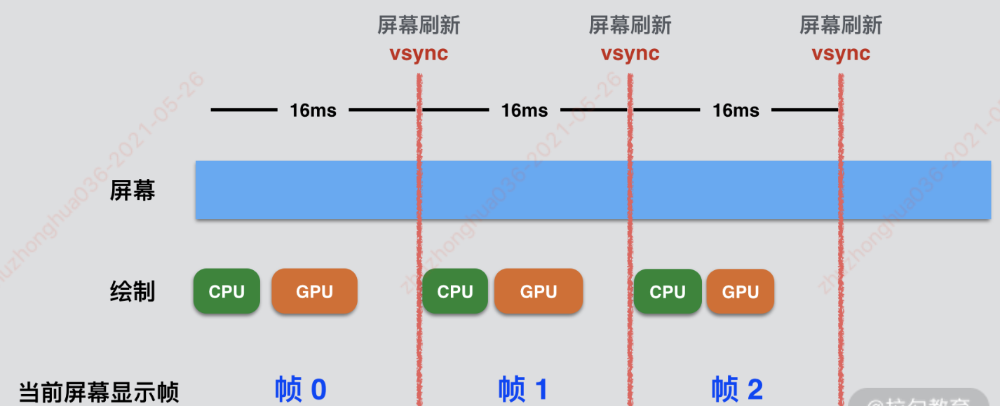

1. 屏幕刷新原理
2. CPU，GPU，SurfaceFling 的工作机制
3. Choreographer 工作原理
4. Vsync 机制原理


#### 1.Systrace的使用

- 运行Systrace脚本，脚本路径在 android-sdk/platform-tools/systrace/ 文件夹中。

~~~shell
python systrace.py --time=10 -o my_systrace.html 
~~~

#### 2.CPU&GPU

##### 2.1.数据经过cpu处理，最后显示在屏幕的过程

- 1.View的绘制经过Measure，Layout，Draw 3个阶段，这三个阶段的工作是由CPU来完成的。另外CPU还会负责处理用户输入，View动画等事件，且这些工作都是在UI线程中完成
- 2.CPU调用了Draw方法后，并没有将数据展示在屏幕上，CPU绘制完后会在RenderThread线程中将这部分数据提交给GPU。GPU负责对这些数据进行栅格化操作（Rasterization），并将数据缓存在一个Buffer中。
- 3.最后手机屏幕再从这个Buffer中读取数据显示到屏幕上，真正对Buffer中的数据进行合成显示到屏幕上的是SurfaceFliinger

##### 2.2双缓冲机制

- 问题由来：	
  - 如果只有一个缓存，GPU向Buffer缓存数据；屏幕不断从Buffer中取数据，会存在并发问题。同时对一个资源进行读写，会污染Buffer中的数据，屏幕有可能显示错乱
- 解决方案：双缓冲机制，有2个Buffer：Back Buffer和Frame Buffer
  - CPU提交的数据被缓存到Back Buffer中，然后GPU对Back Buffer中的数据做栅格化操作。
  - 栅格化后的数据交换（swap）到Frame Buffer，屏幕从Frame Buffer中取出数据显示

##### 2.3. Vsync

- GPU的操作是要将Back Buffer数据交换高Frame Buffer中，为保证数据安全，交换之前，Back Buffer中的数据会锁定，等到了交换的间隔时间才进行数据交换。为了保证交换的间隔时间，Android引入了vsync机制，保证屏幕刷新屏幕

##### Vsync机制的本质是为了保证 屏幕刷新率 和 GPU绘制帧率保持一致

- 概念
  - screen refresh rate — 屏幕刷新率。指的是手机屏幕每秒钟可以刷新多少次。（手机厂商默认60HZ，也就是16.6ms进行一次刷新）
  - frame rate — GPU绘制帧率，指的是GPU每秒能够合成绘制多少帧

- Android系统引入Vsync机制，每隔16ms硬件层发出vsync信号，应用层收到信号后会触发UI的渲染流程，通过vsync信号也会触发SurfaceFlinger读取Buffer中的数据，进行合成显示到屏幕上。
- 实现将CPU和GPU的开始时间与屏幕刷新强行拖拽到同一起跑线。




#### 3.Choreographer 编舞者

- 主要作用：接收硬件发出的vsync信号，并进行View的绘制操作

##### 3.1.自定义过程中主动调用控件的绘制方法 invalidate & requestLayout

- 最后都会调用到ViewRootImpl.requestLayout()

~~~java
public final class ViewRootImpl implements ViewParent,
        View.AttachInfo.Callbacks, ThreadedRenderer.DrawCallbacks {
    @Override
    public void requestLayout() {
        if (!mHandlingLayoutInLayoutRequest) {
            checkThread();
            mLayoutRequested = true;
            scheduleTraversals();
        }
    }
          
    // 接着调用 scheduleTraversals
    void scheduleTraversals() {
        if (!mTraversalScheduled) {
            mTraversalScheduled = true;
          // 1.插入一个消息到消息队列MQ中
            mTraversalBarrier = mHandler.getLooper().getQueue().postSyncBarrier();
          // 2.核心方法：将mTraversalRunnable 传递给 Choreographer
            mChoreographer.postCallback(
                    Choreographer.CALLBACK_TRAVERSAL, mTraversalRunnable, null);
            if (!mUnbufferedInputDispatch) {
                scheduleConsumeBatchedInput();
            }
            notifyRendererOfFramePending();
            pokeDrawLockIfNeeded();
        }
    }
}
~~~

- Choreographer.postCallback

~~~java
public final class Choreographer {
  
    public void postCallback(int callbackType, Runnable action, Object token) {
        postCallbackDelayed(callbackType, action, token, 0);
    }

    public void postCallbackDelayed(int callbackType,
            Runnable action, Object token, long delayMillis) {
       ...
        postCallbackDelayedInternal(callbackType, action, token, delayMillis);
    }

  	// callbackType的值为ViewRootImpl中调用方法的入参 Choreographer.CALLBACK_TRAVERSAL
  	// delayMillis默认为0
    private void postCallbackDelayedInternal(int callbackType,
            Object action, Object token, long delayMillis) {
        synchronized (mLock) {
            final long now = SystemClock.uptimeMillis();
            final long dueTime = now + delayMillis;
          // 重要：向CallbackQueue队列中添加一个CallBack的回调，action为Runnable
          // 最后会将action 作为参数封装成 CallbackRecord 对象，并将该对象保存到CallbackQueue队列中
          // 该CallbackQueue 中的数据结构底层为链表
            mCallbackQueues[callbackType].addCallbackLocked(dueTime, action, token);

          // 正常情况下会进入if 条件语句
            if (dueTime <= now) {
              // 该方法最终会想系统注册一个Vsync信号
                scheduleFrameLocked(now);
            } else {
                Message msg = mHandler.obtainMessage(MSG_DO_SCHEDULE_CALLBACK, action);
                msg.arg1 = callbackType;
              // 发送同步屏障消息
                msg.setAsynchronous(true);
                mHandler.sendMessageAtTime(msg, dueTime);
            }
        }
    }
  
  //注册一个vsync信号
    private void scheduleFrameLocked(long now) {
        if (!mFrameScheduled) {
            mFrameScheduled = true;
            if (USE_VSYNC) {
                if (isRunningOnLooperThreadLocked()) {
                    scheduleVsyncLocked();
                } else {
                    Message msg = mHandler.obtainMessage(MSG_DO_SCHEDULE_VSYNC);
                    msg.setAsynchronous(true);
                    mHandler.sendMessageAtFrontOfQueue(msg);
                }
            } else {
                final long nextFrameTime = Math.max(
                        mLastFrameTimeNanos / TimeUtils.NANOS_PER_MS + sFrameDelay, now);
                }
                Message msg = mHandler.obtainMessage(MSG_DO_FRAME);
                msg.setAsynchronous(true);
                mHandler.sendMessageAtTime(msg, nextFrameTime);
            }
        }
    }
  
	//最后会调用native方法进行vsync信号注册
    private void scheduleVsyncLocked() {
        mDisplayEventReceiver.scheduleVsync();
    }
}
~~~

##### 3.2.注册&接收vsync信号

~~~java
public abstract class DisplayEventReceiver {
    // 注册
    public void scheduleVsync() {
        if (mReceiverPtr == 0) {
        } else {
            nativeScheduleVsync(mReceiverPtr);
        }
    }
}

    private final class FrameDisplayEventReceiver extends DisplayEventReceiver
            implements Runnable {
        private boolean mHavePendingVsync;
        private long mTimestampNanos;
        private int mFrame;

        @Override
        public void onVsync(long timestampNanos, int builtInDisplayId, int frame) {
            if (builtInDisplayId != SurfaceControl.BUILT_IN_DISPLAY_ID_MAIN) {
                scheduleVsync();
                return;
            }

            long now = System.nanoTime();
            if (timestampNanos > now) {
                timestampNanos = now;
            }

            if (mHavePendingVsync) {
            } else {
                mHavePendingVsync = true;
            }

            mTimestampNanos = timestampNanos;
            mFrame = frame;
            Message msg = Message.obtain(mHandler, this);
            msg.setAsynchronous(true);
            mHandler.sendMessageAtTime(msg, timestampNanos / TimeUtils.NANOS_PER_MS);
        }
        
				//接收vsync信号
        @Override
        public void run() {
            mHavePendingVsync = false;
            doFrame(mTimestampNanos, mFrame);
        }
    }
~~~

##### 3.3.Choreographer.doFrame() 接收到信号后进行界面绘制

~~~java
public final class Choreographer {
  
    void doFrame(long frameTimeNanos, int frame) {
        final long startNanos;
        synchronized (mLock) {
            if (!mFrameScheduled) {
                return; // no work to do
            }

            if (DEBUG_JANK && mDebugPrintNextFrameTimeDelta) {
                mDebugPrintNextFrameTimeDelta = false;
            }

            long intendedFrameTimeNanos = frameTimeNanos;
            startNanos = System.nanoTime();
            final long jitterNanos = startNanos - frameTimeNanos;
            if (jitterNanos >= mFrameIntervalNanos) {
                final long skippedFrames = jitterNanos / mFrameIntervalNanos;
                final long lastFrameOffset = jitterNanos % mFrameIntervalNanos;
                frameTimeNanos = startNanos - lastFrameOffset;
            }

            if (frameTimeNanos < mLastFrameTimeNanos) {
                scheduleVsyncLocked();
                return;
            }

            if (mFPSDivisor > 1) {
                long timeSinceVsync = frameTimeNanos - mLastFrameTimeNanos;
                if (timeSinceVsync < (mFrameIntervalNanos * mFPSDivisor) && timeSinceVsync > 0) {
                    scheduleVsyncLocked();
                    return;
                }
            }

            mFrameInfo.setVsync(intendedFrameTimeNanos, frameTimeNanos);
            mFrameScheduled = false;
            mLastFrameTimeNanos = frameTimeNanos;
        }

        try {
            Trace.traceBegin(Trace.TRACE_TAG_VIEW, "Choreographer#doFrame");
            AnimationUtils.lockAnimationClock(frameTimeNanos / TimeUtils.NANOS_PER_MS);
						
          //核心逻辑：执行各种Callbacks，完成在一帧时间内处理 input，animation，traversal 3件事
            mFrameInfo.markInputHandlingStart();
            doCallbacks(Choreographer.CALLBACK_INPUT, frameTimeNanos);

            mFrameInfo.markAnimationsStart();
            doCallbacks(Choreographer.CALLBACK_ANIMATION, frameTimeNanos);

            mFrameInfo.markPerformTraversalsStart();
            doCallbacks(Choreographer.CALLBACK_TRAVERSAL, frameTimeNanos);

            doCallbacks(Choreographer.CALLBACK_COMMIT, frameTimeNanos);
        } finally {
            AnimationUtils.unlockAnimationClock();
            Trace.traceEnd(Trace.TRACE_TAG_VIEW);
        }
    }
  
  
    void doCallbacks(int callbackType, long frameTimeNanos) {
        CallbackRecord callbacks;
        synchronized (mLock) {
            final long now = System.nanoTime();
          // 取出CallbackQueue 队列中保存的 CallbackRecord,取出的是链表的头节点
            callbacks = mCallbackQueues[callbackType].extractDueCallbacksLocked(
                    now / TimeUtils.NANOS_PER_MS);
            if (callbacks == null) {
                return;
            }
            mCallbacksRunning = true;

            if (callbackType == Choreographer.CALLBACK_COMMIT) {
                final long jitterNanos = now - frameTimeNanos;
                Trace.traceCounter(Trace.TRACE_TAG_VIEW, "jitterNanos", (int) jitterNanos);
                if (jitterNanos >= 2 * mFrameIntervalNanos) {
                    final long lastFrameOffset = jitterNanos % mFrameIntervalNanos
                            + mFrameIntervalNanos;
                    frameTimeNanos = now - lastFrameOffset;
                    mLastFrameTimeNanos = frameTimeNanos;
                }
            }
        }
        try {
            Trace.traceBegin(Trace.TRACE_TAG_VIEW, CALLBACK_TRACE_TITLES[callbackType]);
          
          // 然后不断遍历链表的所有节点，并执行其中的run方法，其内部真正执行的是最开始调用requestLayout方法时
          // 在ViewRootImple 方法中 调用的mChoreographer.postCallback() 方法中的参数 mTraversalRunnable 任务的run方法
            for (CallbackRecord c = callbacks; c != null; c = c.next) {
                c.run(frameTimeNanos);
            }
        } finally {
            synchronized (mLock) {
                mCallbacksRunning = false;
                do {
                    final CallbackRecord next = callbacks.next;
                    recycleCallbackLocked(callbacks);
                    callbacks = next;
                } while (callbacks != null);
            }
            Trace.traceEnd(Trace.TRACE_TAG_VIEW);
        }
    }
  
    private static final class CallbackRecord {
        public CallbackRecord next;
        public long dueTime;
        public Object action; // Runnable or FrameCallback
        public Object token;

        public void run(long frameTimeNanos) {
            if (token == FRAME_CALLBACK_TOKEN) {
                ((FrameCallback)action).doFrame(frameTimeNanos);
            } else {
                ((Runnable)action).run();
            }
        }
    }
}
~~~

- 接收到vsync信号后，最后执行的是CallbackRecord.run方法，最后会执行其中的 action方法
  - 该action 可以为Choreographer.postCallback() 方法的mTraversalRunnable 参数

```java
mChoreographer.postCallback(
        Choreographer.CALLBACK_TRAVERSAL, mTraversalRunnable, null);

    final TraversalRunnable mTraversalRunnable = new TraversalRunnable();

    final class TraversalRunnable implements Runnable {
        @Override
        public void run() {
            doTraversal();
        }
    }

    void doTraversal() {
        if (mTraversalScheduled) {
            mTraversalScheduled = false;
            mHandler.getLooper().getQueue().removeSyncBarrier(mTraversalBarrier);

            if (mProfile) {
                Debug.startMethodTracing("ViewAncestor");
            }
						// 在该方法中最终执行了渲染的三个方法：measure，layout，draw
            performTraversals();

            if (mProfile) {
                Debug.stopMethodTracing();
                mProfile = false;
            }
        }
    }
```

- 还有一种情况是设置了FrameCallback 回调

```java
Choreographer.getInstance().postFrameCallback(new Choreographer.FrameCallback() {
    @Override
    public void doFrame(long frameTimeNanos) {
        //接收到vsync信号，
    }
});
```

	##### 3.4.Choreographer总结

Choreographer 是一个承上启下的角色

- 收集应用层输入：当应用层执行了各种操作后（输入，手指触摸，其他情况），需要刷新界面；可以通过Choreographer 往一个缓存中追加各种事件输入（callback），这些事件主要包括input，animation，traverssal绘制等，这些callback不会立即执行。而是会缓存在Choreographer 中的 CallbackQueue中
- 接收硬件发出的vsync信号：Choreographer中有个内部类 FrameDisplayEventReceiver主要用来接收硬件层发出的vsync信号。当接收到vsync信号之后，会调用onVsync --> doFrame —>doCallbacks,在doCallbacks方法中会从CallbackQueue队列中取出进行绘制的TraversalRunnable，并调用其run方法进行绘制
- Choreographer的本质是保证软件层和屏幕刷新处于同一频率，使的app以一个比较稳定的帧率运行，减少丢帧的概率

#### 4.使用Choreographer 实现帧渲染监控

- Choreographer提供了postFrameCallback方法，可以往CallbackQueue 队列中添加FrameCallback对象实例
- 当收到硬件的vsync信号后，会执行CallbackQueue 队列的所有节点数据，内部会执行FrameCallback的doFrame方法

```java
Choreographer.getInstance().postFrameCallback(new Choreographer.FrameCallback() {
    @Override
    public void doFrame(long frameTimeNanos) {
        //接收到vsync信号，
    }
});
```

##### 实现原理

- doFrame方法会在绘制每一帧时被调用，所有我们可以在app层主动向Choreographer中添加Callback，然后通过检测两次doFrame方法执行的时间间隔来判断是否发生"丢帧"

```java
    private long lastFrameTimeNanos;

Choreographer.getInstance().postFrameCallback(new Choreographer.FrameCallback() {
     @Override
    public void doFrame(long frameTimeNanos) {
        //接收到vsync信号
        // frameTimeNanos是当前刷新的时间
        System.out.println("frameTimeNanos:" + frameTimeNanos);
        if (lastFrameTimeNanos == 0) {
            lastFrameTimeNanos = frameTimeNanos;
        }
        //差值
        long diff = TimeUnit.MILLISECONDS.convert(
                frameTimeNanos - lastFrameTimeNanos,
                TimeUnit.MILLISECONDS);
        if (diff > 16.6f) {
            System.out.println("丢帧了");
        }

        lastFrameTimeNanos = frameTimeNanos;
        //从新注册，往Choreographer中添加监听
        Choreographer.getInstance().postFrameCallback(this);
    }
});
```


