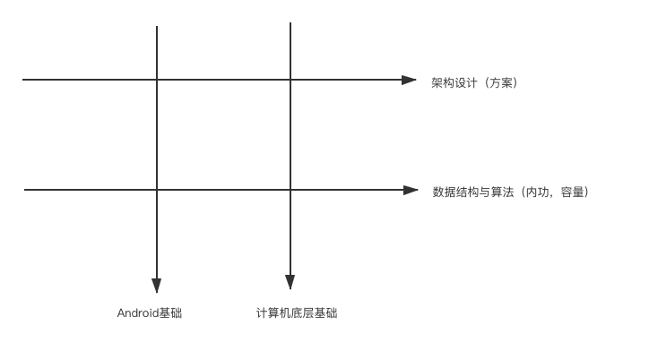

1.井子型知识体系架构

- 数据结构与算法是内容，是脑容量，是悟性，
  - 是知识体系的基础，是上层架构搭建是否稳固的根基。
- 计算机基础是深度，是底层知识点的支撑
- Android知识点是针对这一系统软件的设计在上层应用表现的特性
- 架构设计是数据结构与算法和基础知识的应用，在上层搭建的框架，其方案设计与选型依赖于底层的基础知识。

#### 2.各个体系骨架构成

#####2.1.数据结构与算法：

- 基本数据结构
  - 数组，链表，栈，队列，优先级队列，树，图
- 算法
  - 排序，二分法，贪心，回溯，kmp，动态规划

##### 2.2.计算机基础

- 链接：elf 可执行文件格式
- 虚拟内存：内存分配
- 进程：进程间通信
- 线程：并发编程，线程池，锁
- 网络：tcp，dns，http，http2，https

##### 2.3.Android基础知识

- 四大组件
- 自定义控件
- 事件分发
- View渲染流程
- RecyclerView：绘制，与缓存设计
- app启动流程
- AMS
- PKMS

##### 2.4.架构（方案设计与实现）

- Android性能优化
  - 启动，内存，卡顿，网络
- 架构
  - 组件化，热修复，插件化，JetPackt，日志收集与上传
- 第三方架构
  - ThreadPoolExecutor，OkHttp，Glide，EventBus

##### 成功的秘诀

- 知识，汗水，灵感，机遇
- 费曼学习法，将学习过的知识用自己的话表达出来
- 输入的量决定输出的质，输出倒逼输入