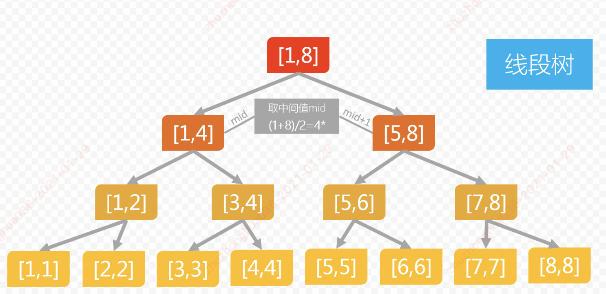

#### 线段树

- 线段树是一种平衡二叉搜索树（完全二叉树），他将一个线段区间划分成一些单元区间。
- 对于线段树中的每一个**非叶子节点**, 表示区间[a,b]的和，他的**左孩子表示的区间为[a,(a+b)/2]**,**右孩子表示的区间为[(a+b)/2+1,b]**.
- 最后生成的线段树的叶子节点数目为N，与原始数组下标对应。
- 线段树一般包括建立，查询，插入，更新等操作，建立规模为N的时间复杂度是O(NlogN),其他操作时间复杂度为O(logN)

##### 线段树的特点

- 线段树是完全二叉树，线段树可以使用数组保存，对二叉树进行层序遍历。
- 假设某个节点下表为i，则他的左孩子下标为2 * i+1，右孩子下标为2 * i+2。
- 如果数组nums = [0,1,3,4,6],存储为线段树数组values = [14,4,10,1,3,4,6,0,1]
- 其中value[pos] 的值，保存的是nums[left,right] （数组nums在区间left到right 的元素之和）

##### 线段树的构造

- 

