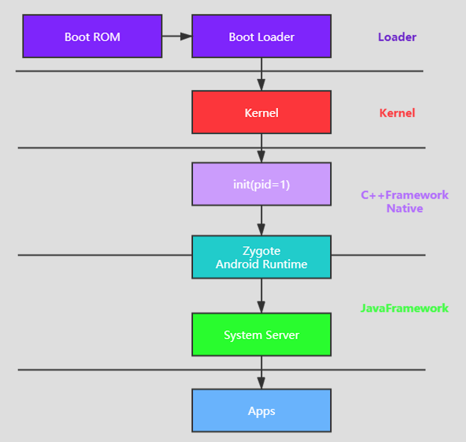
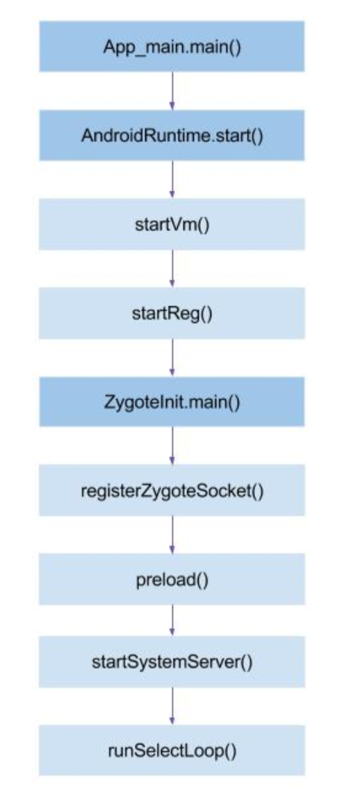

#### 系统启动流程

1. 启动电源以及系统启动

- 电源按下，引导芯片从ROM开始执行，加载引导程序到RAM

2. 引导程序

- 引导程序是Android操作系统开始运行前的一个小程序。Boot Loader

3. 内核

- 加载驱动，启动init进程

4. init进程

- 解析init.rc文件
- 启动Zygote进程
- 启动servicemanage进程，并注册sm服务

5. Zygote进程

- 启动AndroidRuntime
- 启动虚拟机
- 启动SystemServer服务

6. 启动Launcher

#### Zygote进程启动

- AndroidRuntime:为Android应用运行所需的运行时环境，包括
  - Dalvik VM：将字节码转成机器码
  - Java类库
  - JNI
  - libc
- 面试题
  - Android系统启动流程
  - SystemServer为什么要在Zygote中启动，而不是由init直接启动
    - Zygote孵化器，会提前加载一些资源，写时拷贝
  - 为什么要专门使用zygote进程去孵化应用进程，而不是让system_server去孵化
    - SystemServer启动了很多系统服务（AMS，PMS等），应用进程不需要
    - 进程的fork对多线程不友好，会造成死锁。
  - Zygote为什么不采用Binder机制进行IPC通信
    - Binder机制存在Binder线程池
    - fork拷贝对多线程不友好

