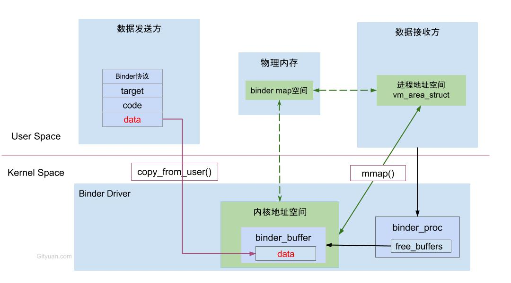
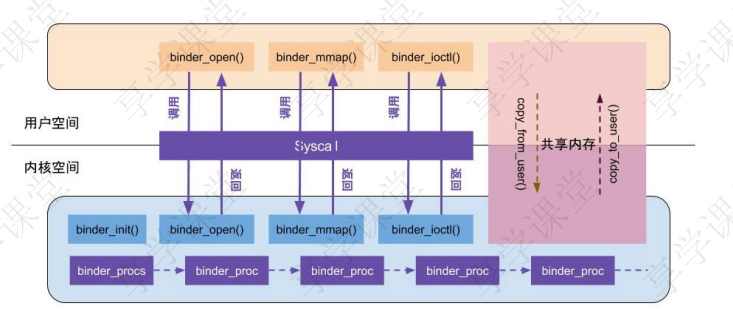
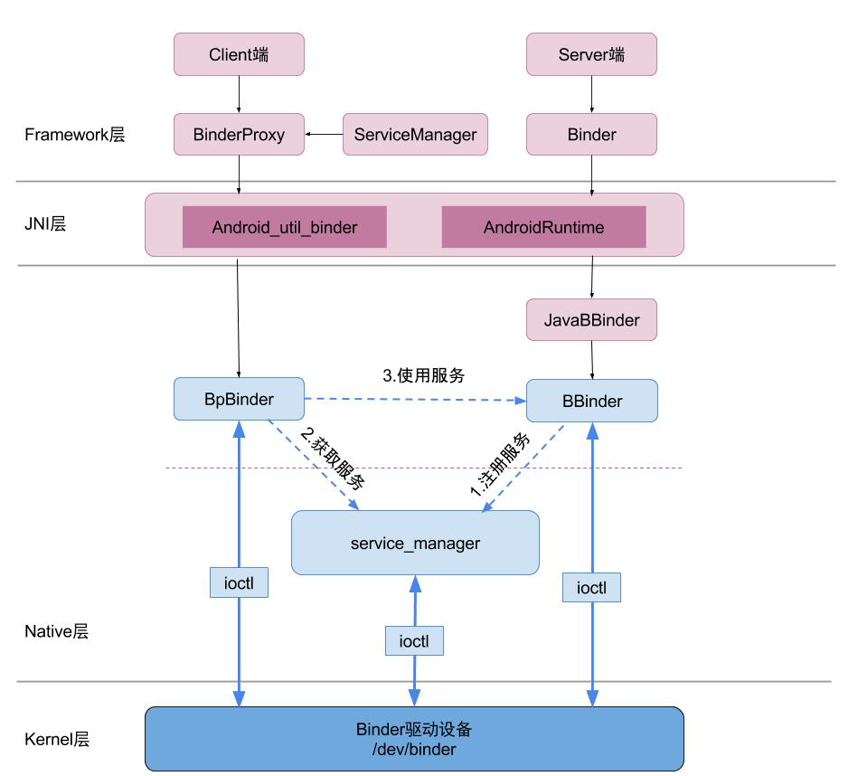

#####Binder是什么？

- 进程间通信

#####Binder的特点，与其他ipc机制比较

- 数据拷贝一次
- C/S架构
- 安全性：系统分配uid

#####如何实现一次拷贝

- mmap

#####binder驱动启动

- init(),创建binder设备节点
- open()获取binder驱动文件描述符
- mmap()，在内核分配一块内存，用于存放数据
- ioctl()，将ipc数据作为参数传递给binder driver

##### binder框架整体流程图

