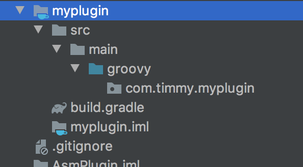
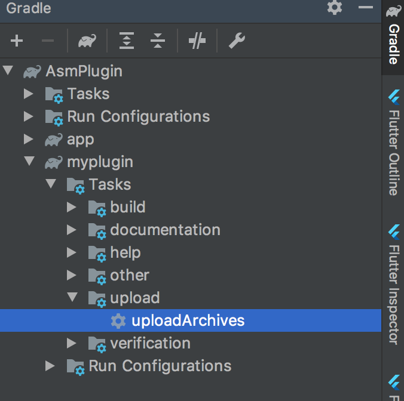
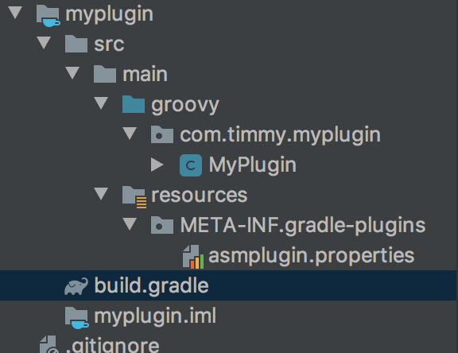
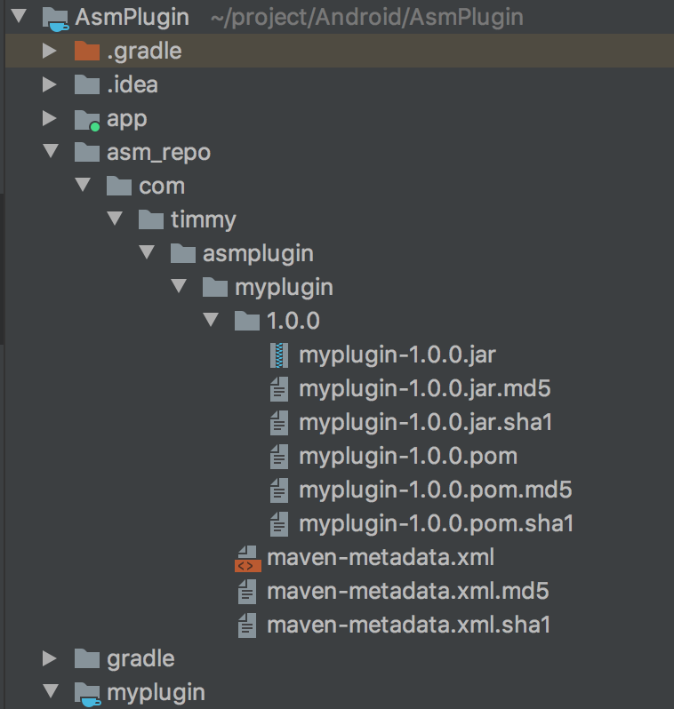
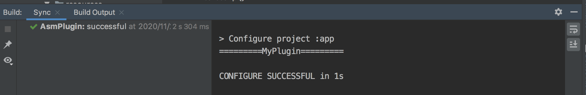

##### 前言

- 做Android开发大多遇到到这种需求：
  - 记录每一个页面的打开和关闭事件，并通过各种DataTracking框架上传到服务器，用来日后做数据分析
- 面对这样的需求，一般人会想到在每一个Activity的 onCreate 和 onDestory 方法中，分别添加页面打开和页面关闭的逻辑，常见做法如下：
  - 修改项目中现有的每一个Activity，这样存在的问题是，项目以后添加新的页面，这套逻辑需要重新拷贝一遍，很容易遗漏
  - 将项目中所有的Activity继承自BaseActivity，将页面打开和关闭的逻辑添加在BaseActivity中，这种方案看起来比第1种方案高级很多，并且后续项目有新的Activity，直接继承BaseActvity即可。
    - 但是这种方案对第三方依赖库种的界面则无能为力，因为我们没有第三方依赖库的源码

#### 编译插桩

- 编译插桩就是在代码编译期间修改已有的代码或者生成新代码。

- 编译插桩的时机

理解编译插桩之前，先回顾一下Android项目中.java文件的编译过程：

- 从上图可以看出，可以在1，2处对代码进行改造
  - 在.java文件编译成.class文件时，APT，AndroidAnnotation等就是在此处触发代码生成的。
  - 在.class文件进一步优化成.dex文件时，也就是直接操作字节码。这种方式功能更加强大，应用场景也更多。但是门槛比较高，需要对字节码有一定的理解。

使用一张图来描述ASM框架对字节码操作的流程：

##### 案例实现

使用ASM实现在每一个Activity打开时输出相应的log日志

**实现思路**

1. 遍历项目中所有的.class文件
   - 如何找到项目中编译生成的.class文件，这是我们需要解决的第一个问题。
   - 可以自定义Transform，来获取所有的.class文件引用，但是Transform的使用需要依赖Gradle Plugin。
   - 因此第一步需要创建一个单独的Gradle Plugin，并在Gradle Plugin中使用自定义的Transform找出所有的.class文件。
2. 遍历到目标.class文件（Activity）之后，通过ASM动态注入需要被插入的字节码
   - 如果第一步进行顺利，可以找出所有的.class文件。
   - 接下来就需要过滤出目标Activity文件，并在目标Activity文件的onCreate 方法中，通过ASM插入相应的log日志字节码

#### 具体实现：

1.新建项目

2.新建module

- 删除module目录下文件，除了保留src/main 和build.gradle文件
- 因为插件使用groovy语言编写，所以在main目录下心间groovy目录用于存放.groovy文件，并且在build.gradle文件中，添加groovy插件和sdk依赖

- build.gradle文件内容

~~~groovy
apply plugin:'groovy'

repositories {
    mavenCentral()
    jcenter()
}

dependencies {
    implementation gradleApi()
    implementation localGroovy()
    implementation 'com.android.tools.build:gradle:3.6.3'
}
~~~

3.编码

- 在groovy目录下新建.groovy文件，并实现Plugin接口

~~~groovy
package com.timmy.myplugin

import org.gradle.api.Plugin
import org.gradle.api.Project

public class MyPlugin implements Plugin<Project>{
    @Override
    void apply(Project project) {
        System.out.println("=========MyPlugin=========")
    }
}
~~~

- 在main目录下，新建resources目录，接着在resources目录下新建 META-INF/gradle-plugins目录
  - 在该目录下新建xxx.properties文件,文件内容为指定Plugin插件路径
  - 其中xxx为使用时，设置的插件名

~~~java
implementation-class=com.timmy.myplugin.MyPlugin
~~~

- 生成本地maven库，编辑build.gradle文件内容为

~~~groovy
apply plugin: 'groovy'

repositories {
    mavenCentral()
    jcenter()
}

dependencies {
    implementation gradleApi()
    implementation localGroovy()
    implementation 'com.android.tools.build:gradle:3.6.3'
}

apply plugin: 'maven'
group = 'com.timmy.asmplugin'
version = '1.0.0'
uploadArchives {
    repositories {
        mavenDeployer {
						//生成的插件放在上层目录的asm_repo文件夹下
            repository(url: uri('../asm_repo'))
        }
    }
}
~~~

- gradle任务自动生成

module目录结构：

生成的本地插件内容：

4.使用

- 在app module中使用，编辑app模块下.gradle文件，设置插件依赖

~~~groovy
apply plugin: 'asmplugin'

buildscript {
    repositories {
        maven { url uri('../asm_repo') }
        google()
        jcenter()
    }
    dependencies {
        //group + module名 + 版本号
        classpath 'com.timmy.asmplugin:myplugin:1.0.0'
    }
}
~~~

- 验证插件是否生效，clean项目查看build输出

