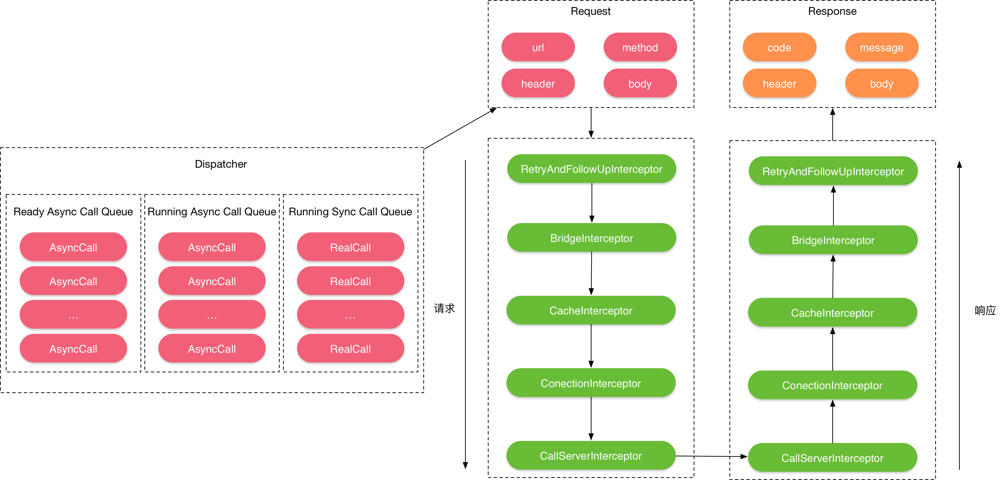
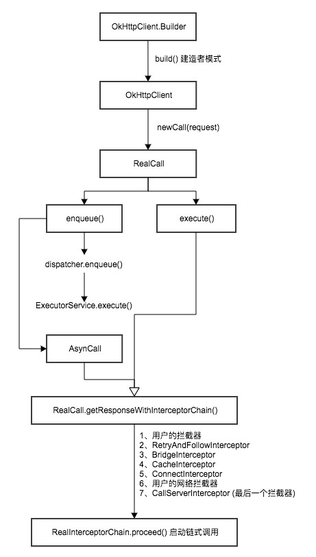

#### OkHttp

##### okhttp特点

- 支持spdy，http2，底层使用socket通信，对一台机器的所有请求共享同一个socket
- 内置连接池，支持连接复用，减少延迟
- 支持透明的gzip压缩响应体
- 通过缓存避免重复的请求
- 请求失败时自动重试主机的其他ip，自动重定向

##### Okhttp使用流程

1. 创建OkHttpClient对象 
2. 创建Request对象 
3. okhttpclient对象调用newCall并传入request对象获得一个Call对象
4. 发起请求并获取响应数据（通过请求execute方法，异步调用enqueue方法）

~~~java
    private void getSync(final String url) {
        new Thread(new Runnable() {
            @Override
            public void run() {
                try {
                    //1.创建OkHttpClient对象
                    OkHttpClient client = new OkHttpClient();

                    //2.创建请求对象 Request
                    Request request = new Request.Builder()
                            .url(url)
                            .get()
                            .build();

                    //3.根据request创建 Call对象
                    Call call = client.newCall(request);

                    //4.调用execute方法，同步方式请求响应Response
                    Response response = call.execute();
                    if (response.isSuccessful()) {
//                        String string = response.body().string();
                        //获取响应数据，切换到主线程进行界面更新
                    }
                } catch (IOException e) {
                    e.printStackTrace();
                }
            }
        }).start();
    }

    private void getAsync(String url) {
        //1.创建OkHttpClient对象
        OkHttpClient client = new OkHttpClient();

        //2.创建请求对象 Request
        Request request = new Request.Builder()
                .url(url)
                .get()
                .build();

        //3.根据request创建 Call对象
        Call call = client.newCall(request);

        //4.调用enqueue方法，异步请求网络，响应数据通过callback返回
        call.enqueue(new Callback() {
            @Override
            public void onFailure(Call call, IOException e) {

            }

            @Override
            public void onResponse(Call call, Response response) throws IOException {
                //获取响应数据，当前在子线程，需要切换到主线程进行界面更新
            }
        });
    }
~~~

#### Okhttp工作流程

1. 通过OkHttpClient创建Call对象，并发起同步或者异步请求
2. okhttpclient会通过Dispatcher对所有的RealCall（Call实现类）进行统一管理，并通过execute()及enqueue()方法对同步或者异步请求进行处理
3. execute和enqueue方法最终会调用RealCall中的getResponseWithInterceptorChain()方法，并从拦截器中获取响应数据Response并返回
4. 拦截器中，依次通过RetryAndFollowUpInterceptor（重定向拦截器），BridgeInterceptor（桥接拦截器），CacheInterceptor（缓存拦截器），ConnectInterceptor（链接拦截器），CallServerInterceptor（网络拦截器）对请求依次处理，与服务器建立连接后，获取数据；再经过上诉拦截器依次处理后，最终将结果返回给调用方

- 请求整体流程图

##### 其他操作

- post请求
  - RequestBody
- 设置超时时间
- 设置请求头Header

#### 拦截器Interceptors

- OkHttp自身有5个interceptor实现

##### 1.RetryAndFollowUpInterceptor:负责重定向

- 构建一个StreamAllocation对象，而后调用下一个拦截器获取结果，从返回结果中获取重定向的request，如果重定向的request不为空的话，并且不超过重定向最大次数就进行重定向
- 内部通过一个while(true)循环完成下一轮的重定向请求
- StreamAllocation的作用：负责统筹管理Connection，Stream，Call三个实体类，具体就是为了一个Call（RealCall），寻找(findConnection)一个Connection（RealConnection），获取一个Stream（HttpCode）

#####2.BridgeInterceptor

- 负责将原始Request转换后发送给服务器端，以及将Response转化为对调用友好的Response
- 具体就是对request增加content-type，content-length，connection，accept-encoding等请求头以及对返回结果进行解压等

#####3.CacheInterceptor：负责读取缓存以及升级缓存

##### 4.ConnectInterceptor：负责与服务器建立连接

- 使用StreamAllocation.newStream方法来和服务器建立连接，并返回输入输出流（HttpCodec）
- 实际上是通过StreamAllocation中的findConnection方法寻找一个可用的Connection
- 而后调用Connection的connect方法，使用Socket与服务端建立连接

#####5.CallServerInterceptor：负责从服务器读取响应的数据

- 主要工作是吧请求的request写入到服务端，而后从服务端读取response

- 写入请求头 - 写入请求体 - 读取响应头 - 读取响应体

##### Okhttp总体设计图

1. 通过一个构建者模式(Request.Builder)构建所有的request，然后分发到Dispatcher(分发器)
2. Dispatcher再把request分到到HttpEngine(真正干活的类)中，HttpEngine首先要看下本次请求有没有缓存，如果有缓存，就从缓存中取数据，然后返回给response；如果没有缓存，HttpEngine就把request分发到连接池(ConnectionPool)中
3. 在ConnectionPool中，通过Connection发起请求，首先选择Route(路由)和Platform(平台),然后到达Server(Socket)，获取到Data，然后返回response

- Okhttp流程图

#### 连接池原理

- 因为http是基于tcp，tcp连接时需要经过三次握手，为了加快网络访问速度，将request的header中的connection请求头设置为keep-alive来复用连接
- okhttp的连接池由ConnectionPool类实现，并对连接进行回收和管理，支持5个并发keepalive，默认链路生命为5分钟（链路空闲后，保持存活的时间）

- 连接池清除
  - 在ConnectionPool中有一个异步线程去清除连接池中的连接，首先通过cleanup方法执行清除，而后返回等待clean返回的时间后，再次进行清除，以此循环，持续清除

~~~java
//清除线程
private final Runnable cleanupRunnable = new Runnable() {
    @Override public void run() {
      while (true) {
        long waitNanos = cleanup(System.nanoTime());
        if (waitNanos == -1) return;
        if (waitNanos > 0) {
          long waitMillis = waitNanos / 1000000L;
          waitNanos -= (waitMillis * 1000000L);
          synchronized (ConnectionPool.this) {
            try {
              ConnectionPool.this.wait(waitMillis, (int) waitNanos);
            } catch (InterruptedException ignored) {
            }
          }
        }
      }
    }
  };

//计算清除方法
  long cleanup(long now) {
    int inUseConnectionCount = 0;
    int idleConnectionCount = 0;
    RealConnection longestIdleConnection = null;
    long longestIdleDurationNs = Long.MIN_VALUE;
    
    synchronized (this) {
      for (Iterator<RealConnection> i = connections.iterator(); i.hasNext(); ) {
        RealConnection connection = i.next();
        if (pruneAndGetAllocationCount(connection, now) > 0) {
          inUseConnectionCount++;
          continue;
        }

        idleConnectionCount++;
        long idleDurationNs = now - connection.idleAtNanos;
        if (idleDurationNs > longestIdleDurationNs) {
          longestIdleDurationNs = idleDurationNs;
          longestIdleConnection = connection;
        }
      }

      if (longestIdleDurationNs >= this.keepAliveDurationNs
          || idleConnectionCount > this.maxIdleConnections) {
        connections.remove(longestIdleConnection);
      } else if (idleConnectionCount > 0) {
        return keepAliveDurationNs - longestIdleDurationNs;
      } else if (inUseConnectionCount > 0) {
      } else {
        cleanupRunning = false;
        return -1;
      }
    }
    closeQuietly(longestIdleConnection.socket());
    return 0;
  }
~~~

##### 连接池原理2

1. 首先统计空闲连接数量
2. 而后通过for循环查找最长空闲时间的连接以及对应空闲时长
3. 而后判断这个最长空闲时间的连接能否超出最长空闲连接数，或者超过最大空闲时间，满足其一则执行连接清理；否则返回一个对应等待时间

- 统计空闲连接方法
  - StreamAllocation创立一个Connection后会将自己增加到Connection的connections.allocaitons列表中，数据读取完毕之后，会将自己从Connection的connections.allocaitons中移除。
  - 所以判断一个Connection是否是空闲连接用的是引用计数法，查看connections.allocaitons中是否有StreamAllocation，没有则表示是空闲连接

~~~java
  private int pruneAndGetAllocationCount(RealConnection connection, long now) {
    List<Reference<StreamAllocation>> references = connection.allocations;
    for (int i = 0; i < references.size(); ) {
      Reference<StreamAllocation> reference = references.get(i);

      if (reference.get() != null) {
        i++;
        continue;
      }

      StreamAllocation.StreamAllocationReference streamAllocRef =
          (StreamAllocation.StreamAllocationReference) reference;
      String message = "A connection to " + connection.route().address().url()
          + " was leaked. Did you forget to close a response body?";
      Platform.get().logCloseableLeak(message, streamAllocRef.callStackTrace);

      references.remove(i);
      connection.noNewStreams = true;

      if (references.isEmpty()) {
        connection.idleAtNanos = now - keepAliveDurationNs;
        return 0;
      }
    }

    return references.size();
  }
~~~

